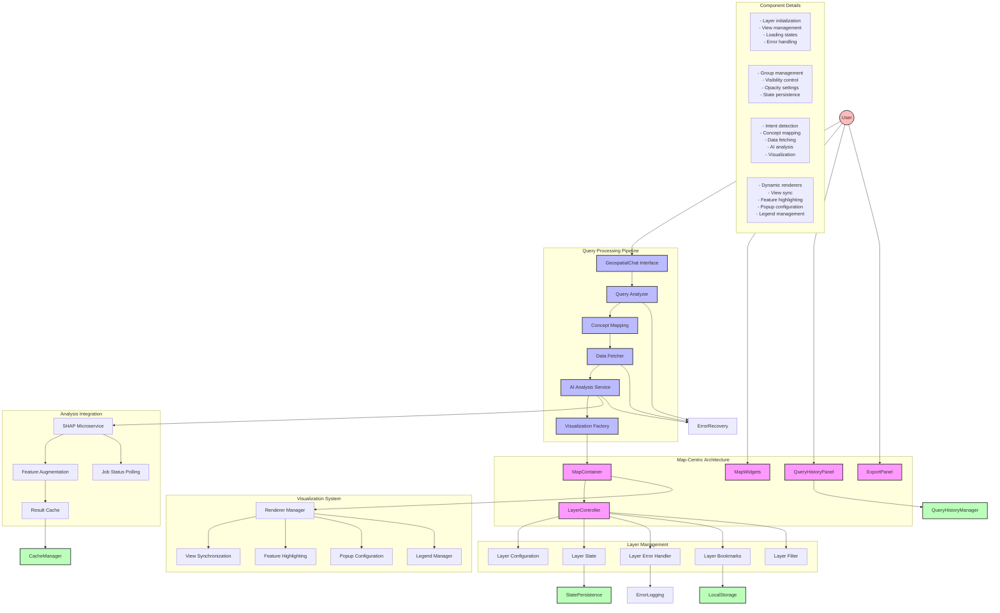
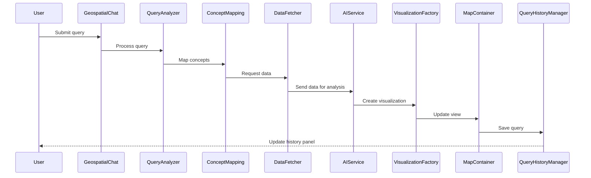
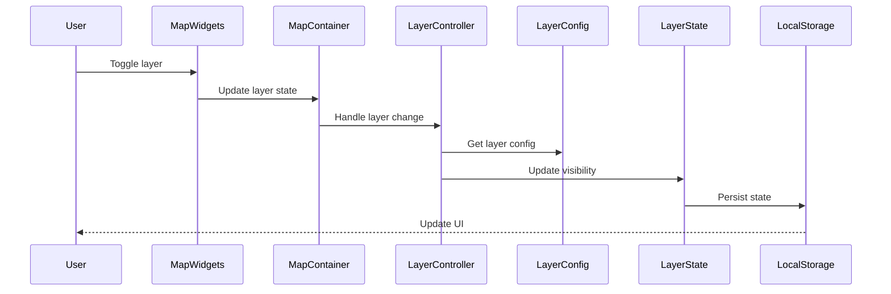
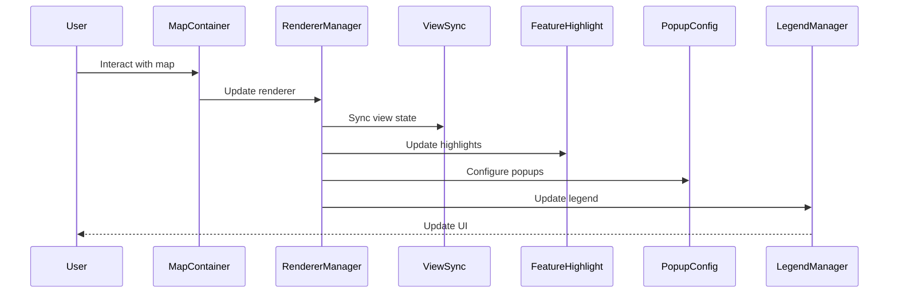
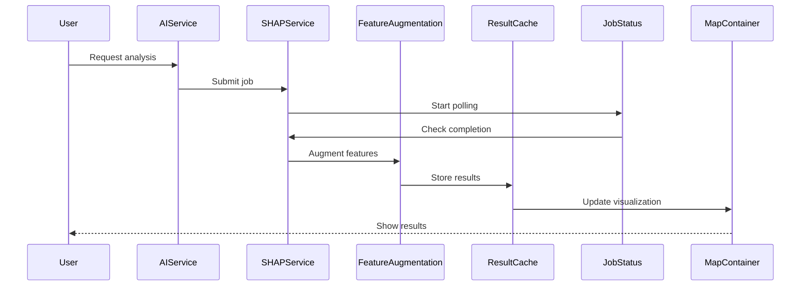
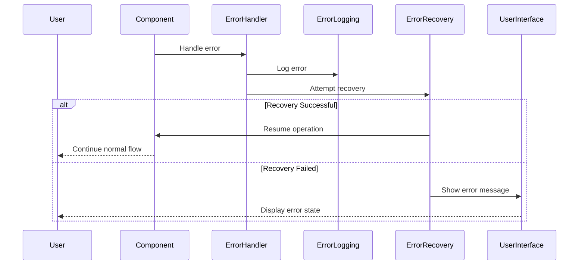

## Component Descriptions

### Map-Centric Architecture
- **MapContainer**: Central hub for map visualization and component coordination
- **LayerController**: Manages layer visibility, opacity, and state
- **MapWidgets**: Provides UI controls for map interaction
- **QueryHistoryPanel**: Manages query history and favorites
- **ExportPanel**: Handles layer data export functionality

### Query Processing Pipeline
- **GeospatialChat Interface**: Entry point for user queries
- **Query Analyzer**: Processes and classifies queries
- **Concept Mapping**: Maps query terms to layers and fields
- **Data Fetcher**: Retrieves data from configured layers
- **AI Analysis Service**: Integrates with SHAP microservice
- **Visualization Factory**: Creates appropriate visualizations

### Layer Management
- **Layer Configuration**: Manages layer settings and metadata
- **Layer State**: Tracks layer visibility and properties
- **Layer Error Handler**: Manages layer-related errors
- **Layer Bookmarks**: Saves and restores layer combinations
- **Layer Filter**: Provides search and filtering capabilities

### Visualization System
- **Renderer Manager**: Creates and manages renderers
- **View Synchronization**: Coordinates map view updates
- **Feature Highlighting**: Manages feature selection
- **Popup Configuration**: Configures feature popups
- **Legend Manager**: Manages map legends

### Analysis Integration
- **SHAP Microservice**: Performs advanced statistical analysis
- **Feature Augmentation**: Enhances features with analysis results
- **Result Cache**: Caches analysis results
- **Job Status**: Monitors analysis job progress

### Data Persistence
- **Query History Manager**: Manages query history
- **Local Storage**: Stores layer bookmarks
- **State Persistence**: Saves layer states
- **Cache Manager**: Manages result caching

### Error Handling
- **Error Logging**: Logs system errors
- **Error Recovery**: Handles error recovery
- **Validation**: Validates data and operations

## Sequence Diagrams

### Query Processing Flow

### Layer Management Flow

### Visualization Flow

### Analysis Flow

### Error Handling Flow
