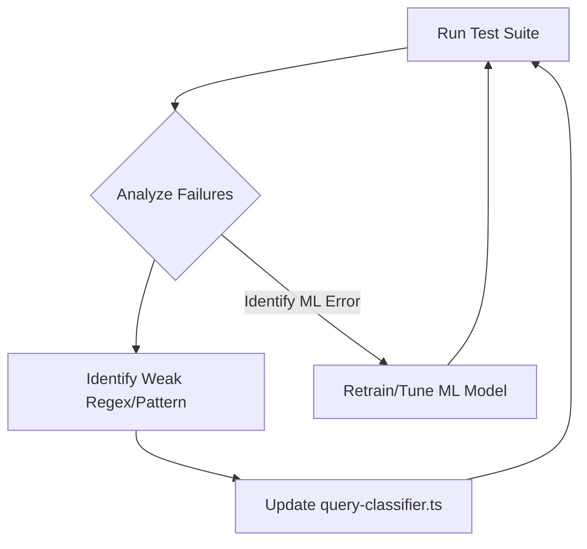

# Query Classifier Testing Plan

This document outlines a systematic plan for testing and improving the query classifier in `lib/query-classifier.ts`.

## 1. Goal

The primary goal is to create a reproducible and extensible testing framework that allows us to:
-   Validate the accuracy of the current query classifier.
-   Identify specific queries or query types that are failing.
-   Provide a clear feedback loop for improving the classification logic (patterns, keywords, and ML models).
-   Track improvements over time.

## 2. Testing Methodology

The testing process will be automated through a dedicated test script. This script will execute a predefined suite of test queries and compare the classifier's output against expected results.

### Core Components:

1.  **Test Query Suite (`test-queries.json`)**: A structured file (e.g., JSON) will contain a comprehensive list of test queries. Each query will be mapped to an expected outcome.

    **Example Entry:**
    ```json
    {
      "query": "Show me areas with high income and high education",
      "expected": {
        "visualizationType": "JOINT_HIGH",
        "intent": "joint_high_analysis",
        "relevantLayers": ["demographics", "education"],
        "relevantFields": ["median_household_income", "bachelor_degree_or_higher_pct"]
      }
    }
    ```

2.  **Test Runner Script (`test/query-classifier-suite.ts`)**: A script that:
    *   Loads the test queries from the JSON file.
    *   Initializes the `QueryClassifier`.
    *   Iterates through each test case.
    *   Calls `classifier.classifyQuery()` for each query.
    *   Compares the actual `AnalysisResult` with the `expected` result.
    *   Generates a detailed report of the test run.

3.  **Test Report (`test-report.md`)**: The output of the test runner. This report will be in a human-readable format (like a markdown table) and will highlight successes, failures, and discrepancies.

    **Example Report Table:**
| Query | Expected Viz | Actual Viz | Layers Matched | Status |
| :--- | :--- | :--- | :--- | :--- |
| "Show top 10 areas..." | `TOP_N` | `TOP_N` | `conversions` | ✅ PASS |
| "Areas with high income..." | `JOINT_HIGH` | `CHOROPLETH` | `demographics` | ❌ FAIL |


## 3. Implementation Steps

1.  **Create `test/test-queries.json`**: Populate this file with a diverse set of queries covering all 28 visualization types. Include edge cases, ambiguous queries, and variations in phrasing.

2.  **Create `test/query-classifier-suite.ts`**:
    *   Set up a test runner using a framework like Jest or a simple Node.js script.
    *   Implement the logic to load queries, run the classifier, and compare results.
    *   Implement the report generation logic.

3.  **Integrate into Workflow**:
    *   Add a new `npm` script (e.g., `npm run test:queries`) to execute the test suite.
    *   Run the suite after any changes to `query-classifier.ts` or related configuration files.

## 4. Improvement Cycle

The testing framework enables a continuous improvement cycle:



This plan provides a structured way to enhance the query classifier's intelligence and accuracy, ensuring a better user experience. 