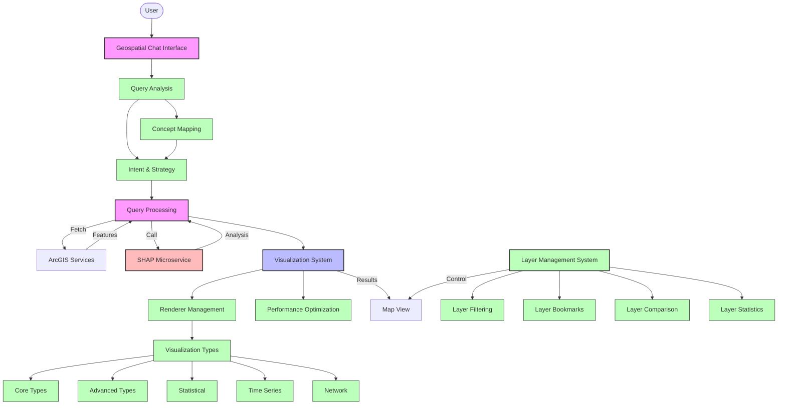

```mermaid
flowchart TD
    User([User]) --> GCI[Geospatial Chat Interface]
    GCI --> QA[Query Analysis]
    QA --> CM[Concept Mapping]
    QA --> IS[Intent & Strategy]
    CM --> IS
    
    IS --> QP[Query Processing]
    QP --> |Fetch| ArcGIS[ArcGIS Services]
    QP --> |Call| SHAP[SHAP Microservice]
    
    ArcGIS --> |Features| QP
    SHAP --> |Analysis| QP
    
    QP --> VS[Visualization System]
    VS --> RM[Renderer Management]
    VS --> PO[Performance Optimization]
    
    RM --> VT[Visualization Types]
    VT --> Core[Core Types]
    VT --> Advanced[Advanced Types]
    VT --> Statistical[Statistical]
    VT --> TimeSeries[Time Series]
    VT --> Network[Network]
    
    VS --> |Results| MapView[Map View]
    
    LMS[Layer Management System] --> |Control| MapView
    LMS --> LF[Layer Filtering]
    LMS --> LB[Layer Bookmarks]
    LMS --> LC[Layer Comparison]
    LMS --> LS[Layer Statistics]
    
    style GCI fill:#f9f,stroke:#333,stroke-width:2px
    style QP fill:#f9f,stroke:#333,stroke-width:2px
    style VS fill:#bbf,stroke:#333,stroke-width:2px
    style LMS fill:#bfb,stroke:#333,stroke-width:2px
    style SHAP fill:#fbb,stroke:#333,stroke-width:2px
    
    classDef tested fill:#bfb,stroke:#333,stroke-width:1px
    classDef partial fill:#bbf,stroke:#333,stroke-width:1px
    classDef pending fill:#fbb,stroke:#333,stroke-width:1px
    
    class LMS,LC,LS,LF,LB tested
    class QA,CM,IS,QP,SHAP tested
    class VS,RM,PO,VT,Core,Advanced,Statistical,TimeSeries,Network tested
    class GCI tested
```
