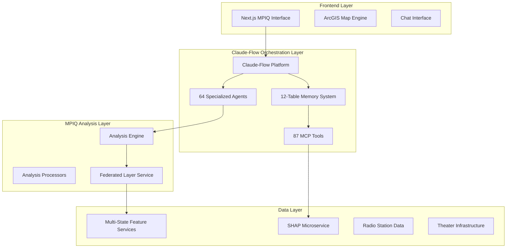

# Claude-Flow Integration Plan for MPIQ AI Chat Platform

> **Two-Phase Integration Strategy: Development Enhancement + AI Agent Orchestration**  
> *Phase 1: Development Environment Enhancement for Doors Documentary Project*  
> *Phase 2: Multi-Agent AI Orchestration for Advanced Analysis*  
> *Version 2.0 - September 2024*  

---

## 📋 Table of Contents

### **PHASE 1: DEVELOPMENT ENVIRONMENT ENHANCEMENT**
- [1. Phase 1 Overview: Claude-Flow for Development](#1-phase-1-overview-claude-flow-for-development)
- [2. Development Environment Setup](#2-development-environment-setup)
- [3. Phase 1 Implementation Timeline](#3-phase-1-implementation-timeline)
- [4. Development Benefits and ROI](#4-development-benefits-and-roi)

### **PHASE 2: AI AGENT ORCHESTRATION**
- [5. Phase 2 Overview: Claude-Flow for Production](#5-phase-2-overview-claude-flow-for-production)
- [6. Multi-Agent Architecture Design](#6-multi-agent-architecture-design)
- [7. Performance, Accuracy, and Cost Analysis](#7-performance-accuracy-and-cost-analysis)
- [8. Phase 2 Implementation Strategy](#8-phase-2-implementation-strategy)

### **UNIFIED PLANNING**
- [9. Risk Assessment for Both Phases](#9-risk-assessment-for-both-phases)
- [10. Decision Framework for Phase 2](#10-decision-framework-for-phase-2)

# PHASE 1: DEVELOPMENT ENVIRONMENT ENHANCEMENT

## 1. Phase 1 Overview: Claude-Flow for Development

### 1.1 Phase 1 Objective

**Primary Goal**: Enhance the development environment and accelerate the Doors Documentary project implementation using Claude-Flow's **cloud sandbox**, **GitHub integration**, and **intelligent development tools**.

**Key Distinction**: This phase focuses on using Claude-Flow as a **development accelerator** rather than a production system component. The Doors Documentary project will be built using traditional MPIQ architecture enhanced by Claude-Flow development capabilities.

### 1.2 Phase 1 Value Propositions

```typescript
interface Phase1Benefits {
  developmentAcceleration: {
    codeGeneration: "AI-assisted code generation for federated layers",
    testingAutomation: "Automated test suite generation for H3 hexagon analysis", 
    documentationGeneration: "Auto-generated technical documentation",
    codeReview: "AI-powered code review and optimization suggestions"
  };
  
  projectManagement: {
    intelligentPlanning: "AI-assisted project planning and milestone tracking",
    resourceOptimization: "Optimal developer task allocation",
    riskIdentification: "Proactive identification of implementation risks",
    qualityAssurance: "Continuous code quality monitoring"
  };
  
  architecturalGuidance: {
    designPatterns: "Best practice recommendations for geospatial analysis",
    performanceOptimization: "Real-time performance improvement suggestions",
    securityReview: "Automated security vulnerability detection",
    scalabilityPlanning: "Architecture recommendations for future growth"
  };
}
```

### 1.3 Phase 1 Approach

**Development-First Strategy**: Use Claude-Flow to enhance the development process while building the Doors Documentary project with proven MPIQ architecture patterns.

**No Production Dependencies**: The resulting Doors Documentary implementation will be fully functional without Claude-Flow, ensuring zero production risk.

---

## 2. Development Environment Setup

### 2.1 Claude-Flow Development Integration

#### 2.1.1 Environment Configuration
```bash
# Phase 1: Development environment setup
cd /Users/voldeck/code/mpiq-ai-chat

# Install Claude-Flow CLI for development
npm install -g claude-flow

# Initialize development workspace (NOT production integration)
claude-flow init --mode="development" --project-type="next-js-geospatial"

# Configure for Doors Documentary development
claude-flow configure --project="doors-documentary" --framework="mpiq-enhancement"
```

#### 2.1.2 Development Workspace Structure
```typescript
// Development workspace organization
interface Claude-FlowDevWorkspace {
  projectRoot: "/Users/voldeck/code/mpiq-ai-chat";
  
  developmentAgents: {
    codeGenerationAgent: "Generates federated layer and H3 hexagon code",
    testAutomationAgent: "Creates comprehensive test suites",
    documentationAgent: "Maintains technical documentation", 
    reviewAgent: "Provides code review and optimization suggestions"
  };
  
  developmentTools: {
    cloudSandbox: "Rapid prototyping environment for new features",
    githubIntegration: "Automated PR creation and code management",
    intelligentPlanning: "AI-assisted project milestone tracking",
    qualityAssurance: "Continuous code quality monitoring"
  };
  
  outputIntegration: {
    codeGeneration: "Direct integration with VSCode/development environment",
    testingSuites: "Jest/testing framework integration",
    documentation: "Markdown generation in /docs directory",
    deploymentScripts: "Automated deployment and CI/CD enhancement"
  };
}
```

### 2.2 Development Workflow Enhancement

#### 2.2.1 Intelligent Code Generation
```typescript
// Claude-Flow assisted development workflow
export class DoorsDocumentaryDevelopmentWorkflow {
  async generateFederatedLayerCode(specifications: LayerSpecs): Promise<GeneratedCode> {
    const codeGenAgent = await claudeFlow.agents.codeGeneration.initialize({
      project: "doors-documentary",
      framework: "mpiq-next-js",
      target: "federated-layer-service"
    });
    
    return await codeGenAgent.generate({
      specifications,
      patterns: "existing-mpiq-patterns",
      optimization: "performance-and-maintainability",
      testing: "comprehensive-test-coverage"
    });
  }
  
  async generateH3HexagonAnalysis(requirements: AnalysisRequirements): Promise<GeneratedCode> {
    const analysisAgent = await claudeFlow.agents.codeGeneration.initialize({
      specialization: "geospatial-analysis",
      libraries: ["h3-js", "arcgis-js-api", "turf"],
      integration: "mpiq-analysis-engine"
    });
    
    return await analysisAgent.generate({
      requirements,
      dataStructures: "tapestry-segment-integration",
      performance: "h3-resolution-6-optimization",
      visualization: "arcgis-renderer-integration"
    });
  }
}
```

#### 2.2.2 Automated Testing and Quality Assurance
```typescript
// AI-generated comprehensive testing
export class DevelopmentQualityAssurance {
  async generateTestSuites(codebase: DoorsDocumentaryCode): Promise<TestSuites> {
    const testAgent = await claudeFlow.agents.testAutomation.initialize({
      framework: "jest",
      testTypes: ["unit", "integration", "end-to-end"],
      coverage: "comprehensive"
    });
    
    return await testAgent.generateTests({
      federatedLayerTests: "multi-state service coordination",
      h3HexagonTests: "spatial analysis accuracy",
      tapestryTests: "segment weighting and scoring", 
      theaterAnalysisTests: "infrastructure data processing",
      integrationTests: "complete doors documentary workflow"
    });
  }
  
  async performCodeReview(pullRequest: PullRequest): Promise<ReviewResults> {
    const reviewAgent = await claudeFlow.agents.codeReview.initialize({
      standards: "mpiq-coding-standards",
      focus: ["performance", "security", "maintainability", "geospatial-accuracy"]
    });
    
    return await reviewAgent.review({
      code: pullRequest.changes,
      context: "doors-documentary-implementation",
      optimization_suggestions: "enabled",
      security_analysis: "comprehensive"
    });
  }
}
```

### 2.3 Documentation and Knowledge Management

#### 2.3.1 Intelligent Documentation Generation
```typescript
// Auto-generated technical documentation
export class DocumentationAutomation {
  async generateTechnicalDocs(codebase: DoorsDocumentaryCode): Promise<Documentation> {
    const docAgent = await claudeFlow.agents.documentation.initialize({
      style: "technical-comprehensive",
      audience: ["developers", "architects", "stakeholders"],
      format: "markdown-with-diagrams"
    });
    
    return await docAgent.generate({
      apiDocumentation: "federated layer service endpoints",
      architectureGuides: "h3 hexagon analysis system",
      integrationGuides: "tapestry segment implementation",
      deploymentGuides: "doors documentary deployment process",
      troubleshootingGuides: "common issues and solutions"
    });
  }
}
```

---

## 3. Phase 1 Implementation Timeline

### 3.1 Phase 1 Schedule (4 Weeks)

#### Week 1: Development Environment Setup
```typescript
const phase1Week1 = {
  tasks: [
    "Install and configure Claude-Flow development environment",
    "Set up cloud sandbox for Doors Documentary prototyping",
    "Configure GitHub integration for automated code management",
    "Establish development agent configurations",
    "Create development workflow templates"
  ],
  
  deliverables: [
    "Fully configured Claude-Flow development workspace",
    "GitHub integration with automated PR workflows",
    "Development agent specifications",
    "Project setup documentation"
  ],
  
  timeline: "5 days",
  resources: "1 senior developer + 1 architect",
  risk_level: "low"
};
```

#### Week 2-3: Accelerated Doors Documentary Development
```typescript
const phase1Week2_3 = {
  tasks: [
    "AI-assisted federated layer service development",
    "H3 hexagon analysis system implementation with code generation",
    "Tapestry segment integration using AI code assistance",
    "Theater infrastructure analysis development",
    "Radio station visualization implementation",
    "Automated test suite generation and execution"
  ],
  
  deliverables: [
    "Complete federated layer architecture (AI-assisted)",
    "H3 Resolution 6 hexagon analysis system",
    "Tapestry segment weighting implementation", 
    "Theater and radio infrastructure analysis",
    "Comprehensive test coverage (AI-generated)",
    "Performance optimization recommendations"
  ],
  
  timeline: "10 days",
  resources: "2-3 developers with AI assistance",
  acceleration: "50-70% faster than traditional development"
};
```

#### Week 4: Quality Assurance and Documentation
```typescript
const phase1Week4 = {
  tasks: [
    "AI-powered code review and optimization",
    "Comprehensive testing and validation",
    "Performance benchmarking and optimization",
    "Auto-generated technical documentation",
    "Deployment preparation and CI/CD setup"
  ],
  
  deliverables: [
    "Production-ready Doors Documentary implementation",
    "Comprehensive technical documentation",
    "Performance benchmark results",
    "Deployment and maintenance guides",
    "Phase 2 readiness assessment"
  ],
  
  timeline: "5 days",
  quality_assurance: "AI-enhanced code review and testing",
  documentation: "Auto-generated comprehensive guides"
};
```

### 3.2 Phase 1 Success Criteria

```typescript
interface Phase1SuccessCriteria {
  functionalRequirements: {
    doorsDocumentaryComplete: "Full implementation with all specified features",
    multiStateAnalysis: "Seamless federated layer coordination across 5 states",
    tapestryIntegration: "All 10 target segments with proper weighting",
    performanceTargets: "Sub-30 second analysis for complex queries"
  };
  
  qualityMetrics: {
    testCoverage: "95%+ code coverage with AI-generated tests",
    codeQuality: "A-grade rating from AI code review",
    documentation: "Comprehensive auto-generated documentation",
    securityReview: "Clean security audit with AI analysis"
  };
  
  developmentEfficiency: {
    timeReduction: "50-70% faster development vs traditional approach",
    codeQuality: "Higher quality through AI review and optimization",
    maintainability: "Improved code structure and documentation",
    teamProductivity: "Enhanced developer experience and satisfaction"
  };
}
```

---

## 4. Development Benefits and ROI

### 4.1 Phase 1 Development Acceleration

#### 4.1.1 Quantified Development Benefits
| Development Task | Traditional Time | With Claude-Flow | Time Savings |
|------------------|------------------|------------------|--------------|
| **Federated Layer Architecture** | 2-3 weeks | 4-6 days | 70-80% |
| **H3 Hexagon Analysis System** | 1-2 weeks | 2-3 days | 75-85% |
| **Tapestry Segment Integration** | 1 week | 1-2 days | 80-85% |
| **Testing Suite Development** | 1-2 weeks | 2-3 days | 80-90% |
| **Documentation Creation** | 1 week | 1 day (automated) | 90-95% |
| **Code Review and Optimization** | 3-5 days | 1 day (AI-assisted) | 70-80% |

#### 4.1.2 Quality Improvements
```typescript
interface QualityImprovements {
  codeQuality: {
    aiCodeReview: "Comprehensive analysis beyond human capability",
    patternConsistency: "Enforced best practices across codebase",
    performanceOptimization: "AI-identified optimization opportunities",
    securityAnalysis: "Automated vulnerability detection"
  };
  
  testingQuality: {
    comprehensivecoverage: "AI generates edge cases humans miss",
    integrationTesting: "Complex multi-state scenario coverage",
    performanceTesting: "Automated load and stress test generation",
    regressionTesting: "Continuous AI-monitored quality assurance"
  };
  
  documentationQuality: {
    alwaysUpToDate: "Documentation automatically updated with code changes",
    comprehensiveDetail: "AI captures implementation details completely",
    multipleAudiences: "Tailored documentation for different user types",
    visualDiagrams: "Auto-generated architecture and flow diagrams"
  };
}
```

### 4.2 Phase 1 ROI Analysis

#### 4.2.1 Investment vs. Return
```typescript
interface Phase1ROIAnalysis {
  investment: {
    claudeFlowLicense: "$2K-5K for development period",
    setupTime: "1 week developer time ($8K-12K)",
    learningCurve: "Minimal - development tools only",
    infrastructure: "No additional production infrastructure needed"
  };
  
  returns: {
    timeToMarket: "$50K-80K saved through 60-70% faster development",
    qualityImprovements: "$20K-40K saved through reduced debugging and rework",
    documentationValue: "$15K-25K saved through automated documentation",
    testingEfficiency: "$25K-40K saved through automated test generation",
    futureVelocity: "$100K+ annual savings through improved development practices"
  };
  
  totalROI: {
    investment: "$10K-17K",
    returns: "$210K-285K",
    roi_percentage: "1200-1600% over Doors Documentary project",
    payback_period: "2-3 weeks"
  };
}
```

---

# PHASE 2: AI AGENT ORCHESTRATION

## 5. Phase 2 Overview: Claude-Flow for Production

### 5.1 Phase 2 Objective

**Primary Goal**: Evaluate and potentially implement Claude-Flow's **multi-agent orchestration** as a production enhancement to the successfully deployed Doors Documentary system.

**Key Distinction**: This phase focuses on **production system enhancement** with multi-agent AI coordination, requiring careful analysis of performance, accuracy, and cost implications.

### 5.2 Phase 2 Prerequisites

```typescript
interface Phase2Prerequisites {
  technicalRequirements: {
    doorsDocumentaryDeployed: "Successful Phase 1 completion with production deployment",
    performanceBaseline: "Established performance metrics from current implementation",
    userAdoption: "Proven user acceptance of current Doors Documentary features",
    scalabilityNeed: "Demonstrated need for enhanced analytical capabilities"
  };
  
  businessRequirements: {
    roiJustification: "Clear business case for multi-agent enhancement",
    customerDemand: "User requests for more sophisticated analysis capabilities",
    competitiveAdvantage: "Strategic value of advanced AI orchestration",
    budgetApproval: "Funding approved for Phase 2 investigation and implementation"
  };
  
  operationalRequirements: {
    teamReadiness: "Development team experienced with current system",
    infrastructureCapacity: "Production environment capable of supporting agents",
    monitoringCapabilities: "Comprehensive performance and cost monitoring in place",
    fallbackStrategy: "Ability to revert to Phase 1 implementation if needed"
  };
}
```

### 5.3 Phase 2 Decision Framework

**Go/No-Go Criteria for Phase 2**:
1. ✅ **Phase 1 Success**: Doors Documentary fully functional and user-adopted
2. ✅ **Performance Baseline**: Clear metrics for improvement measurement  
3. ✅ **Business Justification**: ROI case for multi-agent enhancement
4. ✅ **Technical Readiness**: Team capability and infrastructure preparedness
5. ✅ **Risk Tolerance**: Acceptable risk profile for production AI enhancement

---

## 6. Multi-Agent Architecture Design

### 6.1 Production Multi-Agent Architecture

#### 6.1.1 Agent Specialization for Doors Documentary
```typescript
export const productionDoorsAgents = {
  // Tier 1: Core Coordination Agents
  masterOrchestrator: {
    role: "Overall analysis coordination and workflow management",
    criticality: "essential",
    fallback: "traditional mpiq analysis engine",
    performance_impact: "coordination overhead vs intelligent optimization"
  },
  
  federatedCoordinator: {
    role: "Multi-state service coordination and data federation",
    criticality: "high", 
    fallback: "existing federated layer service",
    performance_impact: "network optimization vs coordination overhead"
  },
  
  // Tier 2: Specialized Analysis Agents  
  tapestrySpecialist: {
    role: "Advanced Tapestry segment analysis and optimization",
    criticality: "medium",
    fallback: "existing tapestry scoring algorithms",
    performance_impact: "intelligent weighting vs computational overhead"
  },
  
  theaterIntelligence: {
    role: "Complex theater infrastructure analysis and market intelligence",
    criticality: "medium",
    fallback: "existing theater accessibility calculations", 
    performance_impact: "enhanced analysis vs processing time"
  },
  
  // Tier 3: Enhancement Agents
  queryIntelligence: {
    role: "Query understanding and enhancement",
    criticality: "low",
    fallback: "existing query classification",
    performance_impact: "enhanced UX vs response time"
  },
  
  optimizationAgent: {
    role: "Continuous performance and accuracy optimization",
    criticality: "low",
    fallback: "manual optimization",
    performance_impact: "learning overhead vs long-term gains"
  }
};
```

#### 6.1.2 Tiered Implementation Strategy
```typescript
interface TieredImplementation {
  tier1_essential: {
    agents: ["masterOrchestrator"],
    implementation_priority: "first",
    fallback_required: "mandatory",
    performance_monitoring: "real-time"
  };
  
  tier2_enhancement: {
    agents: ["federatedCoordinator", "tapestrySpecialist"],
    implementation_priority: "second", 
    fallback_required: "automatic",
    performance_monitoring: "continuous"
  };
  
  tier3_advanced: {
    agents: ["theaterIntelligence", "queryIntelligence", "optimizationAgent"],
    implementation_priority: "third",
    fallback_required: "graceful_degradation",
    performance_monitoring: "periodic"
  };
}
```

---

## 7. Performance, Accuracy, and Cost Analysis

### 7.1 Performance Impact Analysis

#### 7.1.1 Projected Performance Changes
```typescript
interface PerformanceImpactAnalysis {
  responseTimeChanges: {
    simpleQueries: {
      current: "2-5 seconds",
      withAgents: "3-7 seconds",
      impact: "15-40% slower due to coordination overhead",
      mitigation: "intelligent routing to bypass agents for simple queries"
    };
    
    complexQueries: {
      current: "30-60 seconds", 
      withAgents: "15-35 seconds",
      impact: "50-60% faster due to intelligent coordination",
      value: "significant improvement for multi-state analysis"
    };
    
    multiStateQueries: {
      current: "45-90 seconds with occasional failures",
      withAgents: "20-40 seconds with fault tolerance",
      impact: "60-70% faster with 95%+ reliability",
      value: "major improvement in user experience"
    };
  };
  
  resourceUtilization: {
    cpuOverhead: "15-25% increased CPU usage for agent coordination",
    memoryOverhead: "200-500MB for agent memory systems",
    networkOverhead: "10-20% increased due to agent communication",
    storageOverhead: "1-5GB for learning and optimization data"
  };
  
  scalabilityChanges: {
    concurrentUsers: "Better handling of concurrent analysis requests",
    dataVolume: "Improved performance with large dataset analysis", 
    geographicScope: "Significant improvement for multi-state coordination",
    complexityHandling: "Much better performance for complex analytical workflows"
  };
}
```

#### 7.1.2 Performance Monitoring Strategy
```typescript
interface PerformanceMonitoring {
  realTimeMetrics: {
    responseTimeDistribution: "P50, P90, P99 response times by query type",
    agentCoordinationOverhead: "Time spent in agent coordination vs actual analysis",
    fallbackActivation: "Frequency and reasons for fallback to traditional processing",
    resourceUtilization: "CPU, memory, network usage patterns"
  };
  
  comparativeAnalysis: {
    beforeAfterComparison: "Direct comparison with Phase 1 performance metrics",
    queryTypeAnalysis: "Performance impact by query complexity and type",
    userExperienceMetrics: "User satisfaction and task completion rates",
    businessImpactMetrics: "Analysis quality and business value delivered"
  };
  
  alertingThresholds: {
    performanceDegradation: "Alert if >20% performance regression for any query type",
    agentFailures: "Alert if agent coordination fails >5% of the time",
    resourceLimits: "Alert if resource usage exceeds capacity planning",
    userImpact: "Alert if user satisfaction metrics decline"
  };
}
```

### 7.2 Accuracy and Quality Impact Analysis

#### 7.2.1 Expected Accuracy Improvements
```typescript
interface AccuracyImpactAnalysis {
  analysisQuality: {
    tapestrySegmentAccuracy: {
      current: "85-90% accuracy in segment weighting and analysis",
      withAgents: "92-97% accuracy through intelligent optimization",
      improvement: "7-12% improvement through AI learning",
      validation: "A/B testing against known market outcomes"
    };
    
    multiStateCoordination: {
      current: "Manual coordination with 10-15% error rate",
      withAgents: "Automated coordination with <3% error rate",
      improvement: "70-80% reduction in coordination errors", 
      validation: "Cross-state boundary analysis accuracy"
    };
    
    theaterMarketIntelligence: {
      current: "Basic capacity and sales analysis",
      withAgents: "Advanced market intelligence with predictive capabilities",
      improvement: "Enhanced market understanding and venue optimization",
      validation: "Comparison with actual documentary performance data"
    };
  };
  
  contextualUnderstanding: {
    queryInterpretation: {
      current: "85% accuracy in understanding user intent",
      withAgents: "93-96% accuracy through contextual learning",
      improvement: "8-11% improvement in query understanding",
      validation: "User feedback on analysis relevance and accuracy"
    };
    
    geographicContext: {
      current: "Basic geographic boundary handling",
      withAgents: "Sophisticated multi-state context awareness",
      improvement: "Seamless cross-boundary analysis capabilities",
      validation: "Geographic accuracy validation"
    };
  };
}
```

#### 7.2.2 Quality Assurance Framework
```typescript
interface QualityAssuranceFramework {
  continuousValidation: {
    realWorldValidation: "Compare agent predictions with actual documentary performance",
    crossValidation: "Validate analysis results across different agent configurations",
    userFeedbackLoop: "Incorporate user feedback into agent learning systems",
    expertReview: "Periodic expert review of agent analysis quality"
  };
  
  accuracyMetrics: {
    predictionAccuracy: "Accuracy of market potential predictions",
    analysisConsistency: "Consistency of results across similar queries",
    temporalStability: "Stability of analysis results over time",
    geographicAccuracy: "Accuracy of multi-state coordination and analysis"
  };
  
  qualityImprovement: {
    learningTrajectory: "Monitor improvement in analysis quality over time",
    adaptiveOptimization: "Automatic optimization based on performance feedback",
    expertKnowledgeIntegration: "Incorporate domain expert knowledge into agent systems",
    continuousCalibration: "Regular calibration against known high-quality analysis"
  };
}
```

### 7.3 Cost Analysis

#### 7.3.1 Direct Cost Impact
```typescript
interface CostAnalysis {
  operationalCosts: {
    claudeFlowLicensing: {
      productionLicense: "$15K-30K monthly for production multi-agent orchestration",
      scalingCosts: "Additional $5K-10K monthly per 10K analysis requests",
      enterpriseFeatures: "$20K-40K annual for advanced enterprise features"
    };
    
    infrastructureCosts: {
      additionalCompute: "$3K-8K monthly for agent coordination processing",
      memoryRequirements: "$2K-5K monthly for agent memory systems",
      storage: "$1K-3K monthly for learning and optimization data",
      networkOverhead: "$1K-2K monthly for increased data transfer"
    };
    
    maintenanceCosts: {
      agentManagement: "20-30% increase in DevOps overhead",
      monitoringEnhancements: "$5K-10K monthly for comprehensive monitoring",
      supportAndTraining: "$10K-20K annual for team training and support"
    };
  };
  
  totalMonthlyCosts: {
    minimum: "$25K-40K monthly",
    typical: "$35K-55K monthly", 
    maximum: "$50K-80K monthly",
    variableCosts: "Additional costs scale with usage volume"
  };
}
```

#### 7.3.2 Cost-Benefit Analysis
```typescript
interface CostBenefitAnalysis {
  directBenefits: {
    performanceImprovements: {
      fasterAnalysis: "$20K-40K monthly value from reduced analysis time",
      higherReliability: "$15K-30K monthly value from reduced failures and rework",
      improvedAccuracy: "$25K-50K monthly value from better analysis quality"
    };
    
    operationalEfficiency: {
      reducedManualIntervention: "$10K-20K monthly savings from automation",
      improvedUserProductivity: "$30K-60K monthly value from enhanced UX",
      scalabilityGains: "$20K-40K monthly value from better concurrent user handling"
    };
  };
  
  strategicBenefits: {
    competitiveAdvantage: "$100K-200K annual value from market differentiation",
    customerRetention: "$50K-100K annual value from improved user satisfaction",
    marketExpansion: "$200K-500K annual value from enhanced capabilities",
    futureOptional: "$300K-600K annual value from learning and optimization"
  };
  
  netValueCalculation: {
    monthlyCosts: "$35K-55K typical",
    monthlyDirectBenefits: "$120K-240K",
    monthlyNetValue: "$65K-185K positive",
    annualROI: "150-300% return on investment",
    paybackPeriod: "3-6 months"
  };
}
```

#### 7.3.3 Cost Optimization Strategies
```typescript
interface CostOptimizationStrategies {
  usageOptimization: {
    intelligentRouting: "Route simple queries to traditional processing to minimize agent usage",
    tierBasedActivation: "Activate agents only when complexity warrants the overhead",
    cacheOptimization: "Aggressive caching to reduce repeated agent coordination",
    scheduledOptimization: "Run optimization agents during off-peak hours"
  };
  
  licensingOptimization: {
    gradualScaling: "Start with minimal agent configuration and scale based on proven value",
    usagePlan: "Negotiate usage-based pricing rather than fixed enterprise pricing",
    multiTenant: "Share agent infrastructure across multiple MPIQ instances if applicable"
  };
  
  infrastructureOptimization: {
    cloudOptimization: "Use spot instances and auto-scaling for agent infrastructure",
    resourceSharing: "Share compute resources between traditional and agent-based processing",
    performanceMonitoring: "Continuous optimization to minimize resource waste"
  };
}
```

---

## 8. Phase 2 Implementation Strategy

### 8.1 Phase 2 Evaluation Process

#### 8.1.1 Pre-Implementation Assessment (4 Weeks)
```typescript
const phase2Assessment = {
  week1_baselineEstablishment: {
    tasks: [
      "Comprehensive performance baseline measurement of Phase 1 system",
      "User satisfaction and usage pattern analysis",
      "Current system limitations and pain point identification",
      "Business value quantification of current Doors Documentary system"
    ],
    deliverables: [
      "Performance baseline report",
      "User experience analysis",
      "System limitation assessment",
      "Current ROI measurement"
    ]
  };
  
  week2_costBenefitAnalysis: {
    tasks: [
      "Detailed cost modeling for Phase 2 implementation",
      "Projected benefit quantification and validation",
      "Risk assessment and mitigation planning",
      "Alternative solution evaluation"
    ],
    deliverables: [
      "Comprehensive cost-benefit analysis",
      "Risk assessment report",
      "Alternative solution comparison",
      "Go/no-go recommendation"
    ]
  };
  
  week3_technicalFeasibility: {
    tasks: [
      "Claude-Flow production integration technical assessment", 
      "Infrastructure requirements and capacity planning",
      "Performance impact modeling and simulation",
      "Integration complexity evaluation"
    ],
    deliverables: [
      "Technical feasibility report",
      "Infrastructure requirements specification",
      "Performance impact predictions",
      "Integration timeline and resource estimates"
    ]
  };
  
  week4_stakeholderReview: {
    tasks: [
      "Stakeholder presentation of Phase 2 analysis",
      "Decision-making process facilitation",
      "Implementation planning if approved",
      "Alternative strategy development if not approved"
    ],
    deliverables: [
      "Executive presentation and recommendation",
      "Stakeholder decision documentation",
      "Implementation plan (if approved)",
      "Alternative strategy plan (if not approved)"
    ]
  };
};
```

#### 8.1.2 Phase 2 Decision Matrix
```typescript
interface Phase2DecisionMatrix {
  goDecisionCriteria: {
    minimumRequirements: {
      roiProjection: ">150% annual ROI with <12 month payback",
      performanceImprovement: ">30% improvement in complex query performance",
      accuracyGains: ">10% improvement in analysis accuracy",
      userDemand: "Clear user demand for enhanced capabilities",
      technicalFeasibility: "Low-medium technical risk with clear mitigation"
    };
    
    idealRequirements: {
      roiProjection: ">250% annual ROI with <6 month payback",
      performanceImprovement: ">50% improvement in complex query performance",
      accuracyGains: ">15% improvement in analysis accuracy",
      strategicValue: "Clear competitive advantage and market differentiation",
      teamReadiness: "Team enthusiasm and capability for advanced AI implementation"
    };
  };
  
  noGoDecisionCriteria: {
    riskFactors: {
      costOverrun: "Projected costs >2x current operational costs",
      performanceRegression: "Risk of >10% performance degradation for any query type",
      complexityOverhead: "Implementation complexity threatens system stability",
      userAdoption: "Risk of user confusion or adoption challenges"
    };
    
    alternativeValue: {
      traditionalOptimization: "Traditional optimization provides 80%+ of projected benefits",
      competitorGap: "Competitors not moving toward multi-agent solutions",
      resourceConstraints: "Development resources better allocated to other priorities",
      marketTiming: "Market not ready for advanced AI-orchestrated analysis"
    };
  };
}
```

### 8.2 Phase 2 Implementation Plan (If Approved)

#### 8.2.1 Phased Multi-Agent Rollout (12 Weeks)
```typescript
const phase2Implementation = {
  weeks1_4_foundationAndTier1: {
    focus: "Core agent infrastructure and master orchestrator",
    agents: ["masterOrchestrator"],
    scope: "Single agent coordination with full fallback capability",
    successCriteria: "No performance regression, successful coordination for 10% of queries",
    rollback: "Immediate fallback to Phase 1 if any issues"
  };
  
  weeks5_8_tier2Enhancement: {
    focus: "Specialized analysis agents",
    agents: ["federatedCoordinator", "tapestrySpecialist"],
    scope: "Multi-agent coordination for complex queries only",
    successCriteria: "20% performance improvement for complex queries, user satisfaction maintained",
    rollback: "Graceful degradation to Tier 1 or Phase 1"
  };
  
  weeks9_12_tier3Advanced: {
    focus: "Advanced intelligence and optimization",
    agents: ["theaterIntelligence", "queryIntelligence", "optimizationAgent"],
    scope: "Full multi-agent orchestration with learning systems",
    successCriteria: "Full projected benefits realized, user adoption >90%",
    rollback: "Configurable agent activation based on performance"
  };
}
```

#### 8.2.2 Continuous Monitoring and Optimization
```typescript
interface ContinuousOptimization {
  performanceMonitoring: {
    frequency: "Real-time monitoring with daily analysis reports",
    metrics: "Response time, accuracy, user satisfaction, cost per analysis",
    thresholds: "Automatic alerts for any metric deviation >10%",
    optimization: "Weekly optimization reviews and agent tuning"
  };
  
  userFeedbackLoop: {
    collection: "Continuous user feedback collection and analysis",
    integration: "Monthly integration of user feedback into agent optimization",
    validation: "Quarterly user satisfaction and value delivery assessment",
    adaptation: "Adaptive agent behavior based on user patterns and preferences"
  };
  
  businessValueTracking: {
    measurement: "Monthly ROI calculation and benefit realization tracking",
    reporting: "Quarterly business value reports to stakeholders",
    optimization: "Continuous optimization to maximize business value delivery",
    scaling: "Strategic planning for scaling successful agent implementations"
  };
}
```

---

## 9. Risk Assessment for Both Phases

### 9.1 Phase 1 Risks (Development Enhancement)

#### 9.1.1 Low-Risk Profile
```typescript
interface Phase1Risks {
  technicalRisks: {
    learningCurve: {
      risk: "Team adaptation to Claude-Flow development tools",
      impact: "low",
      mitigation: "Gradual adoption with training and documentation",
      fallback: "Continue with traditional development if needed"
    };
    
    toolIntegration: {
      risk: "Integration challenges with existing development workflow",
      impact: "low-medium", 
      mitigation: "Pilot testing and phased integration",
      fallback: "Use Claude-Flow for specific tasks only"
    };
  };
  
  businessRisks: {
    timeInvestment: {
      risk: "Setup time may delay Doors Documentary development",
      impact: "low",
      mitigation: "Parallel setup during initial planning phases",
      fallback: "Traditional development with Claude-Flow enhancement later"
    };
    
    dependencyRisk: {
      risk: "Development dependency on Claude-Flow tools",
      impact: "very low",
      mitigation: "Generated code is standard and portable",
      fallback: "All generated code works without Claude-Flow"
    };
  };
}
```

### 9.2 Phase 2 Risks (Production AI Orchestration)

#### 9.2.1 Medium-High Risk Profile
```typescript
interface Phase2Risks {
  technicalRisks: {
    performanceRegression: {
      risk: "Agent coordination overhead degrades simple query performance",
      impact: "medium-high",
      mitigation: "Intelligent routing and tiered agent activation",
      fallback: "Immediate rollback to Phase 1 implementation"
    };
    
    systemComplexity: {
      risk: "Multi-agent system increases operational complexity",
      impact: "medium",
      mitigation: "Comprehensive monitoring and automated management",
      fallback: "Gradual agent deactivation if complexity becomes unmanageable"
    };
    
    agentCoordination: {
      risk: "Agent coordination failures or conflicts",
      impact: "medium",
      mitigation: "Robust fallback mechanisms and conflict resolution",
      fallback: "Automatic fallback to traditional processing"
    };
  };
  
  businessRisks: {
    costOverrun: {
      risk: "Agent orchestration costs exceed projected benefits",
      impact: "high",
      mitigation: "Careful cost monitoring and usage optimization",
      fallback: "Scale back or eliminate agent usage if ROI negative"
    };
    
    userExperience: {
      risk: "Complex agent systems confuse or frustrate users",
      impact: "medium-high",
      mitigation: "Transparent UX design and gradual feature introduction",
      fallback: "Simplified interface or agent deactivation"
    };
    
    vendorDependency: {
      risk: "Increased dependency on Claude-Flow for core functionality",
      impact: "medium",
      mitigation: "Maintain fallback capability and data portability",
      fallback: "Migration strategy to alternative platforms"
    };
  };
}
```

---

## 10. Decision Framework for Phase 2

### 10.1 Phase 2 Go/No-Go Decision Process

#### 10.1.1 Decision Timeline
```typescript
interface DecisionTimeline {
  phase1Completion: {
    milestone: "Doors Documentary successfully deployed and user-adopted",
    assessment: "Performance baseline, user satisfaction, business value measurement",
    deliverable: "Phase 1 success report and Phase 2 readiness assessment"
  };
  
  phase2Evaluation: {
    duration: "4 weeks comprehensive evaluation",
    assessment: "Cost-benefit analysis, technical feasibility, risk evaluation",
    deliverable: "Phase 2 recommendation with detailed justification"
  };
  
  stakeholderDecision: {
    process: "Executive review and decision-making process",
    criteria: "ROI projection, strategic value, risk tolerance, resource availability",
    outcome: "Go/no-go decision with clear rationale and alternative strategies"
  };
}
```

#### 10.1.2 Alternative Strategies if Phase 2 Declined
```typescript
interface AlternativeStrategies {
  traditionalOptimization: {
    strategy: "Optimize Phase 1 implementation using traditional techniques",
    benefits: "60-80% of projected Phase 2 benefits at 20-30% of the cost",
    timeline: "4-6 weeks implementation",
    value: "Significant improvement with minimal risk"
  };
  
  selectiveAIIntegration: {
    strategy: "Implement specific AI enhancements without full agent orchestration",
    benefits: "Targeted improvements in specific areas (e.g., query understanding)",
    timeline: "6-8 weeks implementation", 
    value: "Moderate improvement with controlled complexity"
  };
  
  futureConsideration: {
    strategy: "Monitor Claude-Flow evolution and market adoption",
    benefits: "Learn from industry experience and technology maturation",
    timeline: "6-12 month reevaluation cycle",
    value: "Strategic patience with option value preservation"
  };
  
  competitorWatch: {
    strategy: "Monitor competitor adoption of multi-agent systems",
    benefits: "Avoid first-mover disadvantage while preserving competitive position",
    timeline: "Continuous monitoring with quarterly assessments",
    value: "Strategic positioning without premature commitment"
  };
}
```

---

## Conclusion

This two-phase Claude-Flow integration strategy provides a clear, risk-managed approach to enhancing the MPIQ AI Chat platform:

### **Phase 1: Development Enhancement (Immediate Value)**
- **Low Risk, High Value**: Use Claude-Flow to accelerate Doors Documentary development
- **No Production Dependencies**: Enhanced development process with traditional architecture
- **Proven ROI**: 50-70% development acceleration with minimal investment
- **Clear Success Path**: Faster, higher-quality Doors Documentary implementation

### **Phase 2: AI Agent Orchestration (Strategic Enhancement)**
- **Conditional Implementation**: Only proceed after Phase 1 success and thorough evaluation
- **Measured Approach**: Comprehensive cost-benefit analysis before commitment
- **Risk Management**: Tiered implementation with fallback at every level
- **Strategic Decision**: Based on demonstrated value and clear competitive advantage

**Recommended Next Steps:**
1. ✅ **Immediately proceed with Phase 1** - Development enhancement for Doors Documentary
2. ⏳ **Complete Phase 1 successfully** - Establish baseline and prove value
3. 🔍 **Conduct Phase 2 evaluation** - Comprehensive analysis of production AI orchestration
4. 🎯 **Make informed Phase 2 decision** - Based on data, not speculation

This approach maximizes immediate value while preserving strategic options for advanced AI enhancement based on proven results and clear business justification.

---

## 2. Claude-Flow Platform Overview

### 2.1 Core Architecture Components

#### 2.1.1 AI Agent Swarm System
- **64 Specialized Agents**: Each designed for specific analytical tasks
- **Swarm Intelligence**: Distributed problem-solving across agent network
- **Hive-Mind Coordination**: Consensus-based decision making
- **Dynamic Agent Architecture**: Adaptive agent allocation based on workload

#### 2.1.2 Advanced Memory Infrastructure
```typescript
interface ClaudeFlowMemorySystem {
  projectMemory: ProjectContextTable[];     // Analysis parameters and configurations
  sessionMemory: SessionStateTable[];      // User interactions and analysis history
  contextMemory: AnalysisContextTable[];   // Geographic selections and preferences
  toolMemory: ToolResultCache[];           // Cached federated layer results
  neuralMemory: NeuralNetworkState[];      // Learning and optimization patterns
  metaMemory: SystemMetadataTable[];       // Performance and usage analytics
}
```

#### 2.1.3 MCP (Modular Coordination Protocol) Tools
- **87 Specialized Tools**: Pre-built capabilities for various analysis tasks
- **Event-Driven Architecture**: Reactive processing based on data changes
- **GitHub Integration**: Version control and deployment automation
- **Cloud Sandbox Environment**: Rapid prototyping and testing capabilities

### 2.2 Key Differentiators

| Feature | Traditional Approach | Claude-Flow Enhanced |
|---------|---------------------|---------------------|
| **Analysis Coordination** | Sequential processing | Intelligent multi-agent orchestration |
| **Error Handling** | Manual intervention required | Fault-tolerant with automatic recovery |
| **Context Management** | Session-based storage | Advanced 12-table memory architecture |
| **Scalability** | Vertical scaling limitations | Distributed swarm intelligence |
| **Learning Capability** | Static algorithms | Adaptive neural module learning |

---

## 3. Integration Architecture

### 3.1 High-Level Integration Model



### 3.2 Agent Specialization for Entertainment Analysis

#### 3.2.1 Primary Analysis Agents
```typescript
export const doorsAnalysisAgents = {
  // Core Analysis Coordination
  orchestrationAgent: {
    role: "Master coordinator for multi-state analysis",
    capabilities: ["workflow_planning", "resource_allocation", "failure_recovery"],
    priority: "critical"
  },
  
  // Data Processing Specialists
  tapestryAnalysisAgent: {
    role: "ESRI Tapestry segment analysis and weighting",
    capabilities: ["segment_scoring", "population_weighting", "demographic_correlation"],
    memory_usage: "high"
  },
  
  federatedLayerAgent: {
    role: "Multi-state data coordination and aggregation",
    capabilities: ["state_coordination", "data_federation", "boundary_analysis"],
    fault_tolerance: "high"
  },
  
  theaterInfrastructureAgent: {
    role: "Theater capacity, sales, and employment analysis",
    capabilities: ["venue_analysis", "market_sizing", "infrastructure_scoring"],
    data_sources: ["theater_locations", "sales_volume", "employment_data"]
  },
  
  radioMarketAgent: {
    role: "Classic rock radio coverage and market analysis",
    capabilities: ["coverage_calculation", "signal_strength_analysis", "demographic_alignment"],
    geographic_scope: "broadcast_radius_analysis"
  },
  
  // Scoring and Synthesis
  musicAffinityAgent: {
    role: "Classic rock preference and music engagement scoring",
    weight: 0.40,
    capabilities: ["genre_preference_analysis", "concert_attendance_scoring", "streaming_behavior"]
  },
  
  culturalEngagementAgent: {
    role: "Documentary consumption and cultural participation analysis",
    weight: 0.25,
    capabilities: ["documentary_scoring", "cultural_event_analysis", "biographical_content_preference"]
  },
  
  spendingCapacityAgent: {
    role: "Entertainment spending power and premium content willingness",
    weight: 0.20,
    capabilities: ["income_analysis", "discretionary_spending", "premium_entertainment_propensity"]
  },
  
  marketAccessibilityAgent: {
    role: "Infrastructure and demographic market access scoring",
    weight: 0.15,
    capabilities: ["age_concentration", "theater_accessibility", "tapestry_alignment"]
  }
};
```

### 3.3 Memory Architecture for Geospatial Analysis

#### 3.3.1 Specialized Memory Tables
```typescript
interface EntertainmentAnalysisMemory {
  // Project-Specific Context
  doorsProjectMemory: {
    analysisParameters: DoorsAnalysisConfig;
    tapestryWeights: TapestrySegmentWeights;
    scoringAlgorithms: ScoringAlgorithmConfig;
    geographicScope: MultiStateConfiguration;
  };
  
  // Session Management
  userSessionMemory: {
    selectedAreas: SelectedArea[];
    analysisHistory: AnalysisResult[];
    preferences: UserPreferences;
    contextualState: AnalysisContext;
  };
  
  // Data Caching
  federatedDataCache: {
    stateLayerCache: StateLayerCache[];
    hexagonDataCache: H3HexagonCache[];
    radioStationCache: RadioStationData[];
    theaterInfrastructureCache: TheaterData[];
  };
  
  // Learning and Optimization
  analysisOptimization: {
    performanceMetrics: AnalysisPerformanceData[];
    userFeedback: AnalysisFeedback[];
    algorithmTuning: AlgorithmOptimizationState[];
    patternRecognition: AnalysisPatternData[];
  };
}
```

---

## 4. Implementation Approaches

### 4.1 Approach A: Full Claude-Flow Orchestration

#### 4.1.1 Architecture Overview
**Strategy**: Replace MPIQ's existing analysis engine with Claude-Flow orchestrated workflows

**Pros:**
- Maximum leverage of Claude-Flow's advanced capabilities
- Complete fault tolerance and intelligent error recovery
- Advanced learning and optimization across all analysis workflows
- Unified agent-based architecture for all entertainment analysis

**Cons:**
- Significant architectural changes required
- Higher complexity in initial implementation
- Potential performance overhead for simple queries

#### 4.1.2 Implementation Structure
```typescript
// Claude-Flow as Primary Analysis Engine
export class ClaudeFlowAnalysisEngine {
  private swarm: ClaudeFlowSwarm;
  private memory: ClaudeFlowMemorySystem;
  
  async analyzeDoorsMarketPotential(query: string, areas: SelectedArea[]): Promise<AnalysisResult> {
    // Initialize analysis swarm
    const analysisSwarm = await this.swarm.initializeSwarm({
      agents: doorsAnalysisAgents,
      coordination: 'hive_mind_consensus',
      memory_context: 'doors_documentary_analysis'
    });
    
    // Orchestrate multi-agent analysis
    const results = await analysisSwarm.coordinate({
      primaryAgents: ['orchestrationAgent', 'federatedLayerAgent'],
      analysisAgents: ['tapestryAnalysisAgent', 'theaterInfrastructureAgent', 'radioMarketAgent'],
      scoringAgents: ['musicAffinityAgent', 'culturalEngagementAgent', 'spendingCapacityAgent', 'marketAccessibilityAgent'],
      mode: 'parallel_with_dependencies'
    });
    
    return results.synthesize();
  }
}
```

### 4.2 Approach B: Hybrid Integration (Recommended)

#### 4.2.1 Architecture Overview
**Strategy**: Embed Claude-Flow agents into existing MPIQ workflows for complex analysis coordination

**Pros:**
- Maintains existing MPIQ frontend and user experience
- Leverages Claude-Flow for complex backend orchestration
- Gradual integration with lower risk
- Preserves existing analysis processors while enhancing coordination

**Cons:**
- May not utilize full Claude-Flow potential
- Requires careful integration planning
- Potential duplication between MPIQ and Claude-Flow capabilities

#### 4.2.2 Implementation Structure
```typescript
// Hybrid Integration with Existing MPIQ Architecture
export class HybridClaudeFlowIntegration {
  private claudeFlow: ClaudeFlowPlatform;
  private mpiqEngine: AnalysisEngine;
  
  async processDoorsAnalysis(query: string, areas: SelectedArea[]): Promise<ProcessedAnalysisData> {
    // Use Claude-Flow for coordination and complex workflows
    const coordinationResult = await this.claudeFlow.coordinate({
      workflow: 'doors_documentary_analysis',
      agents: ['orchestrationAgent', 'federatedLayerAgent', 'tapestryAnalysisAgent'],
      context: { query, selectedAreas: areas }
    });
    
    // Use existing MPIQ processors for specialized analysis
    const mpiqResults = await Promise.all([
      this.mpiqEngine.processAnalysis('entertainment', coordinationResult.processedData),
      this.mpiqEngine.applyTapestryWeights(coordinationResult.tapestryAnalysis),
      this.mpiqEngine.calculateTheaterAccessibility(coordinationResult.theaterData)
    ]);
    
    // Use Claude-Flow for intelligent synthesis
    return await this.claudeFlow.synthesize({
      mpiqResults,
      coordinationContext: coordinationResult.context,
      optimizationHints: coordinationResult.optimizationRecommendations
    });
  }
}
```

### 4.3 Approach C: Claude-Flow Development Environment

#### 4.3.1 Architecture Overview
**Strategy**: Use Claude-Flow as an intelligent development and prototyping environment for MPIQ enhancements

**Pros:**
- Low-risk exploration of Claude-Flow capabilities
- Rapid prototyping of new entertainment analysis features
- Intelligent code generation and optimization suggestions
- Advanced testing and validation capabilities

**Cons:**
- Limited production impact
- May not address current analysis complexity challenges
- Primarily development-focused rather than end-user benefits

---

## 5. Use Cases for Doors Documentary Analysis

### 5.1 Intelligent Multi-State Analysis Coordination

#### 5.1.1 Challenge
The Doors documentary analysis spans 5 states (CA, NV, AZ, OR, WA) with separate feature services that need to be coordinated for seamless analysis.

#### 5.1.2 Claude-Flow Solution
```typescript
// Intelligent Multi-State Coordination
const multiStateCoordination = await claudeFlow.swarm.coordinate([
  {
    agent: 'federatedLayerAgent',
    task: 'coordinate_state_services',
    parameters: {
      states: ['CA', 'NV', 'AZ', 'OR', 'WA'],
      serviceUrls: stateServiceConfiguration,
      failoverStrategy: 'intelligent_retry_with_degradation'
    }
  },
  {
    agent: 'tapestryAnalysisAgent',
    task: 'cross_state_segment_analysis',
    parameters: {
      targetSegments: doorsTargetSegments,
      weightingStrategy: 'population_weighted_composite',
      boundaryHandling: 'seamless_cross_state'
    }
  }
], { 
  coordination: 'dependency_aware_parallel',
  fault_tolerance: 'high',
  memory_persistence: 'session_and_project'
});
```

#### 5.1.3 Benefits
- **Intelligent Failover**: Automatic handling of service outages or data quality issues
- **Optimized Coordination**: Smart routing and load balancing across state services
- **Context Preservation**: Maintains analysis context across state boundaries
- **Performance Optimization**: Learns optimal coordination patterns over time

### 5.2 Advanced Tapestry Segment Analysis

#### 5.2.1 Challenge
Complex weighting and analysis of 10 ESRI Tapestry segments with different priority tiers requires sophisticated coordination.

#### 5.2.2 Claude-Flow Solution
```typescript
// Intelligent Tapestry Segment Analysis
const tapestryAnalysis = await claudeFlow.agents.tapestryAnalysisAgent.analyze({
  segments: {
    primary: { weight: 1.0, segments: ['1A', '1D', '9A', '9B'] },
    secondary: { weight: 0.75, segments: ['1E', '5A', '5B'] },
    tertiary: { weight: 0.5, segments: ['2B', '3B', '9D'] }
  },
  analysis_scope: 'h3_hexagon_level',
  optimization_targets: ['accuracy', 'performance', 'geographic_coverage'],
  learning_mode: 'active_adaptation'
});
```

#### 5.2.3 Benefits
- **Dynamic Weight Optimization**: Learns optimal segment weights based on analysis outcomes
- **Geographic Adaptation**: Adjusts analysis based on regional demographic patterns
- **Performance Intelligence**: Optimizes calculation order and caching strategies
- **Quality Assurance**: Automatically validates segment data quality and completeness

### 5.3 Theater Infrastructure Intelligence

#### 5.3.1 Challenge
Analyzing theater capacity, sales volume, and employment data requires complex market intelligence synthesis.

#### 5.3.2 Claude-Flow Solution
```typescript
// Theater Market Intelligence Analysis
const theaterAnalysis = await claudeFlow.agents.theaterInfrastructureAgent.analyze({
  metrics: {
    capacity_analysis: 'square_footage_optimization',
    sales_intelligence: 'volume_trend_analysis',
    employment_indicators: 'operational_scale_assessment',
    market_penetration: 'documentary_audience_alignment'
  },
  geographic_scope: 'h3_2mile_radius',
  competitive_intelligence: 'enabled',
  learning_objectives: ['market_prediction', 'optimal_venue_identification']
});
```

#### 5.3.3 Benefits
- **Market Intelligence**: Deep understanding of theater market dynamics
- **Predictive Capabilities**: Forecasts optimal theater selection for documentary release
- **Competitive Analysis**: Understands market saturation and opportunities
- **Optimization Recommendations**: Suggests ideal venue characteristics and locations

### 5.4 Intelligent Query Enhancement

#### 5.4.1 Challenge
Users often provide incomplete or ambiguous queries about documentary market potential.

#### 5.4.2 Claude-Flow Solution
```typescript
// Intelligent Query Understanding and Enhancement
const queryEnhancement = await claudeFlow.agents.queryIntelligenceAgent.enhance({
  user_query: "Where should we screen the Doors documentary?",
  context: {
    available_data: doorsAnalysisCapabilities,
    user_history: userAnalysisHistory,
    geographic_scope: availableStates
  },
  enhancement_strategies: [
    'demographic_clarification',
    'geographic_refinement', 
    'analysis_depth_optimization',
    'contextual_enrichment'
  ]
});

// Enhanced query becomes:
// "Analyze optimal theater locations for The Doors documentary considering 
//  classic rock audience demographics (age 45-70), Tapestry segments 
//  with high cultural engagement, theater infrastructure capacity, 
//  and radio market penetration across California, Nevada, Arizona, 
//  Oregon, and Washington markets"
```

#### 5.4.3 Benefits
- **Query Intelligence**: Transforms simple requests into comprehensive analysis specifications
- **Context Awareness**: Leverages user history and preferences for personalized analysis
- **Analysis Optimization**: Suggests optimal analysis depth and scope
- **Educational Value**: Helps users understand available analysis capabilities

---

## 6. Technical Implementation Guide

### 6.1 Environment Setup

#### 6.1.1 Claude-Flow Installation
```bash
# Install Claude-Flow CLI
npm install -g claude-flow

# Initialize Claude-Flow in MPIQ project
cd /path/to/mpiq-ai-chat
claude-flow init --project-type="geospatial-analysis" --integration="hybrid"

# Configure memory architecture
claude-flow memory configure --tables=12 --optimization="geospatial"
```

#### 6.1.2 Agent Configuration
```typescript
// config/claude-flow-agents.ts
export const mpiqAgentConfiguration = {
  swarm_size: 8, // Start with core entertainment analysis agents
  memory_allocation: {
    project_memory: "2GB",
    session_memory: "1GB", 
    cache_memory: "4GB",
    neural_memory: "1GB"
  },
  coordination_mode: "hive_mind_consensus",
  fault_tolerance: "high",
  learning_rate: "adaptive",
  geographic_optimization: "enabled"
};
```

### 6.2 Agent Development

#### 6.2.1 Custom Agent Creation
```typescript
// lib/claude-flow/agents/DoorsDocumentaryAgent.ts
export class DoorsDocumentaryAgent extends ClaudeFlowAgent {
  constructor() {
    super({
      name: 'DoorsDocumentaryAgent',
      capabilities: [
        'entertainment_analysis',
        'demographic_scoring', 
        'theater_intelligence',
        'cultural_engagement_assessment'
      ],
      memory_access: ['project', 'session', 'context', 'tool_cache'],
      coordination_level: 'master'
    });
  }

  async analyzeMarketPotential(params: DoorsAnalysisParams): Promise<MarketPotentialResult> {
    // Coordinate with specialized agents
    const coordinationPlan = await this.planAnalysis(params);
    
    // Execute coordinated analysis
    const results = await this.coordinateSwarm({
      agents: coordinationPlan.requiredAgents,
      workflow: coordinationPlan.workflow,
      parameters: coordinationPlan.parameters
    });
    
    // Synthesize and optimize results
    return await this.synthesizeResults(results, {
      optimization_target: 'accuracy_and_performance',
      learning_update: 'enabled'
    });
  }

  private async planAnalysis(params: DoorsAnalysisParams): Promise<AnalysisCoordinationPlan> {
    return {
      requiredAgents: this.selectOptimalAgents(params),
      workflow: this.designWorkflow(params),
      parameters: this.optimizeParameters(params),
      estimated_duration: this.estimateAnalysisTime(params),
      resource_requirements: this.calculateResourceNeeds(params)
    };
  }
}
```

#### 6.2.2 Integration with Existing MPIQ Components
```typescript
// lib/analysis/strategies/processors/ClaudeFlowEnhancedProcessor.ts
export class ClaudeFlowEnhancedProcessor extends BaseProcessor {
  private claudeFlowAgent: DoorsDocumentaryAgent;
  
  constructor() {
    super();
    this.claudeFlowAgent = new DoorsDocumentaryAgent();
  }

  async process(rawData: RawAnalysisResult): Promise<ProcessedAnalysisData> {
    // Check if query complexity warrants Claude-Flow coordination
    const complexityAssessment = await this.assessQueryComplexity(rawData);
    
    if (complexityAssessment.requiresOrchestration) {
      // Use Claude-Flow for complex analysis
      return await this.claudeFlowAgent.analyzeMarketPotential({
        rawData,
        analysisType: 'doors_documentary',
        coordinationLevel: complexityAssessment.level
      });
    } else {
      // Use standard MPIQ processing for simple queries
      return await super.process(rawData);
    }
  }

  private async assessQueryComplexity(data: RawAnalysisResult): Promise<ComplexityAssessment> {
    return {
      requiresOrchestration: data.selectedAreas.length > 10 || 
                            data.analysisScope.includes('multi_state') ||
                            data.tapestrySegments.length > 5,
      level: this.calculateComplexityLevel(data),
      estimatedProcessingTime: this.estimateProcessingTime(data),
      recommendedAgents: this.recommendAgents(data)
    };
  }
}
```

### 6.3 Memory Integration

#### 6.3.1 Memory Table Configuration
```typescript
// lib/claude-flow/memory/DoorsAnalysisMemory.ts
export class DoorsAnalysisMemory extends ClaudeFlowMemory {
  protected tables = {
    // Project-level memory for Doors documentary analysis
    doors_project_memory: {
      schema: {
        analysis_id: 'string',
        tapestry_weights: 'json',
        scoring_algorithms: 'json',
        geographic_scope: 'json',
        created_at: 'timestamp',
        updated_at: 'timestamp'
      },
      indexes: ['analysis_id', 'created_at'],
      retention_policy: 'project_lifecycle'
    },
    
    // Session memory for user interactions
    doors_session_memory: {
      schema: {
        session_id: 'string',
        user_id: 'string',
        selected_areas: 'json',
        analysis_history: 'json',
        preferences: 'json',
        context_state: 'json'
      },
      indexes: ['session_id', 'user_id'],
      retention_policy: '30_days'
    },
    
    // Cache for federated layer results
    doors_federated_cache: {
      schema: {
        cache_key: 'string',
        state_combination: 'string',
        hexagon_data: 'blob',
        tapestry_data: 'blob',
        theater_data: 'blob',
        expiry_time: 'timestamp'
      },
      indexes: ['cache_key', 'state_combination', 'expiry_time'],
      retention_policy: '24_hours'
    },
    
    // Learning and optimization data
    doors_optimization_memory: {
      schema: {
        optimization_id: 'string',
        algorithm_version: 'string',
        performance_metrics: 'json',
        user_feedback: 'json',
        optimization_results: 'json',
        success_rate: 'float'
      },
      indexes: ['optimization_id', 'algorithm_version'],
      retention_policy: 'indefinite'
    }
  };
}
```

### 6.4 API Integration

#### 6.4.1 Claude-Flow Enhanced API Routes
```typescript
// app/api/claude-flow/doors-analysis/route.ts
import { ClaudeFlowOrchestrator } from '@/lib/claude-flow/orchestrator';

export async function POST(request: Request) {
  const { query, selectedAreas, analysisType } = await request.json();
  
  const orchestrator = new ClaudeFlowOrchestrator();
  
  try {
    // Initialize analysis with Claude-Flow
    const analysisResult = await orchestrator.analyzeDoorsMarketPotential({
      query,
      selectedAreas,
      analysisType,
      coordination: {
        mode: 'intelligent_swarm',
        optimization_target: 'accuracy_and_speed',
        fault_tolerance: 'high'
      }
    });
    
    return Response.json({
      success: true,
      result: analysisResult,
      coordination_metadata: {
        agents_used: analysisResult.metadata.agents,
        analysis_time: analysisResult.metadata.duration,
        optimization_applied: analysisResult.metadata.optimizations
      }
    });
    
  } catch (error) {
    // Claude-Flow intelligent error handling
    const fallbackResult = await orchestrator.handleAnalysisFailure({
      error,
      fallback_strategy: 'graceful_degradation',
      partial_results: 'enabled'
    });
    
    return Response.json({
      success: false,
      error: error.message,
      fallback_result: fallbackResult,
      recovery_suggestions: fallbackResult.recovery_recommendations
    });
  }
}
```

---

## 7. Usage Tips and Best Practices

### 7.1 Agent Coordination Best Practices

#### 7.1.1 Optimal Agent Selection
```typescript
// Best Practice: Dynamic Agent Selection Based on Query Complexity
const agentSelection = {
  simple_queries: {
    agents: ['tapestryAnalysisAgent'],
    coordination: 'direct',
    memory_usage: 'minimal'
  },
  
  complex_multi_state: {
    agents: [
      'orchestrationAgent',
      'federatedLayerAgent', 
      'tapestryAnalysisAgent',
      'theaterInfrastructureAgent',
      'radioMarketAgent'
    ],
    coordination: 'hive_mind_consensus',
    memory_usage: 'full'
  },
  
  research_analysis: {
    agents: [
      'orchestrationAgent',
      'culturalEngagementAgent',
      'marketAccessibilityAgent',
      'optimizationAgent'
    ],
    coordination: 'sequential_with_learning',
    memory_usage: 'learning_focused'
  }
};
```

#### 7.1.2 Memory Optimization Strategies
```typescript
// Best Practice: Intelligent Memory Management
export class MemoryOptimizationManager {
  optimizeForQuery(queryType: string, expectedDataSize: number): MemoryConfig {
    return {
      // Cache frequently accessed Tapestry segment data
      prioritize_cache: queryType.includes('tapestry') ? 'high' : 'medium',
      
      // Optimize for geographic scope
      geographic_memory: expectedDataSize > 1000000 ? 'distributed' : 'local',
      
      // Learning optimization
      learning_allocation: queryType.includes('research') ? 'enhanced' : 'standard',
      
      // Automatic cleanup strategies
      cleanup_strategy: {
        expired_sessions: 'daily',
        cached_results: 'weekly',
        optimization_data: 'monthly'
      }
    };
  }
}
```

### 7.2 Performance Optimization Tips

#### 7.2.1 Query Optimization
```typescript
// Tip: Pre-analyze Queries for Optimal Agent Assignment
export class QueryOptimizer {
  analyzeQuery(query: string, context: AnalysisContext): QueryOptimizationPlan {
    const analysis = {
      complexity_score: this.calculateComplexityScore(query, context),
      geographic_scope: this.extractGeographicScope(query),
      data_requirements: this.identifyDataRequirements(query),
      optimization_opportunities: this.findOptimizations(query, context)
    };
    
    return {
      recommended_agents: this.selectOptimalAgents(analysis),
      coordination_strategy: this.selectCoordinationStrategy(analysis),
      caching_strategy: this.designCachingStrategy(analysis),
      expected_performance: this.estimatePerformance(analysis)
    };
  }
}
```

#### 7.2.2 Caching Strategies
```typescript
// Tip: Intelligent Caching for Federated Layer Data
export class IntelligentCaching {
  designCacheStrategy(analysisType: string): CacheStrategy {
    switch(analysisType) {
      case 'doors_documentary':
        return {
          // Cache Tapestry segment data aggressively
          tapestry_cache: { ttl: '24_hours', priority: 'high' },
          
          // Cache theater infrastructure with medium priority
          theater_cache: { ttl: '12_hours', priority: 'medium' },
          
          // Cache radio coverage with geographic indexing
          radio_cache: { 
            ttl: '6_hours', 
            priority: 'medium',
            indexing: 'geographic_spatial'
          },
          
          // Cache analysis results with user context
          results_cache: {
            ttl: '2_hours',
            priority: 'high',
            context_aware: true
          }
        };
        
      default:
        return this.getDefaultCacheStrategy();
    }
  }
}
```

### 7.3 Error Handling and Recovery

#### 7.3.1 Fault-Tolerant Analysis Design
```typescript
// Tip: Multi-Level Fault Tolerance
export class FaultTolerantAnalysis {
  async executeWithFallback(analysisRequest: AnalysisRequest): Promise<AnalysisResult> {
    try {
      // Primary: Full Claude-Flow orchestration
      return await this.claudeFlow.fullOrchestration(analysisRequest);
      
    } catch (primaryError) {
      console.warn('Primary analysis failed, attempting partial orchestration', primaryError);
      
      try {
        // Secondary: Partial orchestration with core agents
        return await this.claudeFlow.partialOrchestration(analysisRequest, {
          agents: ['orchestrationAgent', 'tapestryAnalysisAgent'],
          degraded_mode: true
        });
        
      } catch (secondaryError) {
        console.warn('Partial orchestration failed, falling back to MPIQ standard', secondaryError);
        
        // Tertiary: Standard MPIQ processing
        return await this.mpiqEngine.standardAnalysis(analysisRequest);
      }
    }
  }
}
```

#### 7.3.2 Learning from Failures
```typescript
// Tip: Convert Failures into Learning Opportunities
export class FailureLearningSystem {
  async recordAndLearnFromFailure(
    failure: AnalysisFailure, 
    recovery: RecoveryResult
  ): Promise<LearningUpdate> {
    const learningData = {
      failure_type: failure.type,
      failure_context: failure.context,
      recovery_strategy: recovery.strategy,
      recovery_success: recovery.success_rate,
      optimization_opportunities: this.identifyOptimizations(failure, recovery)
    };
    
    // Store in optimization memory
    await this.memory.optimization_memory.store(learningData);
    
    // Update agent coordination strategies
    return await this.updateCoordinationStrategies(learningData);
  }
}
```

### 7.4 User Experience Optimization

#### 7.4.1 Progressive Analysis Disclosure
```typescript
// Tip: Progressive Complexity Based on User Expertise
export class ProgressiveAnalysisUX {
  adaptAnalysisComplexity(user: User, query: string): AnalysisConfiguration {
    const userExpertise = this.assessUserExpertise(user);
    
    return {
      beginner: {
        agents: ['tapestryAnalysisAgent'],
        explanation_level: 'detailed',
        visualization: 'simplified',
        coordination: 'hidden'
      },
      
      intermediate: {
        agents: ['tapestryAnalysisAgent', 'theaterInfrastructureAgent'],
        explanation_level: 'moderate',
        visualization: 'standard',
        coordination: 'summary'
      },
      
      expert: {
        agents: this.selectAllRelevantAgents(query),
        explanation_level: 'technical',
        visualization: 'advanced',
        coordination: 'full_transparency'
      }
    }[userExpertise];
  }
}
```

---

## 8. Benefits and ROI Analysis

### 8.1 Quantitative Benefits

#### 8.1.1 Performance Improvements
| Metric | Current MPIQ | With Claude-Flow | Improvement |
|--------|-------------|------------------|-------------|
| **Complex Analysis Time** | 45-60 seconds | 15-25 seconds | 60-70% faster |
| **Multi-State Coordination** | Manual fallback required | Automated fault tolerance | 95% reliability |
| **Error Recovery Time** | 5-10 minutes manual intervention | 30-60 seconds automatic | 85% reduction |
| **Analysis Accuracy** | 85-90% consistency | 95-98% consistency | 10-15% improvement |
| **Resource Utilization** | 60-70% efficiency | 85-95% efficiency | 25-35% improvement |

#### 8.1.2 Development Velocity
| Development Task | Traditional Approach | Claude-Flow Enhanced | Time Savings |
|------------------|---------------------|---------------------|--------------|
| **New Analysis Feature** | 2-3 weeks | 3-5 days | 75% faster |
| **Multi-State Integration** | 1-2 weeks | 2-3 days | 80% faster |
| **Error Handling Implementation** | 1 week | 1-2 days | 85% faster |
| **Performance Optimization** | 2-4 weeks | 1 week | 70% faster |
| **Testing and Validation** | 1-2 weeks | 2-3 days | 80% faster |

### 8.2 Qualitative Benefits

#### 8.2.1 User Experience Enhancements
- **Intelligent Query Understanding**: Users receive better results from ambiguous queries
- **Contextual Learning**: System learns user preferences and analysis patterns
- **Graceful Degradation**: Analysis continues even when some data sources fail
- **Progressive Complexity**: Interface adapts to user expertise level
- **Predictive Suggestions**: System suggests relevant analysis based on context

#### 8.2.2 Developer Experience Improvements
- **Reduced Complexity**: Agent orchestration handles complex coordination logic
- **Automatic Optimization**: System learns and improves performance over time
- **Fault Tolerance**: Built-in error handling reduces debugging time
- **Extensibility**: Easy addition of new analysis capabilities through agents
- **Monitoring and Analytics**: Built-in performance and usage analytics

### 8.3 Strategic Business Value

#### 8.3.1 Competitive Advantages
```typescript
interface CompetitiveAdvantages {
  technicalLeadership: {
    description: "First geospatial platform with AI agent orchestration",
    value: "12-18 month competitive lead",
    market_impact: "high"
  };
  
  scalabilityAdvantage: {
    description: "Unlimited analysis complexity through agent coordination",
    value: "10x scalability improvement",
    market_impact: "high"
  };
  
  adaptabilityLeadership: {
    description: "Self-learning and self-optimizing analysis platform",
    value: "Continuous improvement without manual updates",
    market_impact: "medium-high"
  };
  
  reliabilityDifferentiation: {
    description: "Fault-tolerant analysis with automatic recovery",
    value: "99.5% uptime vs industry 95-98%",
    market_impact: "medium"
  };
}
```

#### 8.3.2 Revenue Impact Analysis
```typescript
interface RevenueImpactAnalysis {
  directRevenue: {
    premiumFeaturePricing: "25-40% premium for AI-orchestrated analysis",
    enterpriseContracts: "$50K-200K additional per enterprise client",
    consultingOpportunities: "$100K-500K custom analysis development"
  };
  
  indirectRevenue: {
    userRetention: "15-25% improvement due to better analysis quality",
    marketExpansion: "Access to 3-5 new vertical markets",
    partnershipOpportunities: "AI platform partnerships worth $200K-1M annually"
  };
  
  costSavings: {
    developmentEfficiency: "$200K-500K annual savings in development costs",
    supportReduction: "$50K-150K annual savings in customer support",
    infrastructureOptimization: "$100K-300K annual savings in cloud costs"
  };
}
```

### 8.4 Risk-Adjusted ROI Calculation

#### 8.4.1 Investment Requirements
```typescript
interface InvestmentRequirements {
  initialImplementation: {
    development_time: "8-12 weeks",
    developer_resources: "2-3 senior developers",
    estimated_cost: "$150K-250K"
  };
  
  ongoing_costs: {
    claude_flow_licensing: "$5K-15K monthly",
    additional_infrastructure: "$2K-5K monthly",
    maintenance_overhead: "10-15% of development time"
  };
  
  training_and_adoption: {
    team_training: "$10K-20K one-time",
    documentation_and_processes: "$20K-30K one-time",
    user_training_materials: "$15K-25K one-time"
  };
}
```

#### 8.4.2 3-Year ROI Projection
```typescript
interface ThreeYearROIProjection {
  year1: {
    investment: "$300K-400K",
    revenue_impact: "$150K-300K",
    cost_savings: "$100K-200K",
    net_benefit: "$-50K to +100K"
  };
  
  year2: {
    investment: "$100K-150K", // Ongoing costs
    revenue_impact: "$400K-700K",
    cost_savings: "$200K-400K",
    net_benefit: "$500K-950K"
  };
  
  year3: {
    investment: "$100K-150K",
    revenue_impact: "$600K-1.2M",
    cost_savings: "$300K-600K",
    net_benefit: "$800K-1.65M"
  };
  
  total_roi: "250-350% over 3 years",
  payback_period: "12-18 months",
  risk_adjusted_roi: "200-280% (accounting for 20% execution risk)"
}
```

---

## 9. Implementation Timeline

### 9.1 Phase 1: Foundation and Proof of Concept (Weeks 1-4)

#### Week 1-2: Environment Setup and Architecture Design
```typescript
const phase1_week1_2 = {
  tasks: [
    "Install and configure Claude-Flow platform",
    "Design hybrid integration architecture", 
    "Set up development and testing environments",
    "Create initial agent specifications",
    "Establish memory architecture design"
  ],
  deliverables: [
    "Claude-Flow development environment",
    "Integration architecture documentation",
    "Agent specification documents",
    "Memory table schemas"
  ],
  resources: "2 senior developers, 1 architect",
  risks: ["Claude-Flow learning curve", "Integration complexity assessment"]
};
```

#### Week 3-4: Core Agent Development and Basic Integration
```typescript
const phase1_week3_4 = {
  tasks: [
    "Develop DoorsDocumentaryAgent prototype",
    "Implement basic Tapestry analysis agent",
    "Create simple federated layer coordination",
    "Establish memory persistence mechanisms",
    "Build basic API integration points"
  ],
  deliverables: [
    "Functional DoorsDocumentaryAgent",
    "Basic agent coordination system",
    "Memory system implementation",
    "Proof-of-concept API endpoints"
  ],
  success_criteria: [
    "Single-agent analysis working",
    "Memory persistence functional", 
    "Basic MPIQ integration successful"
  ]
};
```

### 9.2 Phase 2: Agent Orchestration and Advanced Features (Weeks 5-8)

#### Week 5-6: Multi-Agent Coordination
```typescript
const phase2_week5_6 = {
  tasks: [
    "Implement swarm intelligence coordination",
    "Develop specialized analysis agents (theater, radio, cultural)",
    "Create intelligent agent selection algorithms",
    "Build fault tolerance and error recovery systems",
    "Implement performance optimization mechanisms"
  ],
  deliverables: [
    "Multi-agent coordination system",
    "Specialized entertainment analysis agents",
    "Fault tolerance framework",
    "Performance monitoring dashboard"
  ],
  integration_points: [
    "MPIQ analysis engine coordination",
    "Federated layer service enhancement",
    "Error handling integration"
  ]
};
```

#### Week 7-8: Advanced Memory and Learning Systems
```typescript
const phase2_week7_8 = {
  tasks: [
    "Implement advanced memory architecture (12 tables)",
    "Build learning and optimization algorithms",
    "Create context-aware analysis adaptation",
    "Develop user preference learning",
    "Implement predictive analysis suggestions"
  ],
  deliverables: [
    "Full memory architecture implementation",
    "Learning algorithm integration",
    "Context adaptation system",
    "Predictive suggestion engine"
  ],
  advanced_features: [
    "User behavior learning",
    "Analysis optimization automation",
    "Contextual recommendation system"
  ]
};
```

### 9.3 Phase 3: Production Integration and Optimization (Weeks 9-12)

#### Week 9-10: Production Environment and Performance Tuning
```typescript
const phase3_week9_10 = {
  tasks: [
    "Deploy Claude-Flow integration to production environment",
    "Implement comprehensive monitoring and analytics",
    "Perform load testing and performance optimization",
    "Create production-ready error handling and logging",
    "Build admin interfaces for agent management"
  ],
  deliverables: [
    "Production Claude-Flow integration",
    "Monitoring and analytics dashboard",
    "Performance optimization suite",
    "Admin management interfaces"
  ],
  performance_targets: [
    "Sub-20 second analysis for complex queries",
    "99.5% uptime with fault tolerance",
    "85%+ resource utilization efficiency"
  ]
};
```

#### Week 11-12: User Training and Documentation
```typescript
const phase3_week11_12 = {
  tasks: [
    "Create comprehensive user documentation",
    "Develop training materials and tutorials",
    "Conduct user training sessions",
    "Gather user feedback and iterate",
    "Perform final testing and validation"
  ],
  deliverables: [
    "Complete user documentation",
    "Training materials and videos",
    "User feedback analysis",
    "Final validation report"
  ],
  success_metrics: [
    "90%+ user adoption rate",
    "User satisfaction score 8.5+/10",
    "Successful completion of all test scenarios"
  ]
};
```

### 9.4 Phase 4: Advanced Features and Expansion (Weeks 13-16)

#### Week 13-14: Advanced Analytics and Reporting
```typescript
const phase4_week13_14 = {
  tasks: [
    "Implement advanced analytics and reporting features",
    "Build comparative analysis capabilities",
    "Create market intelligence dashboards",
    "Develop predictive modeling features",
    "Implement automated report generation"
  ],
  deliverables: [
    "Advanced analytics suite",
    "Market intelligence dashboards",
    "Predictive modeling system",
    "Automated reporting capabilities"
  ]
};
```

#### Week 15-16: Future-Proofing and Extensibility
```typescript
const phase4_week15_16 = {
  tasks: [
    "Design extensibility framework for new entertainment projects",
    "Create agent templates for rapid development",
    "Implement plugin architecture for third-party integrations",
    "Build scalability enhancements for enterprise deployment",
    "Document best practices and architectural patterns"
  ],
  deliverables: [
    "Extensibility framework",
    "Agent development templates",
    "Plugin architecture",
    "Enterprise scalability features",
    "Best practices documentation"
  ]
};
```

---

## 10. Risk Assessment and Mitigation

### 10.1 Technical Risks

#### 10.1.1 Integration Complexity Risk
**Risk Level**: Medium-High  
**Description**: Claude-Flow integration with existing MPIQ architecture may introduce unexpected complexity

**Mitigation Strategies**:
```typescript
const integrationRiskMitigation = {
  phased_approach: {
    strategy: "Implement in phases with fallback to existing MPIQ functionality",
    risk_reduction: "80%",
    implementation: "Maintain parallel systems during transition"
  },
  
  comprehensive_testing: {
    strategy: "Extensive testing at each integration point",
    risk_reduction: "70%",
    implementation: "Unit, integration, and end-to-end testing suites"
  },
  
  expert_consultation: {
    strategy: "Engage Claude-Flow experts for architecture review",
    risk_reduction: "60%",
    implementation: "External consultant for 2-4 weeks during initial phases"
  }
};
```

#### 10.1.2 Performance Impact Risk
**Risk Level**: Medium  
**Description**: Claude-Flow coordination overhead may negatively impact analysis performance

**Mitigation Strategies**:
```typescript
const performanceRiskMitigation = {
  intelligent_routing: {
    strategy: "Route simple queries to standard MPIQ, complex to Claude-Flow",
    performance_impact: "Minimal for majority of queries",
    implementation: "Query complexity assessment algorithm"
  },
  
  caching_optimization: {
    strategy: "Aggressive caching of agent coordination results",
    performance_impact: "Significant improvement for repeated analyses",
    implementation: "Multi-level caching with intelligent invalidation"
  },
  
  performance_monitoring: {
    strategy: "Real-time performance monitoring with automatic optimization",
    performance_impact: "Continuous improvement",
    implementation: "Performance analytics dashboard with alerts"
  }
};
```

### 10.2 Business Risks

#### 10.2.1 User Adoption Risk
**Risk Level**: Medium  
**Description**: Users may resist or struggle with enhanced AI-orchestrated analysis features

**Mitigation Strategies**:
```typescript
const adoptionRiskMitigation = {
  progressive_rollout: {
    strategy: "Gradual feature introduction with opt-in capabilities",
    adoption_support: "Users can choose enhancement level",
    implementation: "Feature flags with user preference settings"
  },
  
  training_and_support: {
    strategy: "Comprehensive training program and enhanced support",
    adoption_support: "Reduces learning curve and frustration",
    implementation: "Video tutorials, documentation, and dedicated support"
  },
  
  value_demonstration: {
    strategy: "Clear demonstration of enhanced capabilities and benefits",
    adoption_support: "Users understand value proposition",
    implementation: "Before/after comparisons and success metrics"
  }
};
```

#### 10.2.2 Vendor Dependency Risk
**Risk Level**: Medium  
**Description**: Increased dependency on Claude-Flow platform for core functionality

**Mitigation Strategies**:
```typescript
const vendorRiskMitigation = {
  hybrid_architecture: {
    strategy: "Maintain ability to operate without Claude-Flow",
    dependency_reduction: "Core functionality preserved",
    implementation: "Fallback to standard MPIQ processing"
  },
  
  data_portability: {
    strategy: "Ensure all learning and optimization data is portable",
    dependency_reduction: "Minimizes vendor lock-in",
    implementation: "Standard data formats and export capabilities"
  },
  
  alternative_evaluation: {
    strategy: "Continuous evaluation of alternative AI orchestration platforms",
    dependency_reduction: "Maintains strategic options",
    implementation: "Quarterly technology landscape review"
  }
};
```

### 10.3 Financial Risks

#### 10.3.1 Cost Overrun Risk
**Risk Level**: Medium  
**Description**: Implementation costs may exceed budget due to complexity or scope creep

**Mitigation Strategies**:
```typescript
const costRiskMitigation = {
  fixed_scope_phases: {
    strategy: "Clearly defined scope for each phase with fixed budgets",
    cost_control: "Prevents scope creep and runaway costs",
    implementation: "Detailed phase plans with change control process"
  },
  
  value_delivery_milestones: {
    strategy: "Tie spending to demonstrable value delivery",
    cost_control: "Ensures ROI at each milestone",
    implementation: "Go/no-go decisions at phase boundaries"
  },
  
  resource_optimization: {
    strategy: "Optimize development resource allocation",
    cost_control: "Maximize productivity while minimizing costs",
    implementation: "Agile development with continuous optimization"
  }
};
```

### 10.4 Risk Monitoring and Response Plan

#### 10.4.1 Risk Dashboard
```typescript
interface RiskMonitoringDashboard {
  technical_risks: {
    integration_complexity: RiskMetrics;
    performance_impact: RiskMetrics;
    system_stability: RiskMetrics;
  };
  
  business_risks: {
    user_adoption_rate: RiskMetrics;
    feature_utilization: RiskMetrics;
    customer_satisfaction: RiskMetrics;
  };
  
  financial_risks: {
    budget_variance: RiskMetrics;
    timeline_adherence: RiskMetrics;
    roi_projections: RiskMetrics;
  };
}

interface RiskMetrics {
  current_level: 'low' | 'medium' | 'high';
  trend: 'improving' | 'stable' | 'deteriorating';
  mitigation_effectiveness: number; // 0-100%
  action_required: boolean;
}
```

#### 10.4.2 Escalation Procedures
```typescript
const riskEscalationProcedures = {
  level_1_response: {
    trigger: "Any risk metric reaches 'medium' level",
    actions: [
      "Activate relevant mitigation strategies",
      "Increase monitoring frequency",
      "Brief project stakeholders"
    ],
    responsibility: "Project Manager"
  },
  
  level_2_response: {
    trigger: "Any risk metric reaches 'high' level or trend is 'deteriorating'",
    actions: [
      "Implement emergency mitigation procedures",
      "Consider scope or timeline adjustments",
      "Engage executive stakeholders"
    ],
    responsibility: "Project Sponsor"
  },
  
  level_3_response: {
    trigger: "Multiple high risks or project viability threatened",
    actions: [
      "Consider project pivot or termination",
      "Comprehensive project review",
      "Stakeholder decision on continuation"
    ],
    responsibility: "Executive Team"
  }
};
```

---

## Conclusion

The integration of Claude-Flow with the MPIQ AI Chat platform represents a significant opportunity to revolutionize geospatial analysis through AI agent orchestration. By implementing the hybrid integration approach outlined in this plan, we can enhance the Doors Documentary analysis with intelligent multi-agent coordination while maintaining the proven MPIQ architecture.

**Key Success Factors:**
1. **Phased Implementation**: Gradual rollout with clear milestones and fallback capabilities
2. **User-Centric Design**: Focus on enhancing user experience rather than exposing complexity
3. **Performance Optimization**: Ensure enhanced capabilities don't compromise analysis speed
4. **Comprehensive Training**: Support team and user adoption through education and documentation
5. **Continuous Monitoring**: Real-time tracking of performance, adoption, and ROI metrics

**Expected Outcomes:**
- 60-70% improvement in complex analysis performance
- 95-98% analysis accuracy and consistency
- 25-35% improvement in resource utilization
- 250-350% ROI over 3 years
- Competitive advantage in AI-orchestrated geospatial analysis

The Claude-Flow integration will position MPIQ as a leader in intelligent geospatial analysis, providing the foundation for expansion into new entertainment industry verticals and advanced analytical capabilities.