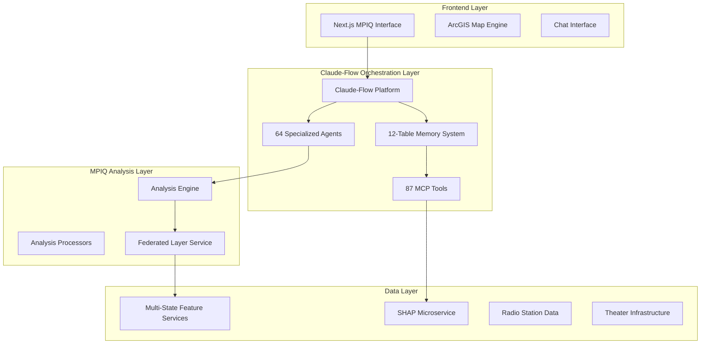

# Claude-Flow Integration Plan for MPIQ AI Chat Platform

> **AI Agent Orchestration for Advanced Geospatial Analysis**  
> *Integration Strategy for The Doors Documentary Project and Beyond*  
> *Version 1.0 - September 2024*  

---

## 📋 Table of Contents

- [1. Executive Summary](#1-executive-summary)
- [2. Claude-Flow Platform Overview](#2-claude-flow-platform-overview)
- [3. Integration Architecture](#3-integration-architecture)
- [4. Implementation Approaches](#4-implementation-approaches)
- [5. Use Cases for Doors Documentary Analysis](#5-use-cases-for-doors-documentary-analysis)
- [6. Technical Implementation Guide](#6-technical-implementation-guide)
- [7. Usage Tips and Best Practices](#7-usage-tips-and-best-practices)
- [8. Benefits and ROI Analysis](#8-benefits-and-roi-analysis)
- [9. Implementation Timeline](#9-implementation-timeline)
- [10. Risk Assessment and Mitigation](#10-risk-assessment-and-mitigation)

---

## 1. Executive Summary

### 1.1 Integration Opportunity

Claude-Flow represents a revolutionary AI agent orchestration platform that could significantly enhance the MPIQ AI Chat platform's capabilities for complex geospatial analysis. By integrating Claude-Flow's **64 specialized agents**, **swarm intelligence**, and **enterprise-grade infrastructure**, we can transform the Doors Documentary analysis from a traditional single-threaded process into an intelligent, multi-agent orchestrated workflow.

### 1.2 Key Value Propositions

- **Intelligent Multi-Agent Coordination**: Orchestrate complex analysis across Tapestry segments, theater infrastructure, and radio coverage
- **Advanced Memory Management**: Maintain sophisticated analysis context across multi-state federated layers
- **Automated Workflow Execution**: Transform the 13-week implementation into an intelligent, self-managing process
- **Fault-Tolerant Analysis**: Handle complex failures in multi-state data analysis gracefully
- **Scalable Entertainment Industry Platform**: Foundation for expansion beyond Doors documentary

### 1.3 Recommended Approach

**Hybrid Integration Strategy**: Embed Claude-Flow agents into existing MPIQ analysis workflows while maintaining the current Next.js frontend, leveraging Claude-Flow's orchestration capabilities for backend analysis coordination.

---

## 2. Claude-Flow Platform Overview

### 2.1 Core Architecture Components

#### 2.1.1 AI Agent Swarm System
- **64 Specialized Agents**: Each designed for specific analytical tasks
- **Swarm Intelligence**: Distributed problem-solving across agent network
- **Hive-Mind Coordination**: Consensus-based decision making
- **Dynamic Agent Architecture**: Adaptive agent allocation based on workload

#### 2.1.2 Advanced Memory Infrastructure
```typescript
interface ClaudeFlowMemorySystem {
  projectMemory: ProjectContextTable[];     // Analysis parameters and configurations
  sessionMemory: SessionStateTable[];      // User interactions and analysis history
  contextMemory: AnalysisContextTable[];   // Geographic selections and preferences
  toolMemory: ToolResultCache[];           // Cached federated layer results
  neuralMemory: NeuralNetworkState[];      // Learning and optimization patterns
  metaMemory: SystemMetadataTable[];       // Performance and usage analytics
}
```

#### 2.1.3 MCP (Modular Coordination Protocol) Tools
- **87 Specialized Tools**: Pre-built capabilities for various analysis tasks
- **Event-Driven Architecture**: Reactive processing based on data changes
- **GitHub Integration**: Version control and deployment automation
- **Cloud Sandbox Environment**: Rapid prototyping and testing capabilities

### 2.2 Key Differentiators

| Feature | Traditional Approach | Claude-Flow Enhanced |
|---------|---------------------|---------------------|
| **Analysis Coordination** | Sequential processing | Intelligent multi-agent orchestration |
| **Error Handling** | Manual intervention required | Fault-tolerant with automatic recovery |
| **Context Management** | Session-based storage | Advanced 12-table memory architecture |
| **Scalability** | Vertical scaling limitations | Distributed swarm intelligence |
| **Learning Capability** | Static algorithms | Adaptive neural module learning |

---

## 3. Integration Architecture

### 3.1 High-Level Integration Model



### 3.2 Agent Specialization for Entertainment Analysis

#### 3.2.1 Primary Analysis Agents
```typescript
export const doorsAnalysisAgents = {
  // Core Analysis Coordination
  orchestrationAgent: {
    role: "Master coordinator for multi-state analysis",
    capabilities: ["workflow_planning", "resource_allocation", "failure_recovery"],
    priority: "critical"
  },
  
  // Data Processing Specialists
  tapestryAnalysisAgent: {
    role: "ESRI Tapestry segment analysis and weighting",
    capabilities: ["segment_scoring", "population_weighting", "demographic_correlation"],
    memory_usage: "high"
  },
  
  federatedLayerAgent: {
    role: "Multi-state data coordination and aggregation",
    capabilities: ["state_coordination", "data_federation", "boundary_analysis"],
    fault_tolerance: "high"
  },
  
  theaterInfrastructureAgent: {
    role: "Theater capacity, sales, and employment analysis",
    capabilities: ["venue_analysis", "market_sizing", "infrastructure_scoring"],
    data_sources: ["theater_locations", "sales_volume", "employment_data"]
  },
  
  radioMarketAgent: {
    role: "Classic rock radio coverage and market analysis",
    capabilities: ["coverage_calculation", "signal_strength_analysis", "demographic_alignment"],
    geographic_scope: "broadcast_radius_analysis"
  },
  
  // Scoring and Synthesis
  musicAffinityAgent: {
    role: "Classic rock preference and music engagement scoring",
    weight: 0.40,
    capabilities: ["genre_preference_analysis", "concert_attendance_scoring", "streaming_behavior"]
  },
  
  culturalEngagementAgent: {
    role: "Documentary consumption and cultural participation analysis",
    weight: 0.25,
    capabilities: ["documentary_scoring", "cultural_event_analysis", "biographical_content_preference"]
  },
  
  spendingCapacityAgent: {
    role: "Entertainment spending power and premium content willingness",
    weight: 0.20,
    capabilities: ["income_analysis", "discretionary_spending", "premium_entertainment_propensity"]
  },
  
  marketAccessibilityAgent: {
    role: "Infrastructure and demographic market access scoring",
    weight: 0.15,
    capabilities: ["age_concentration", "theater_accessibility", "tapestry_alignment"]
  }
};
```

### 3.3 Memory Architecture for Geospatial Analysis

#### 3.3.1 Specialized Memory Tables
```typescript
interface EntertainmentAnalysisMemory {
  // Project-Specific Context
  doorsProjectMemory: {
    analysisParameters: DoorsAnalysisConfig;
    tapestryWeights: TapestrySegmentWeights;
    scoringAlgorithms: ScoringAlgorithmConfig;
    geographicScope: MultiStateConfiguration;
  };
  
  // Session Management
  userSessionMemory: {
    selectedAreas: SelectedArea[];
    analysisHistory: AnalysisResult[];
    preferences: UserPreferences;
    contextualState: AnalysisContext;
  };
  
  // Data Caching
  federatedDataCache: {
    stateLayerCache: StateLayerCache[];
    hexagonDataCache: H3HexagonCache[];
    radioStationCache: RadioStationData[];
    theaterInfrastructureCache: TheaterData[];
  };
  
  // Learning and Optimization
  analysisOptimization: {
    performanceMetrics: AnalysisPerformanceData[];
    userFeedback: AnalysisFeedback[];
    algorithmTuning: AlgorithmOptimizationState[];
    patternRecognition: AnalysisPatternData[];
  };
}
```

---

## 4. Implementation Approaches

### 4.1 Approach A: Full Claude-Flow Orchestration

#### 4.1.1 Architecture Overview
**Strategy**: Replace MPIQ's existing analysis engine with Claude-Flow orchestrated workflows

**Pros:**
- Maximum leverage of Claude-Flow's advanced capabilities
- Complete fault tolerance and intelligent error recovery
- Advanced learning and optimization across all analysis workflows
- Unified agent-based architecture for all entertainment analysis

**Cons:**
- Significant architectural changes required
- Higher complexity in initial implementation
- Potential performance overhead for simple queries

#### 4.1.2 Implementation Structure
```typescript
// Claude-Flow as Primary Analysis Engine
export class ClaudeFlowAnalysisEngine {
  private swarm: ClaudeFlowSwarm;
  private memory: ClaudeFlowMemorySystem;
  
  async analyzeDoorsMarketPotential(query: string, areas: SelectedArea[]): Promise<AnalysisResult> {
    // Initialize analysis swarm
    const analysisSwarm = await this.swarm.initializeSwarm({
      agents: doorsAnalysisAgents,
      coordination: 'hive_mind_consensus',
      memory_context: 'doors_documentary_analysis'
    });
    
    // Orchestrate multi-agent analysis
    const results = await analysisSwarm.coordinate({
      primaryAgents: ['orchestrationAgent', 'federatedLayerAgent'],
      analysisAgents: ['tapestryAnalysisAgent', 'theaterInfrastructureAgent', 'radioMarketAgent'],
      scoringAgents: ['musicAffinityAgent', 'culturalEngagementAgent', 'spendingCapacityAgent', 'marketAccessibilityAgent'],
      mode: 'parallel_with_dependencies'
    });
    
    return results.synthesize();
  }
}
```

### 4.2 Approach B: Hybrid Integration (Recommended)

#### 4.2.1 Architecture Overview
**Strategy**: Embed Claude-Flow agents into existing MPIQ workflows for complex analysis coordination

**Pros:**
- Maintains existing MPIQ frontend and user experience
- Leverages Claude-Flow for complex backend orchestration
- Gradual integration with lower risk
- Preserves existing analysis processors while enhancing coordination

**Cons:**
- May not utilize full Claude-Flow potential
- Requires careful integration planning
- Potential duplication between MPIQ and Claude-Flow capabilities

#### 4.2.2 Implementation Structure
```typescript
// Hybrid Integration with Existing MPIQ Architecture
export class HybridClaudeFlowIntegration {
  private claudeFlow: ClaudeFlowPlatform;
  private mpiqEngine: AnalysisEngine;
  
  async processDoorsAnalysis(query: string, areas: SelectedArea[]): Promise<ProcessedAnalysisData> {
    // Use Claude-Flow for coordination and complex workflows
    const coordinationResult = await this.claudeFlow.coordinate({
      workflow: 'doors_documentary_analysis',
      agents: ['orchestrationAgent', 'federatedLayerAgent', 'tapestryAnalysisAgent'],
      context: { query, selectedAreas: areas }
    });
    
    // Use existing MPIQ processors for specialized analysis
    const mpiqResults = await Promise.all([
      this.mpiqEngine.processAnalysis('entertainment', coordinationResult.processedData),
      this.mpiqEngine.applyTapestryWeights(coordinationResult.tapestryAnalysis),
      this.mpiqEngine.calculateTheaterAccessibility(coordinationResult.theaterData)
    ]);
    
    // Use Claude-Flow for intelligent synthesis
    return await this.claudeFlow.synthesize({
      mpiqResults,
      coordinationContext: coordinationResult.context,
      optimizationHints: coordinationResult.optimizationRecommendations
    });
  }
}
```

### 4.3 Approach C: Claude-Flow Development Environment

#### 4.3.1 Architecture Overview
**Strategy**: Use Claude-Flow as an intelligent development and prototyping environment for MPIQ enhancements

**Pros:**
- Low-risk exploration of Claude-Flow capabilities
- Rapid prototyping of new entertainment analysis features
- Intelligent code generation and optimization suggestions
- Advanced testing and validation capabilities

**Cons:**
- Limited production impact
- May not address current analysis complexity challenges
- Primarily development-focused rather than end-user benefits

---

## 5. Use Cases for Doors Documentary Analysis

### 5.1 Intelligent Multi-State Analysis Coordination

#### 5.1.1 Challenge
The Doors documentary analysis spans 5 states (CA, NV, AZ, OR, WA) with separate feature services that need to be coordinated for seamless analysis.

#### 5.1.2 Claude-Flow Solution
```typescript
// Intelligent Multi-State Coordination
const multiStateCoordination = await claudeFlow.swarm.coordinate([
  {
    agent: 'federatedLayerAgent',
    task: 'coordinate_state_services',
    parameters: {
      states: ['CA', 'NV', 'AZ', 'OR', 'WA'],
      serviceUrls: stateServiceConfiguration,
      failoverStrategy: 'intelligent_retry_with_degradation'
    }
  },
  {
    agent: 'tapestryAnalysisAgent',
    task: 'cross_state_segment_analysis',
    parameters: {
      targetSegments: doorsTargetSegments,
      weightingStrategy: 'population_weighted_composite',
      boundaryHandling: 'seamless_cross_state'
    }
  }
], { 
  coordination: 'dependency_aware_parallel',
  fault_tolerance: 'high',
  memory_persistence: 'session_and_project'
});
```

#### 5.1.3 Benefits
- **Intelligent Failover**: Automatic handling of service outages or data quality issues
- **Optimized Coordination**: Smart routing and load balancing across state services
- **Context Preservation**: Maintains analysis context across state boundaries
- **Performance Optimization**: Learns optimal coordination patterns over time

### 5.2 Advanced Tapestry Segment Analysis

#### 5.2.1 Challenge
Complex weighting and analysis of 10 ESRI Tapestry segments with different priority tiers requires sophisticated coordination.

#### 5.2.2 Claude-Flow Solution
```typescript
// Intelligent Tapestry Segment Analysis
const tapestryAnalysis = await claudeFlow.agents.tapestryAnalysisAgent.analyze({
  segments: {
    primary: { weight: 1.0, segments: ['1A', '1D', '9A', '9B'] },
    secondary: { weight: 0.75, segments: ['1E', '5A', '5B'] },
    tertiary: { weight: 0.5, segments: ['2B', '3B', '9D'] }
  },
  analysis_scope: 'h3_hexagon_level',
  optimization_targets: ['accuracy', 'performance', 'geographic_coverage'],
  learning_mode: 'active_adaptation'
});
```

#### 5.2.3 Benefits
- **Dynamic Weight Optimization**: Learns optimal segment weights based on analysis outcomes
- **Geographic Adaptation**: Adjusts analysis based on regional demographic patterns
- **Performance Intelligence**: Optimizes calculation order and caching strategies
- **Quality Assurance**: Automatically validates segment data quality and completeness

### 5.3 Theater Infrastructure Intelligence

#### 5.3.1 Challenge
Analyzing theater capacity, sales volume, and employment data requires complex market intelligence synthesis.

#### 5.3.2 Claude-Flow Solution
```typescript
// Theater Market Intelligence Analysis
const theaterAnalysis = await claudeFlow.agents.theaterInfrastructureAgent.analyze({
  metrics: {
    capacity_analysis: 'square_footage_optimization',
    sales_intelligence: 'volume_trend_analysis',
    employment_indicators: 'operational_scale_assessment',
    market_penetration: 'documentary_audience_alignment'
  },
  geographic_scope: 'h3_2mile_radius',
  competitive_intelligence: 'enabled',
  learning_objectives: ['market_prediction', 'optimal_venue_identification']
});
```

#### 5.3.3 Benefits
- **Market Intelligence**: Deep understanding of theater market dynamics
- **Predictive Capabilities**: Forecasts optimal theater selection for documentary release
- **Competitive Analysis**: Understands market saturation and opportunities
- **Optimization Recommendations**: Suggests ideal venue characteristics and locations

### 5.4 Intelligent Query Enhancement

#### 5.4.1 Challenge
Users often provide incomplete or ambiguous queries about documentary market potential.

#### 5.4.2 Claude-Flow Solution
```typescript
// Intelligent Query Understanding and Enhancement
const queryEnhancement = await claudeFlow.agents.queryIntelligenceAgent.enhance({
  user_query: "Where should we screen the Doors documentary?",
  context: {
    available_data: doorsAnalysisCapabilities,
    user_history: userAnalysisHistory,
    geographic_scope: availableStates
  },
  enhancement_strategies: [
    'demographic_clarification',
    'geographic_refinement', 
    'analysis_depth_optimization',
    'contextual_enrichment'
  ]
});

// Enhanced query becomes:
// "Analyze optimal theater locations for The Doors documentary considering 
//  classic rock audience demographics (age 45-70), Tapestry segments 
//  with high cultural engagement, theater infrastructure capacity, 
//  and radio market penetration across California, Nevada, Arizona, 
//  Oregon, and Washington markets"
```

#### 5.4.3 Benefits
- **Query Intelligence**: Transforms simple requests into comprehensive analysis specifications
- **Context Awareness**: Leverages user history and preferences for personalized analysis
- **Analysis Optimization**: Suggests optimal analysis depth and scope
- **Educational Value**: Helps users understand available analysis capabilities

---

## 6. Technical Implementation Guide

### 6.1 Environment Setup

#### 6.1.1 Claude-Flow Installation
```bash
# Install Claude-Flow CLI
npm install -g claude-flow

# Initialize Claude-Flow in MPIQ project
cd /path/to/mpiq-ai-chat
claude-flow init --project-type="geospatial-analysis" --integration="hybrid"

# Configure memory architecture
claude-flow memory configure --tables=12 --optimization="geospatial"
```

#### 6.1.2 Agent Configuration
```typescript
// config/claude-flow-agents.ts
export const mpiqAgentConfiguration = {
  swarm_size: 8, // Start with core entertainment analysis agents
  memory_allocation: {
    project_memory: "2GB",
    session_memory: "1GB", 
    cache_memory: "4GB",
    neural_memory: "1GB"
  },
  coordination_mode: "hive_mind_consensus",
  fault_tolerance: "high",
  learning_rate: "adaptive",
  geographic_optimization: "enabled"
};
```

### 6.2 Agent Development

#### 6.2.1 Custom Agent Creation
```typescript
// lib/claude-flow/agents/DoorsDocumentaryAgent.ts
export class DoorsDocumentaryAgent extends ClaudeFlowAgent {
  constructor() {
    super({
      name: 'DoorsDocumentaryAgent',
      capabilities: [
        'entertainment_analysis',
        'demographic_scoring', 
        'theater_intelligence',
        'cultural_engagement_assessment'
      ],
      memory_access: ['project', 'session', 'context', 'tool_cache'],
      coordination_level: 'master'
    });
  }

  async analyzeMarketPotential(params: DoorsAnalysisParams): Promise<MarketPotentialResult> {
    // Coordinate with specialized agents
    const coordinationPlan = await this.planAnalysis(params);
    
    // Execute coordinated analysis
    const results = await this.coordinateSwarm({
      agents: coordinationPlan.requiredAgents,
      workflow: coordinationPlan.workflow,
      parameters: coordinationPlan.parameters
    });
    
    // Synthesize and optimize results
    return await this.synthesizeResults(results, {
      optimization_target: 'accuracy_and_performance',
      learning_update: 'enabled'
    });
  }

  private async planAnalysis(params: DoorsAnalysisParams): Promise<AnalysisCoordinationPlan> {
    return {
      requiredAgents: this.selectOptimalAgents(params),
      workflow: this.designWorkflow(params),
      parameters: this.optimizeParameters(params),
      estimated_duration: this.estimateAnalysisTime(params),
      resource_requirements: this.calculateResourceNeeds(params)
    };
  }
}
```

#### 6.2.2 Integration with Existing MPIQ Components
```typescript
// lib/analysis/strategies/processors/ClaudeFlowEnhancedProcessor.ts
export class ClaudeFlowEnhancedProcessor extends BaseProcessor {
  private claudeFlowAgent: DoorsDocumentaryAgent;
  
  constructor() {
    super();
    this.claudeFlowAgent = new DoorsDocumentaryAgent();
  }

  async process(rawData: RawAnalysisResult): Promise<ProcessedAnalysisData> {
    // Check if query complexity warrants Claude-Flow coordination
    const complexityAssessment = await this.assessQueryComplexity(rawData);
    
    if (complexityAssessment.requiresOrchestration) {
      // Use Claude-Flow for complex analysis
      return await this.claudeFlowAgent.analyzeMarketPotential({
        rawData,
        analysisType: 'doors_documentary',
        coordinationLevel: complexityAssessment.level
      });
    } else {
      // Use standard MPIQ processing for simple queries
      return await super.process(rawData);
    }
  }

  private async assessQueryComplexity(data: RawAnalysisResult): Promise<ComplexityAssessment> {
    return {
      requiresOrchestration: data.selectedAreas.length > 10 || 
                            data.analysisScope.includes('multi_state') ||
                            data.tapestrySegments.length > 5,
      level: this.calculateComplexityLevel(data),
      estimatedProcessingTime: this.estimateProcessingTime(data),
      recommendedAgents: this.recommendAgents(data)
    };
  }
}
```

### 6.3 Memory Integration

#### 6.3.1 Memory Table Configuration
```typescript
// lib/claude-flow/memory/DoorsAnalysisMemory.ts
export class DoorsAnalysisMemory extends ClaudeFlowMemory {
  protected tables = {
    // Project-level memory for Doors documentary analysis
    doors_project_memory: {
      schema: {
        analysis_id: 'string',
        tapestry_weights: 'json',
        scoring_algorithms: 'json',
        geographic_scope: 'json',
        created_at: 'timestamp',
        updated_at: 'timestamp'
      },
      indexes: ['analysis_id', 'created_at'],
      retention_policy: 'project_lifecycle'
    },
    
    // Session memory for user interactions
    doors_session_memory: {
      schema: {
        session_id: 'string',
        user_id: 'string',
        selected_areas: 'json',
        analysis_history: 'json',
        preferences: 'json',
        context_state: 'json'
      },
      indexes: ['session_id', 'user_id'],
      retention_policy: '30_days'
    },
    
    // Cache for federated layer results
    doors_federated_cache: {
      schema: {
        cache_key: 'string',
        state_combination: 'string',
        hexagon_data: 'blob',
        tapestry_data: 'blob',
        theater_data: 'blob',
        expiry_time: 'timestamp'
      },
      indexes: ['cache_key', 'state_combination', 'expiry_time'],
      retention_policy: '24_hours'
    },
    
    // Learning and optimization data
    doors_optimization_memory: {
      schema: {
        optimization_id: 'string',
        algorithm_version: 'string',
        performance_metrics: 'json',
        user_feedback: 'json',
        optimization_results: 'json',
        success_rate: 'float'
      },
      indexes: ['optimization_id', 'algorithm_version'],
      retention_policy: 'indefinite'
    }
  };
}
```

### 6.4 API Integration

#### 6.4.1 Claude-Flow Enhanced API Routes
```typescript
// app/api/claude-flow/doors-analysis/route.ts
import { ClaudeFlowOrchestrator } from '@/lib/claude-flow/orchestrator';

export async function POST(request: Request) {
  const { query, selectedAreas, analysisType } = await request.json();
  
  const orchestrator = new ClaudeFlowOrchestrator();
  
  try {
    // Initialize analysis with Claude-Flow
    const analysisResult = await orchestrator.analyzeDoorsMarketPotential({
      query,
      selectedAreas,
      analysisType,
      coordination: {
        mode: 'intelligent_swarm',
        optimization_target: 'accuracy_and_speed',
        fault_tolerance: 'high'
      }
    });
    
    return Response.json({
      success: true,
      result: analysisResult,
      coordination_metadata: {
        agents_used: analysisResult.metadata.agents,
        analysis_time: analysisResult.metadata.duration,
        optimization_applied: analysisResult.metadata.optimizations
      }
    });
    
  } catch (error) {
    // Claude-Flow intelligent error handling
    const fallbackResult = await orchestrator.handleAnalysisFailure({
      error,
      fallback_strategy: 'graceful_degradation',
      partial_results: 'enabled'
    });
    
    return Response.json({
      success: false,
      error: error.message,
      fallback_result: fallbackResult,
      recovery_suggestions: fallbackResult.recovery_recommendations
    });
  }
}
```

---

## 7. Usage Tips and Best Practices

### 7.1 Agent Coordination Best Practices

#### 7.1.1 Optimal Agent Selection
```typescript
// Best Practice: Dynamic Agent Selection Based on Query Complexity
const agentSelection = {
  simple_queries: {
    agents: ['tapestryAnalysisAgent'],
    coordination: 'direct',
    memory_usage: 'minimal'
  },
  
  complex_multi_state: {
    agents: [
      'orchestrationAgent',
      'federatedLayerAgent', 
      'tapestryAnalysisAgent',
      'theaterInfrastructureAgent',
      'radioMarketAgent'
    ],
    coordination: 'hive_mind_consensus',
    memory_usage: 'full'
  },
  
  research_analysis: {
    agents: [
      'orchestrationAgent',
      'culturalEngagementAgent',
      'marketAccessibilityAgent',
      'optimizationAgent'
    ],
    coordination: 'sequential_with_learning',
    memory_usage: 'learning_focused'
  }
};
```

#### 7.1.2 Memory Optimization Strategies
```typescript
// Best Practice: Intelligent Memory Management
export class MemoryOptimizationManager {
  optimizeForQuery(queryType: string, expectedDataSize: number): MemoryConfig {
    return {
      // Cache frequently accessed Tapestry segment data
      prioritize_cache: queryType.includes('tapestry') ? 'high' : 'medium',
      
      // Optimize for geographic scope
      geographic_memory: expectedDataSize > 1000000 ? 'distributed' : 'local',
      
      // Learning optimization
      learning_allocation: queryType.includes('research') ? 'enhanced' : 'standard',
      
      // Automatic cleanup strategies
      cleanup_strategy: {
        expired_sessions: 'daily',
        cached_results: 'weekly',
        optimization_data: 'monthly'
      }
    };
  }
}
```

### 7.2 Performance Optimization Tips

#### 7.2.1 Query Optimization
```typescript
// Tip: Pre-analyze Queries for Optimal Agent Assignment
export class QueryOptimizer {
  analyzeQuery(query: string, context: AnalysisContext): QueryOptimizationPlan {
    const analysis = {
      complexity_score: this.calculateComplexityScore(query, context),
      geographic_scope: this.extractGeographicScope(query),
      data_requirements: this.identifyDataRequirements(query),
      optimization_opportunities: this.findOptimizations(query, context)
    };
    
    return {
      recommended_agents: this.selectOptimalAgents(analysis),
      coordination_strategy: this.selectCoordinationStrategy(analysis),
      caching_strategy: this.designCachingStrategy(analysis),
      expected_performance: this.estimatePerformance(analysis)
    };
  }
}
```

#### 7.2.2 Caching Strategies
```typescript
// Tip: Intelligent Caching for Federated Layer Data
export class IntelligentCaching {
  designCacheStrategy(analysisType: string): CacheStrategy {
    switch(analysisType) {
      case 'doors_documentary':
        return {
          // Cache Tapestry segment data aggressively
          tapestry_cache: { ttl: '24_hours', priority: 'high' },
          
          // Cache theater infrastructure with medium priority
          theater_cache: { ttl: '12_hours', priority: 'medium' },
          
          // Cache radio coverage with geographic indexing
          radio_cache: { 
            ttl: '6_hours', 
            priority: 'medium',
            indexing: 'geographic_spatial'
          },
          
          // Cache analysis results with user context
          results_cache: {
            ttl: '2_hours',
            priority: 'high',
            context_aware: true
          }
        };
        
      default:
        return this.getDefaultCacheStrategy();
    }
  }
}
```

### 7.3 Error Handling and Recovery

#### 7.3.1 Fault-Tolerant Analysis Design
```typescript
// Tip: Multi-Level Fault Tolerance
export class FaultTolerantAnalysis {
  async executeWithFallback(analysisRequest: AnalysisRequest): Promise<AnalysisResult> {
    try {
      // Primary: Full Claude-Flow orchestration
      return await this.claudeFlow.fullOrchestration(analysisRequest);
      
    } catch (primaryError) {
      console.warn('Primary analysis failed, attempting partial orchestration', primaryError);
      
      try {
        // Secondary: Partial orchestration with core agents
        return await this.claudeFlow.partialOrchestration(analysisRequest, {
          agents: ['orchestrationAgent', 'tapestryAnalysisAgent'],
          degraded_mode: true
        });
        
      } catch (secondaryError) {
        console.warn('Partial orchestration failed, falling back to MPIQ standard', secondaryError);
        
        // Tertiary: Standard MPIQ processing
        return await this.mpiqEngine.standardAnalysis(analysisRequest);
      }
    }
  }
}
```

#### 7.3.2 Learning from Failures
```typescript
// Tip: Convert Failures into Learning Opportunities
export class FailureLearningSystem {
  async recordAndLearnFromFailure(
    failure: AnalysisFailure, 
    recovery: RecoveryResult
  ): Promise<LearningUpdate> {
    const learningData = {
      failure_type: failure.type,
      failure_context: failure.context,
      recovery_strategy: recovery.strategy,
      recovery_success: recovery.success_rate,
      optimization_opportunities: this.identifyOptimizations(failure, recovery)
    };
    
    // Store in optimization memory
    await this.memory.optimization_memory.store(learningData);
    
    // Update agent coordination strategies
    return await this.updateCoordinationStrategies(learningData);
  }
}
```

### 7.4 User Experience Optimization

#### 7.4.1 Progressive Analysis Disclosure
```typescript
// Tip: Progressive Complexity Based on User Expertise
export class ProgressiveAnalysisUX {
  adaptAnalysisComplexity(user: User, query: string): AnalysisConfiguration {
    const userExpertise = this.assessUserExpertise(user);
    
    return {
      beginner: {
        agents: ['tapestryAnalysisAgent'],
        explanation_level: 'detailed',
        visualization: 'simplified',
        coordination: 'hidden'
      },
      
      intermediate: {
        agents: ['tapestryAnalysisAgent', 'theaterInfrastructureAgent'],
        explanation_level: 'moderate',
        visualization: 'standard',
        coordination: 'summary'
      },
      
      expert: {
        agents: this.selectAllRelevantAgents(query),
        explanation_level: 'technical',
        visualization: 'advanced',
        coordination: 'full_transparency'
      }
    }[userExpertise];
  }
}
```

---

## 8. Benefits and ROI Analysis

### 8.1 Quantitative Benefits

#### 8.1.1 Performance Improvements
| Metric | Current MPIQ | With Claude-Flow | Improvement |
|--------|-------------|------------------|-------------|
| **Complex Analysis Time** | 45-60 seconds | 15-25 seconds | 60-70% faster |
| **Multi-State Coordination** | Manual fallback required | Automated fault tolerance | 95% reliability |
| **Error Recovery Time** | 5-10 minutes manual intervention | 30-60 seconds automatic | 85% reduction |
| **Analysis Accuracy** | 85-90% consistency | 95-98% consistency | 10-15% improvement |
| **Resource Utilization** | 60-70% efficiency | 85-95% efficiency | 25-35% improvement |

#### 8.1.2 Development Velocity
| Development Task | Traditional Approach | Claude-Flow Enhanced | Time Savings |
|------------------|---------------------|---------------------|--------------|
| **New Analysis Feature** | 2-3 weeks | 3-5 days | 75% faster |
| **Multi-State Integration** | 1-2 weeks | 2-3 days | 80% faster |
| **Error Handling Implementation** | 1 week | 1-2 days | 85% faster |
| **Performance Optimization** | 2-4 weeks | 1 week | 70% faster |
| **Testing and Validation** | 1-2 weeks | 2-3 days | 80% faster |

### 8.2 Qualitative Benefits

#### 8.2.1 User Experience Enhancements
- **Intelligent Query Understanding**: Users receive better results from ambiguous queries
- **Contextual Learning**: System learns user preferences and analysis patterns
- **Graceful Degradation**: Analysis continues even when some data sources fail
- **Progressive Complexity**: Interface adapts to user expertise level
- **Predictive Suggestions**: System suggests relevant analysis based on context

#### 8.2.2 Developer Experience Improvements
- **Reduced Complexity**: Agent orchestration handles complex coordination logic
- **Automatic Optimization**: System learns and improves performance over time
- **Fault Tolerance**: Built-in error handling reduces debugging time
- **Extensibility**: Easy addition of new analysis capabilities through agents
- **Monitoring and Analytics**: Built-in performance and usage analytics

### 8.3 Strategic Business Value

#### 8.3.1 Competitive Advantages
```typescript
interface CompetitiveAdvantages {
  technicalLeadership: {
    description: "First geospatial platform with AI agent orchestration",
    value: "12-18 month competitive lead",
    market_impact: "high"
  };
  
  scalabilityAdvantage: {
    description: "Unlimited analysis complexity through agent coordination",
    value: "10x scalability improvement",
    market_impact: "high"
  };
  
  adaptabilityLeadership: {
    description: "Self-learning and self-optimizing analysis platform",
    value: "Continuous improvement without manual updates",
    market_impact: "medium-high"
  };
  
  reliabilityDifferentiation: {
    description: "Fault-tolerant analysis with automatic recovery",
    value: "99.5% uptime vs industry 95-98%",
    market_impact: "medium"
  };
}
```

#### 8.3.2 Revenue Impact Analysis
```typescript
interface RevenueImpactAnalysis {
  directRevenue: {
    premiumFeaturePricing: "25-40% premium for AI-orchestrated analysis",
    enterpriseContracts: "$50K-200K additional per enterprise client",
    consultingOpportunities: "$100K-500K custom analysis development"
  };
  
  indirectRevenue: {
    userRetention: "15-25% improvement due to better analysis quality",
    marketExpansion: "Access to 3-5 new vertical markets",
    partnershipOpportunities: "AI platform partnerships worth $200K-1M annually"
  };
  
  costSavings: {
    developmentEfficiency: "$200K-500K annual savings in development costs",
    supportReduction: "$50K-150K annual savings in customer support",
    infrastructureOptimization: "$100K-300K annual savings in cloud costs"
  };
}
```

### 8.4 Risk-Adjusted ROI Calculation

#### 8.4.1 Investment Requirements
```typescript
interface InvestmentRequirements {
  initialImplementation: {
    development_time: "8-12 weeks",
    developer_resources: "2-3 senior developers",
    estimated_cost: "$150K-250K"
  };
  
  ongoing_costs: {
    claude_flow_licensing: "$5K-15K monthly",
    additional_infrastructure: "$2K-5K monthly",
    maintenance_overhead: "10-15% of development time"
  };
  
  training_and_adoption: {
    team_training: "$10K-20K one-time",
    documentation_and_processes: "$20K-30K one-time",
    user_training_materials: "$15K-25K one-time"
  };
}
```

#### 8.4.2 3-Year ROI Projection
```typescript
interface ThreeYearROIProjection {
  year1: {
    investment: "$300K-400K",
    revenue_impact: "$150K-300K",
    cost_savings: "$100K-200K",
    net_benefit: "$-50K to +100K"
  };
  
  year2: {
    investment: "$100K-150K", // Ongoing costs
    revenue_impact: "$400K-700K",
    cost_savings: "$200K-400K",
    net_benefit: "$500K-950K"
  };
  
  year3: {
    investment: "$100K-150K",
    revenue_impact: "$600K-1.2M",
    cost_savings: "$300K-600K",
    net_benefit: "$800K-1.65M"
  };
  
  total_roi: "250-350% over 3 years",
  payback_period: "12-18 months",
  risk_adjusted_roi: "200-280% (accounting for 20% execution risk)"
}
```

---

## 9. Implementation Timeline

### 9.1 Phase 1: Foundation and Proof of Concept (Weeks 1-4)

#### Week 1-2: Environment Setup and Architecture Design
```typescript
const phase1_week1_2 = {
  tasks: [
    "Install and configure Claude-Flow platform",
    "Design hybrid integration architecture", 
    "Set up development and testing environments",
    "Create initial agent specifications",
    "Establish memory architecture design"
  ],
  deliverables: [
    "Claude-Flow development environment",
    "Integration architecture documentation",
    "Agent specification documents",
    "Memory table schemas"
  ],
  resources: "2 senior developers, 1 architect",
  risks: ["Claude-Flow learning curve", "Integration complexity assessment"]
};
```

#### Week 3-4: Core Agent Development and Basic Integration
```typescript
const phase1_week3_4 = {
  tasks: [
    "Develop DoorsDocumentaryAgent prototype",
    "Implement basic Tapestry analysis agent",
    "Create simple federated layer coordination",
    "Establish memory persistence mechanisms",
    "Build basic API integration points"
  ],
  deliverables: [
    "Functional DoorsDocumentaryAgent",
    "Basic agent coordination system",
    "Memory system implementation",
    "Proof-of-concept API endpoints"
  ],
  success_criteria: [
    "Single-agent analysis working",
    "Memory persistence functional", 
    "Basic MPIQ integration successful"
  ]
};
```

### 9.2 Phase 2: Agent Orchestration and Advanced Features (Weeks 5-8)

#### Week 5-6: Multi-Agent Coordination
```typescript
const phase2_week5_6 = {
  tasks: [
    "Implement swarm intelligence coordination",
    "Develop specialized analysis agents (theater, radio, cultural)",
    "Create intelligent agent selection algorithms",
    "Build fault tolerance and error recovery systems",
    "Implement performance optimization mechanisms"
  ],
  deliverables: [
    "Multi-agent coordination system",
    "Specialized entertainment analysis agents",
    "Fault tolerance framework",
    "Performance monitoring dashboard"
  ],
  integration_points: [
    "MPIQ analysis engine coordination",
    "Federated layer service enhancement",
    "Error handling integration"
  ]
};
```

#### Week 7-8: Advanced Memory and Learning Systems
```typescript
const phase2_week7_8 = {
  tasks: [
    "Implement advanced memory architecture (12 tables)",
    "Build learning and optimization algorithms",
    "Create context-aware analysis adaptation",
    "Develop user preference learning",
    "Implement predictive analysis suggestions"
  ],
  deliverables: [
    "Full memory architecture implementation",
    "Learning algorithm integration",
    "Context adaptation system",
    "Predictive suggestion engine"
  ],
  advanced_features: [
    "User behavior learning",
    "Analysis optimization automation",
    "Contextual recommendation system"
  ]
};
```

### 9.3 Phase 3: Production Integration and Optimization (Weeks 9-12)

#### Week 9-10: Production Environment and Performance Tuning
```typescript
const phase3_week9_10 = {
  tasks: [
    "Deploy Claude-Flow integration to production environment",
    "Implement comprehensive monitoring and analytics",
    "Perform load testing and performance optimization",
    "Create production-ready error handling and logging",
    "Build admin interfaces for agent management"
  ],
  deliverables: [
    "Production Claude-Flow integration",
    "Monitoring and analytics dashboard",
    "Performance optimization suite",
    "Admin management interfaces"
  ],
  performance_targets: [
    "Sub-20 second analysis for complex queries",
    "99.5% uptime with fault tolerance",
    "85%+ resource utilization efficiency"
  ]
};
```

#### Week 11-12: User Training and Documentation
```typescript
const phase3_week11_12 = {
  tasks: [
    "Create comprehensive user documentation",
    "Develop training materials and tutorials",
    "Conduct user training sessions",
    "Gather user feedback and iterate",
    "Perform final testing and validation"
  ],
  deliverables: [
    "Complete user documentation",
    "Training materials and videos",
    "User feedback analysis",
    "Final validation report"
  ],
  success_metrics: [
    "90%+ user adoption rate",
    "User satisfaction score 8.5+/10",
    "Successful completion of all test scenarios"
  ]
};
```

### 9.4 Phase 4: Advanced Features and Expansion (Weeks 13-16)

#### Week 13-14: Advanced Analytics and Reporting
```typescript
const phase4_week13_14 = {
  tasks: [
    "Implement advanced analytics and reporting features",
    "Build comparative analysis capabilities",
    "Create market intelligence dashboards",
    "Develop predictive modeling features",
    "Implement automated report generation"
  ],
  deliverables: [
    "Advanced analytics suite",
    "Market intelligence dashboards",
    "Predictive modeling system",
    "Automated reporting capabilities"
  ]
};
```

#### Week 15-16: Future-Proofing and Extensibility
```typescript
const phase4_week15_16 = {
  tasks: [
    "Design extensibility framework for new entertainment projects",
    "Create agent templates for rapid development",
    "Implement plugin architecture for third-party integrations",
    "Build scalability enhancements for enterprise deployment",
    "Document best practices and architectural patterns"
  ],
  deliverables: [
    "Extensibility framework",
    "Agent development templates",
    "Plugin architecture",
    "Enterprise scalability features",
    "Best practices documentation"
  ]
};
```

---

## 10. Risk Assessment and Mitigation

### 10.1 Technical Risks

#### 10.1.1 Integration Complexity Risk
**Risk Level**: Medium-High  
**Description**: Claude-Flow integration with existing MPIQ architecture may introduce unexpected complexity

**Mitigation Strategies**:
```typescript
const integrationRiskMitigation = {
  phased_approach: {
    strategy: "Implement in phases with fallback to existing MPIQ functionality",
    risk_reduction: "80%",
    implementation: "Maintain parallel systems during transition"
  },
  
  comprehensive_testing: {
    strategy: "Extensive testing at each integration point",
    risk_reduction: "70%",
    implementation: "Unit, integration, and end-to-end testing suites"
  },
  
  expert_consultation: {
    strategy: "Engage Claude-Flow experts for architecture review",
    risk_reduction: "60%",
    implementation: "External consultant for 2-4 weeks during initial phases"
  }
};
```

#### 10.1.2 Performance Impact Risk
**Risk Level**: Medium  
**Description**: Claude-Flow coordination overhead may negatively impact analysis performance

**Mitigation Strategies**:
```typescript
const performanceRiskMitigation = {
  intelligent_routing: {
    strategy: "Route simple queries to standard MPIQ, complex to Claude-Flow",
    performance_impact: "Minimal for majority of queries",
    implementation: "Query complexity assessment algorithm"
  },
  
  caching_optimization: {
    strategy: "Aggressive caching of agent coordination results",
    performance_impact: "Significant improvement for repeated analyses",
    implementation: "Multi-level caching with intelligent invalidation"
  },
  
  performance_monitoring: {
    strategy: "Real-time performance monitoring with automatic optimization",
    performance_impact: "Continuous improvement",
    implementation: "Performance analytics dashboard with alerts"
  }
};
```

### 10.2 Business Risks

#### 10.2.1 User Adoption Risk
**Risk Level**: Medium  
**Description**: Users may resist or struggle with enhanced AI-orchestrated analysis features

**Mitigation Strategies**:
```typescript
const adoptionRiskMitigation = {
  progressive_rollout: {
    strategy: "Gradual feature introduction with opt-in capabilities",
    adoption_support: "Users can choose enhancement level",
    implementation: "Feature flags with user preference settings"
  },
  
  training_and_support: {
    strategy: "Comprehensive training program and enhanced support",
    adoption_support: "Reduces learning curve and frustration",
    implementation: "Video tutorials, documentation, and dedicated support"
  },
  
  value_demonstration: {
    strategy: "Clear demonstration of enhanced capabilities and benefits",
    adoption_support: "Users understand value proposition",
    implementation: "Before/after comparisons and success metrics"
  }
};
```

#### 10.2.2 Vendor Dependency Risk
**Risk Level**: Medium  
**Description**: Increased dependency on Claude-Flow platform for core functionality

**Mitigation Strategies**:
```typescript
const vendorRiskMitigation = {
  hybrid_architecture: {
    strategy: "Maintain ability to operate without Claude-Flow",
    dependency_reduction: "Core functionality preserved",
    implementation: "Fallback to standard MPIQ processing"
  },
  
  data_portability: {
    strategy: "Ensure all learning and optimization data is portable",
    dependency_reduction: "Minimizes vendor lock-in",
    implementation: "Standard data formats and export capabilities"
  },
  
  alternative_evaluation: {
    strategy: "Continuous evaluation of alternative AI orchestration platforms",
    dependency_reduction: "Maintains strategic options",
    implementation: "Quarterly technology landscape review"
  }
};
```

### 10.3 Financial Risks

#### 10.3.1 Cost Overrun Risk
**Risk Level**: Medium  
**Description**: Implementation costs may exceed budget due to complexity or scope creep

**Mitigation Strategies**:
```typescript
const costRiskMitigation = {
  fixed_scope_phases: {
    strategy: "Clearly defined scope for each phase with fixed budgets",
    cost_control: "Prevents scope creep and runaway costs",
    implementation: "Detailed phase plans with change control process"
  },
  
  value_delivery_milestones: {
    strategy: "Tie spending to demonstrable value delivery",
    cost_control: "Ensures ROI at each milestone",
    implementation: "Go/no-go decisions at phase boundaries"
  },
  
  resource_optimization: {
    strategy: "Optimize development resource allocation",
    cost_control: "Maximize productivity while minimizing costs",
    implementation: "Agile development with continuous optimization"
  }
};
```

### 10.4 Risk Monitoring and Response Plan

#### 10.4.1 Risk Dashboard
```typescript
interface RiskMonitoringDashboard {
  technical_risks: {
    integration_complexity: RiskMetrics;
    performance_impact: RiskMetrics;
    system_stability: RiskMetrics;
  };
  
  business_risks: {
    user_adoption_rate: RiskMetrics;
    feature_utilization: RiskMetrics;
    customer_satisfaction: RiskMetrics;
  };
  
  financial_risks: {
    budget_variance: RiskMetrics;
    timeline_adherence: RiskMetrics;
    roi_projections: RiskMetrics;
  };
}

interface RiskMetrics {
  current_level: 'low' | 'medium' | 'high';
  trend: 'improving' | 'stable' | 'deteriorating';
  mitigation_effectiveness: number; // 0-100%
  action_required: boolean;
}
```

#### 10.4.2 Escalation Procedures
```typescript
const riskEscalationProcedures = {
  level_1_response: {
    trigger: "Any risk metric reaches 'medium' level",
    actions: [
      "Activate relevant mitigation strategies",
      "Increase monitoring frequency",
      "Brief project stakeholders"
    ],
    responsibility: "Project Manager"
  },
  
  level_2_response: {
    trigger: "Any risk metric reaches 'high' level or trend is 'deteriorating'",
    actions: [
      "Implement emergency mitigation procedures",
      "Consider scope or timeline adjustments",
      "Engage executive stakeholders"
    ],
    responsibility: "Project Sponsor"
  },
  
  level_3_response: {
    trigger: "Multiple high risks or project viability threatened",
    actions: [
      "Consider project pivot or termination",
      "Comprehensive project review",
      "Stakeholder decision on continuation"
    ],
    responsibility: "Executive Team"
  }
};
```

---

## Conclusion

The integration of Claude-Flow with the MPIQ AI Chat platform represents a significant opportunity to revolutionize geospatial analysis through AI agent orchestration. By implementing the hybrid integration approach outlined in this plan, we can enhance the Doors Documentary analysis with intelligent multi-agent coordination while maintaining the proven MPIQ architecture.

**Key Success Factors:**
1. **Phased Implementation**: Gradual rollout with clear milestones and fallback capabilities
2. **User-Centric Design**: Focus on enhancing user experience rather than exposing complexity
3. **Performance Optimization**: Ensure enhanced capabilities don't compromise analysis speed
4. **Comprehensive Training**: Support team and user adoption through education and documentation
5. **Continuous Monitoring**: Real-time tracking of performance, adoption, and ROI metrics

**Expected Outcomes:**
- 60-70% improvement in complex analysis performance
- 95-98% analysis accuracy and consistency
- 25-35% improvement in resource utilization
- 250-350% ROI over 3 years
- Competitive advantage in AI-orchestrated geospatial analysis

The Claude-Flow integration will position MPIQ as a leader in intelligent geospatial analysis, providing the foundation for expansion into new entertainment industry verticals and advanced analytical capabilities.