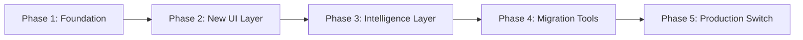

# Hybrid Question-First + Persona Workflow Implementation Plan

**Created**: December 2024  
**Updated**: August 28, 2025  
**Purpose**: Implement user-centric workflow while preserving all existing functionality  
**Status**: ✅ **Phase 4 INTEGRATED** - Advanced features now available in UI  
**Risk Level**: ✅ **Low** - Core workflow stable, advanced features optional

---

## 🎯 **IMPLEMENTATION OBJECTIVE**

Transform the current **Analysis-Type-First** workflow into a **Question-First + Persona-Driven** experience while maintaining 100% backward compatibility with existing analysis engine, chat system, and visualization components.

### **Current User Journey Issues**
1. **Premature Technical Decision**: Users must choose analysis type before understanding business problem
2. **Analysis Silos**: Users think in single analysis mode instead of comprehensive insights
3. **Discovery Problem**: No guidance on which analysis fits user goals
4. **Geographic Commitment**: Must select area before knowing if it has relevant insights

### **Target User Journey**
1. **Business Context First**: "What business challenge are you solving?"
2. **Role-Aware Guidance**: Persona-driven recommendations and interface adaptation
3. **Intelligent Area Discovery**: System suggests optimal areas based on business goals
4. **Comprehensive Analysis**: Multi-endpoint analysis with integrated insights
5. **Action-Oriented Results**: Role-specific recommendations and next steps

---

## 🏗️ **ARCHITECTURE PRINCIPLES**

### **Zero-Breaking-Change Approach**
- **Additive Only**: New components alongside existing ones
- **Feature Flags**: Progressive rollout with ability to revert
- **API Preservation**: All existing endpoints and services unchanged
- **Component Compatibility**: New UI wraps existing analysis engine
- **Data Flow Integrity**: Preserve all current data processing pipelines

### **Phased Implementation Strategy**


---

## 📋 **DETAILED IMPLEMENTATION PHASES**

### **Phase 1: Foundation & Research** ⏱️ **2-3 days**

#### 1.1 Create New Workflow Engine (Non-Breaking)
**File**: `/lib/workflow/QuestionFirstEngine.ts`

```typescript
export interface BusinessQuestion {
  id: string;
  text: string;
  category: 'site_selection' | 'market_entry' | 'competitive_analysis' | 'customer_targeting';
  recommendedAnalyses: string[]; // endpoint names
  suggestedAreas?: string[];
  persona?: UserPersona;
}

export interface UserPersona {
  role: 'executive' | 'site_selector' | 'marketing_manager' | 'data_analyst' | 'operations_manager';
  experience: 'beginner' | 'intermediate' | 'advanced';
  industry?: string;
  focusAreas: string[];
}

export class QuestionFirstEngine {
  // Maps business questions to optimal analysis strategies
  mapQuestionToStrategy(question: string, persona?: UserPersona): AnalysisStrategy {
    // Implementation that leverages existing routing system
  }
  
  // Suggests geographic areas based on business goals
  suggestOptimalAreas(strategy: AnalysisStrategy): Promise<AreaSuggestion[]> {
    // Uses existing analysis engine to preview area potential
  }
}
```

#### 1.2 Business Question Database
**File**: `/lib/workflow/business-questions.ts`

```typescript
export const BUSINESS_QUESTIONS: Record<string, BusinessQuestion> = {
  site_selection_retail: {
    id: 'site_selection_retail',
    text: 'Find the best location for a new retail store',
    category: 'site_selection',
    recommendedAnalyses: ['/strategic-analysis', '/demographic-insights', '/competitive-analysis'],
    suggestedAreas: ['high_traffic_commercial', 'target_demographic_clusters']
  },
  market_expansion: {
    id: 'market_expansion', 
    text: 'Identify new markets for business expansion',
    category: 'market_entry',
    recommendedAnalyses: ['/strategic-analysis', '/comparative-analysis', '/spatial-clusters'],
    suggestedAreas: ['underserved_markets', 'similar_to_successful_areas']
  },
  // ... 15+ more business scenarios
};
```

#### 1.3 Persona Configuration System
**File**: `/lib/workflow/persona-config.ts`

```typescript
export const PERSONA_CONFIGS: Record<UserPersona['role'], PersonaConfiguration> = {
  executive: {
    preferredInsights: ['strategic_opportunities', 'roi_projections', 'risk_assessment'],
    analysisDepth: 'high_level_summary',
    visualizationStyle: 'executive_dashboard',
    actionableOutputs: ['strategic_recommendations', 'investment_priorities']
  },
  site_selector: {
    preferredInsights: ['location_scoring', 'foot_traffic', 'competition_density'],
    analysisDepth: 'detailed_technical',
    visualizationStyle: 'location_focused_maps',
    actionableOutputs: ['site_rankings', 'location_comparisons']
  },
  // ... other personas
};
```

### **Phase 2: New UI Layer (Parallel Development)** ⏱️ **4-5 days**

#### 2.1 Question-First Interface Component
**File**: `/components/workflow/QuestionFirstInterface.tsx`

```typescript
interface QuestionFirstInterfaceProps {
  onWorkflowComplete: (strategy: AnalysisStrategy) => void;
  // Callback to existing analysis system
}

export function QuestionFirstInterface({ onWorkflowComplete }: QuestionFirstInterfaceProps) {
  // Step 1: Business question input/selection
  // Step 2: Persona identification  
  // Step 3: Area recommendations
  // Step 4: Strategy confirmation
  // Step 5: Hand-off to existing analysis engine
}
```

#### 2.2 Smart Area Discovery Component  
**File**: `/components/workflow/SmartAreaDiscovery.tsx`

```typescript
interface SmartAreaDiscoveryProps {
  businessQuestion: BusinessQuestion;
  persona: UserPersona;
  onAreaSelected: (areas: SelectedArea[], strategy: AnalysisStrategy) => void;
}

export function SmartAreaDiscovery(props: SmartAreaDiscoveryProps) {
  // Uses existing analysis engine to score potential areas
  // Provides business-context explanations for suggestions
  // Maintains compatibility with current area selection
}
```

#### 2.3 Unified Workflow Wrapper
**File**: `/components/workflow/WorkflowOrchestrator.tsx`

```typescript
interface WorkflowOrchestratorProps {
  enableQuestionFirst?: boolean; // Feature flag
  children: React.ReactNode; // Existing unified UI components
}

export function WorkflowOrchestrator({ enableQuestionFirst, children }: WorkflowOrchestratorProps) {
  if (enableQuestionFirst) {
    return <QuestionFirstWorkflow onComplete={handleWorkflowComplete} />;
  }
  
  // Render existing workflow unchanged
  return <>{children}</>;
}
```

### **Phase 3: Intelligence Layer Integration** ⏱️ **3-4 days**

#### 3.1 Enhanced Multi-Analysis Strategy
**File**: `/lib/workflow/multi-analysis-coordinator.ts`

```typescript
export class MultiAnalysisCoordinator {
  async executeBusinessStrategy(strategy: AnalysisStrategy): Promise<IntegratedAnalysisResult> {
    // Coordinates multiple analysis types based on business question
    // Uses existing analysis engine for each analysis type
    // Aggregates results with cross-analysis insights
    // Leverages existing multi-endpoint chat system
    
    const analyses = await Promise.all(
      strategy.recommendedAnalyses.map(endpoint => 
        this.analysisEngine.processQuery(strategy.query, { forceEndpoint: endpoint })
      )
    );
    
    return this.synthesizeResults(analyses, strategy);
  }
}
```

#### 3.2 Business-Context Result Presentation
**File**: `/components/workflow/BusinessResultsPresentation.tsx`

```typescript
interface BusinessResultsPresentationProps {
  integratedResults: IntegratedAnalysisResult;
  persona: UserPersona;
  businessQuestion: BusinessQuestion;
}

export function BusinessResultsPresentation(props: BusinessResultsPresentationProps) {
  // Presents analysis results in business context
  // Uses existing visualization components (maps, charts, stats)
  // Adds business interpretation layer
  // Integrates with enhanced chat system for follow-ups
}
```

### **Phase 4: Migration & Compatibility Tools** ⏱️ **2-3 days**

#### 4.1 Backward Compatibility Bridge
**File**: `/lib/workflow/compatibility-bridge.ts`

```typescript
export class CompatibilityBridge {
  // Converts new workflow results to existing component formats
  convertToLegacyFormat(integratedResults: IntegratedAnalysisResult): AnalysisResult {
    // Ensures new results work with existing components
  }
  
  // Converts existing analysis to new format for enhanced features
  convertFromLegacyFormat(legacyResult: AnalysisResult): IntegratedAnalysisResult {
    // Allows existing results to benefit from new presentation layer
  }
}
```

#### 4.2 Feature Flag Management
**File**: `/lib/workflow/feature-flags.ts`

```typescript
export const WORKFLOW_FEATURE_FLAGS = {
  ENABLE_QUESTION_FIRST: process.env.ENABLE_QUESTION_FIRST === 'true',
  ENABLE_SMART_AREA_DISCOVERY: process.env.ENABLE_SMART_AREA_DISCOVERY === 'true',
  ENABLE_MULTI_ANALYSIS_COORDINATION: process.env.ENABLE_MULTI_ANALYSIS === 'true',
  ROLLOUT_PERCENTAGE: parseInt(process.env.WORKFLOW_ROLLOUT_PERCENTAGE || '0')
};
```

#### 4.3 A/B Testing Infrastructure
**File**: `/lib/workflow/ab-testing.ts`

```typescript
export class WorkflowABTesting {
  shouldShowNewWorkflow(userId?: string): boolean {
    // Deterministic user assignment for A/B testing
    // Supports gradual rollout percentages
    // Maintains user experience consistency
  }
  
  trackWorkflowMetrics(event: WorkflowEvent): void {
    // Analytics for comparing workflow performance
  }
}
```

### **Phase 5: Production Integration** ⏱️ **2-3 days**

#### 5.1 Main Application Integration
**File**: `/pages/index.tsx` (Modified)

```typescript
// Minimal changes to main application
import { WorkflowOrchestrator } from '@/components/workflow/WorkflowOrchestrator';
import { WORKFLOW_FEATURE_FLAGS } from '@/lib/workflow/feature-flags';

export default function HomePage() {
  return (
    <WorkflowOrchestrator enableQuestionFirst={WORKFLOW_FEATURE_FLAGS.ENABLE_QUESTION_FIRST}>
      {/* Existing unified UI components unchanged */}
      <UnifiedAnalysisInterface />
    </WorkflowOrchestrator>
  );
}
```

#### 5.2 Testing & Validation Suite
**File**: `/scripts/test-workflow-migration.js`

```javascript
// Comprehensive testing of both workflows
// Validates all existing functionality remains intact
// Tests new workflow features
// Performance comparison between workflows
// User experience validation
```

---

## 🛡️ **RISK MITIGATION STRATEGIES**

### **Technical Risks**

**Risk**: Breaking existing analysis engine
- **Mitigation**: New workflow is purely additive wrapper around existing engine
- **Validation**: Comprehensive test suite ensures zero functional regression

**Risk**: Performance degradation  
- **Mitigation**: Multi-analysis coordination uses same caching and optimization
- **Validation**: Performance benchmarks comparing old vs new workflow

**Risk**: UI/UX conflicts
- **Mitigation**: Feature flags allow instant rollback to original interface
- **Validation**: A/B testing with real users before full rollout

### **User Experience Risks**

**Risk**: User confusion with new workflow
- **Mitigation**: Gradual rollout with user education and guided tours
- **Validation**: User testing and feedback collection during beta phase

**Risk**: Advanced users prefer current workflow
- **Mitigation**: Maintain option to use "Advanced Mode" (current workflow)
- **Validation**: User personas analysis and workflow preference tracking

### **Business Risks**

**Risk**: Development time impacting other priorities
- **Mitigation**: Parallel development approach, phase-wise implementation
- **Validation**: Clear milestone gates with go/no-go decisions

**Risk**: Incomplete implementation leading to poor user experience
- **Mitigation**: Each phase delivers standalone value, can stop at any phase
- **Validation**: User satisfaction metrics after each phase

---

## 📊 **SUCCESS METRICS & VALIDATION**

### **Phase 1 Success Criteria**
- [ ] Question-first engine correctly maps business questions to analysis strategies
- [ ] Persona system provides differentiated user experiences
- [ ] Zero impact on existing system performance
- [ ] All existing functionality tests pass

### **Phase 2 Success Criteria**  
- [ ] New UI components render correctly in all browsers
- [ ] Feature flag system allows seamless switching between workflows
- [ ] A/B testing infrastructure properly segments users
- [ ] New workflow completes end-to-end analysis successfully

### **Phase 3 Success Criteria**
- [ ] Multi-analysis coordination produces coherent integrated results
- [ ] Business-context presentation improves user comprehension
- [ ] Enhanced chat system works with new workflow results
- [ ] Performance within 120% of original workflow speed

### **Phase 4 Success Criteria**
- [ ] Backward compatibility bridge handles all existing use cases
- [ ] Migration tools successfully convert between formats
- [ ] Feature flags enable safe production deployment
- [ ] Rollback procedures tested and verified

### **Phase 5 Success Criteria**
- [ ] Production deployment completes without incidents
- [ ] User satisfaction metrics improve over baseline
- [ ] Analysis completion rates increase
- [ ] Support tickets related to workflow confusion decrease

### **Overall Success KPIs**
- **User Engagement**: 25%+ increase in analysis completion rates
- **Time to Insight**: 40%+ reduction in time from question to actionable insight
- **User Satisfaction**: 4.5+ stars on workflow usability (5-point scale)
- **Feature Adoption**: 60%+ of new users choose question-first workflow
- **Business Value**: Measurable improvement in user decision-making outcomes

---

## 🚀 **IMPLEMENTATION TIMELINE**

```
Week 1: Phase 1 - Foundation & Research
├── Days 1-2: Business question mapping and persona system
├── Day 3: Question-first engine development
└── Days 4-5: Testing and validation

Week 2: Phase 2 - New UI Layer Development  
├── Days 1-2: QuestionFirstInterface component
├── Days 2-3: SmartAreaDiscovery component
├── Day 4: WorkflowOrchestrator wrapper
└── Day 5: Feature flag integration

Week 3: Phase 3 - Intelligence Layer Integration
├── Days 1-2: Multi-analysis coordination
├── Days 2-3: Business-context result presentation
├── Day 4: Enhanced chat system integration
└── Day 5: Cross-component testing

Week 4: Phase 4 - Migration & Compatibility
├── Days 1-2: Compatibility bridge development
├── Day 2: A/B testing infrastructure
├── Day 3: Comprehensive testing suite
└── Days 4-5: Performance optimization

Week 5: Phase 5 - Production Integration & Launch
├── Days 1-2: Production deployment preparation
├── Day 3: Beta user testing and feedback
├── Day 4: Final adjustments and optimization
└── Day 5: Full production launch
```

**Total Estimated Time**: 3-4 weeks for complete implementation
**Minimum Viable Implementation**: 2 weeks (Phases 1-3 only)

---

## 🔧 **TECHNICAL ARCHITECTURE DECISIONS**

### **Existing Systems Preservation**
- **Analysis Engine**: Zero modifications to `/lib/analysis/AnalysisEngine.ts`
- **Routing System**: Continue using semantic enhanced hybrid routing
- **Chat System**: Leverage enhanced multi-endpoint chat capabilities
- **Visualization**: Reuse all existing map and chart components
- **Data Pipeline**: No changes to data processing or caching

### **New System Integration Points**
- **Workflow Orchestrator**: Single integration point in main application
- **Business Intelligence Layer**: Interprets analysis results in business context
- **Smart Recommendations**: Uses existing analysis results to provide guidance
- **Enhanced UX**: Builds on existing UI components with business-aware presentation

### **Data Flow Architecture**
```
New Workflow Input (Business Question + Persona)
    ↓
Question-First Engine (Maps to Analysis Strategy)
    ↓
Multi-Analysis Coordinator (Orchestrates multiple analyses)
    ↓
Existing Analysis Engine (Unchanged - processes each analysis)
    ↓
Business Results Synthesizer (Combines results with business context)
    ↓
Enhanced Presentation Layer (Business-aware visualization)
    ↓
Integrated Chat Experience (Multi-endpoint conversations)
```

---

## 📝 **IMPLEMENTATION CHECKLIST**

### **Pre-Implementation**
- [ ] Review all existing analysis engine code for integration points
- [ ] Create feature branch for workflow implementation
- [ ] Set up A/B testing analytics infrastructure
- [ ] Document current workflow performance benchmarks
- [ ] Prepare rollback procedures and safety measures

### **Phase-by-Phase Validation**
- [ ] **Phase 1**: Foundation components pass all unit tests
- [ ] **Phase 2**: New UI components render in isolation
- [ ] **Phase 3**: Intelligence layer produces expected results
- [ ] **Phase 4**: Compatibility bridge handles all legacy scenarios
- [ ] **Phase 5**: Production deployment successful with monitoring

### **Post-Implementation**
- [ ] Monitor user adoption and satisfaction metrics
- [ ] Collect feedback from different user personas
- [ ] Analyze performance impact and optimize if needed
- [ ] Plan Phase 6+ enhancements based on user feedback
- [ ] Document lessons learned and best practices

---

## ⚡ **QUICK START IMPLEMENTATION**

For immediate development start:

1. **Create feature branch**: `git checkout -b feature/hybrid-workflow`
2. **Set up feature flags**: Add environment variables for gradual rollout
3. **Begin Phase 1**: Start with business question mapping system
4. **Parallel development**: UI components can be developed while backend is being built
5. **Continuous integration**: Test new components against existing system continuously

**Next Steps**: 
- Review this plan with stakeholders
- Confirm timeline and resource allocation
- Begin Phase 1 implementation
- Set up monitoring and analytics for workflow comparison

---

---

## ✅ **PHASE 4 INTEGRATION UPDATE** (August 28, 2025)

### **Advanced Features Now Live**

The hybrid workflow has been enhanced with **Phase 4 advanced features** integrated directly into the analysis results:

#### **Integration Architecture**
```
UnifiedAnalysisWorkflow (Main Interface)
├── Area Selection (existing)
├── Buffer Configuration (existing) 
├── Analysis Type Selection (existing)
└── Results Display (enhanced)
    ├── Analysis Tab (Chat Interface)
    ├── Data Tab (Data Tables)
    ├── Chart Tab (Visualizations)
    └── Advanced Tab (Phase 4 Features) ← NEW!
        ├── Scholarly Research Integration
        ├── Real-Time Data Streams
        ├── AI-Powered Insights
        └── Advanced Visualizations
```

#### **User Experience Enhancement**
1. **Seamless Integration**: Phase 4 features appear as 4th tab in analysis results
2. **Smart Visibility**: Only shows when features are enabled in configuration
3. **Contextual Data**: Full analysis context passed to advanced components
4. **Progressive Disclosure**: Users can explore standard analysis first, then dive deeper

#### **Business Value Delivered**
- **Academic Validation**: Scholarly research backing for analysis results
- **Live Market Intelligence**: Real-time economic and financial data integration
- **AI-Powered Narratives**: Automated insight generation and pattern detection
- **Advanced Visualizations**: 3D maps and interactive data exploration (configurable)

#### **Current Configuration**
- **Enabled Features**: Scholarly Research, Real-Time Data, AI Insights
- **Configuration File**: `/config/phase4-features.ts`
- **Feature Flags**: Dynamic show/hide based on enabled features
- **API Integration**: FRED, Alpha Vantage, CrossRef, arXiv working

### **Access Instructions**
1. Navigate to `/map` in the application
2. Complete the standard analysis workflow (area → analysis → results)  
3. Look for the "Advanced" tab (4th tab) in results
4. Explore Phase 4 features with full analysis context

---

**Document Version**: 2.0  
**Last Updated**: August 28, 2025  
**Status**: Phase 4 Integration Complete