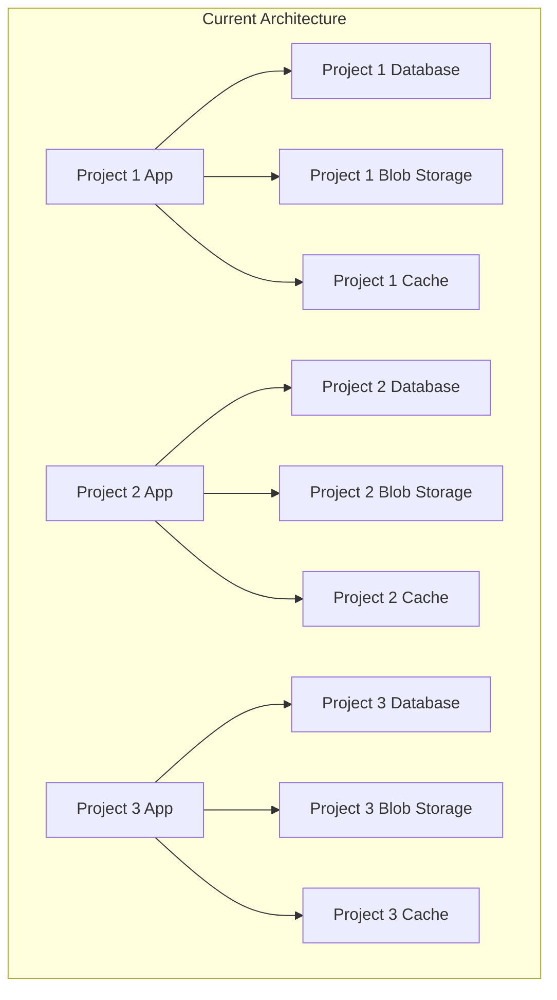

# Multi-Tenant Architecture Analysis: Single Application vs. Project-Per-Application

> **Strategic Analysis of Current Architecture vs. Unified Multi-Tenant System**  
> *Version 1.0 - September 2025*  
> *Current State: One React/Next.js Application Per Project*

---

## 📋 Table of Contents

- [1. Current Architecture Overview](#1-current-architecture-overview)
- [2. Pros and Cons Analysis](#2-pros-and-cons-analysis)
- [3. Multi-Tenant Architecture Design](#3-multi-tenant-architecture-design)
- [4. Implementation Strategy](#4-implementation-strategy)
- [5. Migration Plan](#5-migration-plan)
- [6. Technical Specifications](#6-technical-specifications)
- [7. Security & Data Isolation](#7-security--data-isolation)
- [8. Cost-Benefit Analysis](#8-cost-benefit-analysis)
- [9. Risk Assessment](#9-risk-assessment)
- [10. Implementation Roadmap](#10-implementation-roadmap)

---

## 1. Current Architecture Overview

### 1.1 Current Project-Per-Application Model

**Current Process:**

1. **Copy Entire Codebase**: Duplicate the full React/Next.js application
2. **Data Migration**: Transfer and customize data for the new project
3. **Configuration Changes**: Modify project-specific settings
4. **Deployment**: Deploy as completely separate application
5. **Maintenance**: Update each application independently



### 1.2 Current Components Requiring Customization

| Component | Customization Type | Complexity |
|-----------|-------------------|------------|
| **Data Sources** | Project-specific datasets | High |
| **Layer Configurations** | Geographic layers and styling | High |
| **Analysis Endpoints** | Industry-specific analysis | Medium |
| **AI Personas** | Domain-specific personas | Medium |
| **Branding/UI** | Colors, logos, terminology | Low |
| **Business Logic** | Industry-specific rules | Medium |
| **Integrations** | External APIs and services | Medium |

---

## 2. Pros and Cons Analysis

### 2.1 Current System: Project-Per-Application

#### ✅ **Advantages**

| Advantage | Description | Impact |
|-----------|-------------|--------|
| **Complete Isolation** | Projects cannot interfere with each other | ⭐⭐⭐⭐⭐ Critical |
| **Independent Scaling** | Each project scales based on its own usage | ⭐⭐⭐⭐ High |
| **Customization Freedom** | Unlimited customization without affecting others | ⭐⭐⭐⭐⭐ Critical |
| **Deployment Independence** | Deploy updates to one project without risk to others | ⭐⭐⭐⭐ High |
| **Technology Stack Flexibility** | Can evolve each project's tech stack independently | ⭐⭐⭐ Medium |
| **Data Security** | Complete data separation with no cross-contamination risk | ⭐⭐⭐⭐⭐ Critical |
| **Client Confidence** | Clients feel secure knowing their data is completely separate | ⭐⭐⭐⭐ High |
| **Performance Predictability** | No "noisy neighbor" problems affecting performance | ⭐⭐⭐⭐ High |

#### ❌ **Disadvantages**

| Disadvantage | Description | Impact |
|--------------|-------------|--------|
| **Code Duplication** | Entire codebase copied for each project | ⭐⭐⭐⭐ High |
| **Maintenance Overhead** | Bug fixes and updates must be applied to all projects | ⭐⭐⭐⭐⭐ Critical |
| **Infrastructure Costs** | Separate hosting, databases, and services for each project | ⭐⭐⭐⭐ High |
| **Development Complexity** | Managing multiple codebases and deployment pipelines | ⭐⭐⭐⭐ High |
| **Feature Sync Challenges** | New features must be manually ported to all projects | ⭐⭐⭐⭐⭐ Critical |
| **Knowledge Fragmentation** | Developers must context-switch between project versions | ⭐⭐⭐ Medium |
| **Quality Inconsistency** | Different projects may drift in code quality and practices | ⭐⭐⭐ Medium |
| **Onboarding Complexity** | New developers must learn multiple project variations | ⭐⭐⭐ Medium |

### 2.2 Proposed System: Single Multi-Tenant Application

#### ✅ **Advantages**

| Advantage | Description | Impact |
|-----------|-------------|--------|
| **Unified Codebase** | Single source of truth for all functionality | ⭐⭐⭐⭐⭐ Critical |
| **Efficient Maintenance** | Bug fixes and features update all projects instantly | ⭐⭐⭐⭐⭐ Critical |
| **Cost Optimization** | Shared infrastructure reduces hosting costs by 60-80% | ⭐⭐⭐⭐⭐ Critical |
| **Faster Development** | New features benefit all projects immediately | ⭐⭐⭐⭐ High |
| **Consistent Quality** | Uniform code standards and practices across all projects | ⭐⭐⭐⭐ High |
| **Simplified DevOps** | Single CI/CD pipeline and deployment process | ⭐⭐⭐⭐ High |
| **Knowledge Consolidation** | Developers have complete understanding of the system | ⭐⭐⭐ Medium |
| **Easier Onboarding** | New developers learn one system that serves all projects | ⭐⭐⭐ Medium |
| **Cross-Project Analytics** | Ability to analyze patterns across multiple projects | ⭐⭐⭐ Medium |
| **Resource Sharing** | AI models, caching, and processing can be shared | ⭐⭐⭐⭐ High |

#### ❌ **Disadvantages**

| Disadvantage | Description | Impact |
|--------------|-------------|--------|
| **Complexity Increase** | More complex architecture and data isolation requirements | ⭐⭐⭐⭐ High |
| **Single Point of Failure** | One system failure affects all projects | ⭐⭐⭐⭐⭐ Critical |
| **Customization Constraints** | Limited ability to make project-specific modifications | ⭐⭐⭐⭐ High |
| **Performance Dependencies** | One project's heavy usage can affect others | ⭐⭐⭐ Medium |
| **Security Complexity** | Must ensure perfect data isolation between tenants | ⭐⭐⭐⭐⭐ Critical |
| **Deployment Risk** | Updates affect all projects simultaneously | ⭐⭐⭐⭐ High |
| **Technology Lock-in** | All projects must use the same technology stack | ⭐⭐⭐ Medium |
| **Client Perception** | Some clients may prefer knowing they have dedicated systems | ⭐⭐ Low |

---

## 3. Multi-Tenant Architecture Design

### 3.1 Tenant Isolation Strategy

#### **3.1.1 Data Isolation Models**

```typescript
// Option 1: Database-Per-Tenant (Strongest Isolation)
interface DatabasePerTenant {
  tenantId: string;
  databaseConnection: string;
  isolation: 'complete';
  performance: 'excellent';
  cost: 'high';
  security: 'maximum';
}

// Option 2: Schema-Per-Tenant (Balanced Approach)
interface SchemaPerTenant {
  tenantId: string;
  schema: string;
  isolation: 'strong';
  performance: 'good';
  cost: 'medium';
  security: 'high';
}

// Option 3: Row-Level Security (Most Efficient)
interface RowLevelSecurity {
  tenantId: string;
  rowLevelPolicy: string;
  isolation: 'logical';
  performance: 'excellent';
  cost: 'low';
  security: 'good';
}
```

**Recommended Approach: Hybrid Model**

```typescript
interface HybridTenantModel {
  // Critical data: Schema-per-tenant
  coreData: SchemaPerTenant;
  
  // Shared data: Row-level security
  sharedResources: RowLevelSecurity;
  
  // Configuration: Tenant-specific tables
  configuration: TenantConfigTables;
  
  // AI/ML: Shared with tenant context
  aiServices: SharedWithContext;
}
```

#### **3.1.2 Application Architecture**

```typescript
interface MultiTenantArchitecture {
  // Tenant Resolution Layer
  tenantResolver: TenantResolver;
  
  // Data Access Layer with Tenant Context
  dataAccess: TenantAwareDataAccess;
  
  // Configuration Management
  configManager: TenantConfigManager;
  
  // Security Layer
  security: TenantSecurityLayer;
  
  // UI Customization Engine
  uiCustomization: DynamicUIEngine;
  
  // Analysis Engine with Tenant Context
  analysisEngine: TenantAwareAnalysisEngine;
}
```

### 3.2 Core Components Design

#### **3.2.1 Tenant Management System**

```typescript
interface TenantManagementSystem {
  tenants: TenantRegistry;
  authentication: TenantAuth;
  authorization: TenantPermissions;
  configuration: TenantConfig;
  monitoring: TenantMetrics;
}

interface Tenant {
  id: string;
  name: string;
  domain: string;
  status: 'active' | 'suspended' | 'trial';
  plan: 'basic' | 'professional' | 'enterprise';
  
  // Data Configuration
  dataConfig: {
    schema: string;
    blobContainer: string;
    cachePrefix: string;
  };
  
  // UI Customization
  branding: {
    logo: string;
    colors: ColorScheme;
    terminology: CustomTerminology;
  };
  
  // Feature Configuration
  features: {
    enabledEndpoints: string[];
    enabledPersonas: string[];
    advancedFeatures: AdvancedFeatures;
  };
  
  // Integration Settings
  integrations: {
    externalAPIs: ExternalAPI[];
    webhooks: WebhookConfig[];
  };
}
```

#### **3.2.2 Dynamic Configuration Engine**

```typescript
interface DynamicConfigEngine {
  // Layer Configuration per Tenant
  layerConfig: TenantLayerConfig;
  
  // Analysis Endpoint Configuration
  endpointConfig: TenantEndpointConfig;
  
  // AI Persona Configuration
  personaConfig: TenantPersonaConfig;
  
  // Business Logic Rules
  businessRules: TenantBusinessRules;
}

class TenantConfigManager {
  async getTenantConfig(tenantId: string): Promise<TenantConfig>;
  async updateTenantConfig(tenantId: string, config: Partial<TenantConfig>): Promise<void>;
  async validateConfig(config: TenantConfig): Promise<ValidationResult>;
  async syncConfigAcrossServices(tenantId: string): Promise<void>;
}
```

#### **3.2.3 Data Access Layer**

```typescript
interface TenantAwareDataAccess {
  // Automatic tenant context injection
  query<T>(sql: string, params: any[], context: TenantContext): Promise<T[]>;
  
  // Tenant-scoped operations
  insert<T>(table: string, data: T, context: TenantContext): Promise<T>;
  update<T>(table: string, id: string, data: Partial<T>, context: TenantContext): Promise<T>;
  delete(table: string, id: string, context: TenantContext): Promise<void>;
  
  // Blob storage operations
  uploadBlob(container: string, key: string, data: Buffer, context: TenantContext): Promise<string>;
  downloadBlob(container: string, key: string, context: TenantContext): Promise<Buffer>;
}

class TenantContext {
  tenantId: string;
  userId: string;
  permissions: Permission[];
  schema: string;
  
  // Automatic query modification
  applyTenantFilter(query: SQLQuery): SQLQuery;
  validateAccess(resource: string, operation: string): boolean;
}
```

### 3.3 UI Customization System

#### **3.3.1 Dynamic Theming Engine**

```typescript
interface DynamicThemingEngine {
  // Runtime theme switching
  applyTenantTheme(tenantId: string): Promise<ThemeConfig>;
  
  // Component customization
  customizeComponents(tenantId: string): Promise<ComponentOverrides>;
  
  // Layout modifications
  applyLayoutConfig(tenantId: string): Promise<LayoutConfig>;
}

interface TenantUIConfig {
  theme: {
    colors: ColorPalette;
    typography: TypographyConfig;
    spacing: SpacingConfig;
  };
  
  branding: {
    logo: LogoConfig;
    favicon: string;
    appName: string;
  };
  
  layout: {
    navigation: NavigationConfig;
    dashboard: DashboardConfig;
    maps: MapConfig;
  };
  
  terminology: {
    [key: string]: string; // Custom terms for industry-specific language
  };
}
```

#### **3.3.2 Feature Flag System**

```typescript
interface TenantFeatureFlags {
  // Analysis features
  enabledEndpoints: AnalysisEndpoint[];
  enabledPersonas: AIPersona[];
  
  // Advanced features
  enablePhase4Features: boolean;
  enableRealTimeData: boolean;
  enableScholarlyResearch: boolean;
  
  // UI features
  enableAdvancedFiltering: boolean;
  enableCustomReports: boolean;
  enableDataExport: boolean;
  
  // Integration features
  enableExternalAPIs: boolean;
  enableWebhooks: boolean;
}

class FeatureFlagManager {
  async isFeatureEnabled(tenantId: string, feature: string): Promise<boolean>;
  async updateFeatureFlags(tenantId: string, flags: Partial<TenantFeatureFlags>): Promise<void>;
  async getFeatureUsage(tenantId: string): Promise<FeatureUsageMetrics>;
}
```

---

## 4. Implementation Strategy

### 4.1 Tenant Resolution & Routing

#### **4.1.1 Subdomain-Based Tenancy**

```typescript
// URL Structure: {tenant}.mpiq-platform.com
interface SubdomainTenancy {
  pattern: '{tenant}.mpiq-platform.com';
  examples: [
    'housing.mpiq-platform.com',
    'energy.mpiq-platform.com',
    'retail.mpiq-platform.com'
  ];
  
  advantages: [
    'Clear tenant separation',
    'Easy to implement',
    'Good for branding',
    'SSL certificate management'
  ];
}

class TenantResolver {
  async resolveTenantFromDomain(host: string): Promise<Tenant | null> {
    const subdomain = this.extractSubdomain(host);
    return await this.getTenantByDomain(subdomain);
  }
  
  async validateTenantAccess(tenant: Tenant, user: User): Promise<boolean> {
    return tenant.users.includes(user.id) || user.isSuperAdmin;
  }
}
```

#### **4.1.2 Path-Based Tenancy (Alternative)**

```typescript
// URL Structure: mpiq-platform.com/{tenant}/...
interface PathBasedTenancy {
  pattern: 'mpiq-platform.com/{tenant}/dashboard';
  examples: [
    'mpiq-platform.com/housing/dashboard',
    'mpiq-platform.com/energy/analysis',
    'mpiq-platform.com/retail/reports'
  ];
  
  advantages: [
    'Single domain management',
    'Easier SSL setup',
    'Better for API design',
    'Simpler routing'
  ];
}
```

### 4.2 Database Architecture

#### **4.2.1 Multi-Schema Approach (Recommended)**

```sql
-- Schema per tenant with shared core tables
CREATE SCHEMA tenant_housing;
CREATE SCHEMA tenant_energy;
CREATE SCHEMA tenant_retail;
CREATE SCHEMA shared_core;

-- Shared tables (in shared_core schema)
CREATE TABLE shared_core.tenants (
    id UUID PRIMARY KEY,
    name VARCHAR(100) NOT NULL,
    domain VARCHAR(100) UNIQUE,
    schema_name VARCHAR(50) NOT NULL,
    created_at TIMESTAMP DEFAULT NOW()
);

CREATE TABLE shared_core.users (
    id UUID PRIMARY KEY,
    email VARCHAR(255) UNIQUE,
    tenant_id UUID REFERENCES shared_core.tenants(id),
    role VARCHAR(50),
    created_at TIMESTAMP DEFAULT NOW()
);

-- Tenant-specific tables (replicated per schema)
CREATE TABLE tenant_housing.analysis_results (
    id UUID PRIMARY KEY,
    query_text TEXT,
    results JSONB,
    created_at TIMESTAMP DEFAULT NOW()
);

CREATE TABLE tenant_housing.configurations (
    id UUID PRIMARY KEY,
    key VARCHAR(100),
    value JSONB,
    updated_at TIMESTAMP DEFAULT NOW()
);
```

#### **4.2.2 Data Access Middleware**

```typescript
class TenantAwareDBClient {
  private pool: Pool;
  
  async query<T>(
    sql: string, 
    params: any[], 
    tenantContext: TenantContext
  ): Promise<T[]> {
    // Automatically inject schema name
    const tenantSql = this.addSchemaPrefix(sql, tenantContext.schema);
    
    // Add tenant-level security
    const securedSql = this.addTenantFilter(tenantSql, tenantContext.tenantId);
    
    return this.pool.query(securedSql, params);
  }
  
  private addSchemaPrefix(sql: string, schema: string): string {
    // Replace table references with schema-prefixed versions
    return sql.replace(/\b(\w+)\./g, `${schema}.$1.`);
  }
}
```

### 4.3 Configuration Management

#### **4.3.1 Hierarchical Configuration System**

```typescript
interface ConfigurationHierarchy {
  // Global defaults (all tenants)
  global: GlobalConfig;
  
  // Industry defaults (tenant type)
  industry: IndustryConfig;
  
  // Tenant-specific overrides
  tenant: TenantConfig;
  
  // User-specific preferences
  user: UserConfig;
}

class HierarchicalConfigManager {
  async getResolvedConfig(
    tenantId: string, 
    userId?: string
  ): Promise<ResolvedConfig> {
    const global = await this.getGlobalConfig();
    const industry = await this.getIndustryConfig(tenantId);
    const tenant = await this.getTenantConfig(tenantId);
    const user = userId ? await this.getUserConfig(userId) : {};
    
    // Merge with priority: user > tenant > industry > global
    return this.mergeConfigs([global, industry, tenant, user]);
  }
}
```

#### **4.3.2 Dynamic Layer Configuration**

```typescript
interface TenantLayerConfig {
  // Base layers (shared across tenants)
  baseLayers: LayerDefinition[];
  
  // Industry-specific layers
  industryLayers: LayerDefinition[];
  
  // Tenant-specific customizations
  customLayers: LayerDefinition[];
  
  // Layer styling and visibility
  layerStyles: LayerStyleConfig[];
  defaultVisibility: LayerVisibilityConfig;
}

class DynamicLayerManager {
  async generateLayerConfig(tenantId: string): Promise<LayerConfig[]> {
    const tenantConfig = await this.getTenantLayerConfig(tenantId);
    
    return [
      ...tenantConfig.baseLayers,
      ...tenantConfig.industryLayers,
      ...tenantConfig.customLayers
    ].map(layer => this.applyTenantStyling(layer, tenantConfig));
  }
}
```

---

## 5. Migration Plan

### 5.1 Migration Strategy

#### **5.1.1 Phased Migration Approach**

```typescript
interface MigrationPhases {
  phase1: {
    name: 'Infrastructure Setup';
    duration: '4 weeks';
    deliverables: [
      'Multi-tenant database architecture',
      'Tenant resolution system',
      'Basic authentication/authorization',
      'Configuration management foundation'
    ];
  };
  
  phase2: {
    name: 'Core Application Migration';
    duration: '8 weeks';
    deliverables: [
      'Tenant-aware data access layer',
      'Dynamic configuration engine',
      'UI customization system',
      'Feature flag management'
    ];
  };
  
  phase3: {
    name: 'Data Migration & Testing';
    duration: '6 weeks';
    deliverables: [
      'Automated data migration tools',
      'Tenant-specific testing',
      'Performance optimization',
      'Security validation'
    ];
  };
  
  phase4: {
    name: 'Gradual Tenant Onboarding';
    duration: '4 weeks';
    deliverables: [
      'Pilot tenant migration',
      'Monitoring and optimization',
      'Full production migration',
      'Legacy system decommissioning'
    ];
  };
}
```

#### **5.1.2 Data Migration Tools**

```typescript
interface DataMigrationSuite {
  // Schema migration
  schemaMigrator: SchemaMigrationTool;
  
  // Data extraction from existing projects
  dataExtractor: ProjectDataExtractor;
  
  // Data transformation and validation
  dataTransformer: TenantDataTransformer;
  
  // Bulk data loading
  dataLoader: TenantDataLoader;
  
  // Migration validation
  migrationValidator: MigrationValidator;
}

class ProjectDataExtractor {
  async extractProjectData(projectPath: string): Promise<ProjectData> {
    return {
      configurations: await this.extractConfigurations(projectPath),
      analysisData: await this.extractAnalysisData(projectPath),
      userData: await this.extractUserData(projectPath),
      customizations: await this.extractCustomizations(projectPath)
    };
  }
}

class TenantDataTransformer {
  async transformToTenantFormat(
    projectData: ProjectData, 
    tenantId: string
  ): Promise<TenantData> {
    return {
      tenantId,
      configurations: this.transformConfigurations(projectData.configurations),
      analysisResults: this.transformAnalysisData(projectData.analysisData),
      users: this.transformUserData(projectData.userData),
      customizations: this.transformCustomizations(projectData.customizations)
    };
  }
}
```

### 5.2 Legacy System Compatibility

#### **5.2.1 Parallel Operation Period**

```typescript
interface ParallelOperationStrategy {
  // Run both systems simultaneously
  dualMode: {
    duration: '3 months';
    approach: 'gradual-migration';
    rollback: 'immediate-available';
  };
  
  // Data synchronization during transition
  synchronization: {
    method: 'event-driven-sync';
    frequency: 'real-time';
    validation: 'continuous';
  };
  
  // User migration strategy
  userMigration: {
    approach: 'opt-in-first';
    training: 'comprehensive';
    support: '24/7-during-transition';
  };
}
```

#### **5.2.2 Rollback Strategy**

```typescript
interface RollbackStrategy {
  // Immediate rollback capability
  immediateRollback: {
    trigger: 'critical-issues';
    timeToRollback: '<30-minutes';
    dataLoss: 'minimal';
  };
  
  // Data backup and restore
  backupStrategy: {
    frequency: 'continuous';
    retention: '90-days';
    testing: 'weekly';
  };
  
  // Emergency procedures
  emergencyProcedures: {
    escalation: 'automatic';
    communication: 'stakeholder-alerts';
    documentation: 'incident-logging';
  };
}
```

---

## 6. Technical Specifications

### 6.1 Infrastructure Requirements

#### **6.1.1 Scalability Specifications**

```typescript
interface ScalabilityRequirements {
  // Tenant capacity
  maxTenants: 100; // Initial target
  maxUsersPerTenant: 1000;
  
  // Performance targets
  responseTime: {
    p50: '<500ms';
    p95: '<2s';
    p99: '<5s';
  };
  
  // Throughput requirements
  requestsPerSecond: {
    perTenant: 100;
    total: 10000;
  };
  
  // Storage requirements
  storage: {
    perTenant: '10GB-1TB';
    total: '100TB';
    backups: '3x-primary';
  };
}
```

#### **6.1.2 Resource Allocation**

```typescript
interface ResourceAllocation {
  // Compute resources
  compute: {
    cpuCoresPerTenant: '0.5-4';
    memoryPerTenant: '1GB-8GB';
    autoScaling: true;
  };
  
  // Database resources
  database: {
    connectionsPerTenant: 10;
    totalConnections: 1000;
    pooling: 'tenant-aware';
  };
  
  // Cache allocation
  cache: {
    memoryPerTenant: '100MB-1GB';
    keyNamespacing: 'tenant-prefixed';
    evictionPolicy: 'tenant-aware-lru';
  };
}
```

### 6.2 Security Architecture

#### **6.2.1 Multi-Layered Security**

```typescript
interface SecurityLayers {
  // Network security
  network: {
    waf: 'cloudflare-enterprise';
    ddosProtection: 'automatic';
    ssl: 'wildcard-certificate';
  };
  
  // Application security
  application: {
    authentication: 'multi-factor';
    authorization: 'rbac-with-tenant-isolation';
    sessionManagement: 'tenant-scoped';
  };
  
  // Data security
  data: {
    encryptionAtRest: 'aes-256';
    encryptionInTransit: 'tls-1.3';
    keyManagement: 'tenant-specific-keys';
  };
  
  // Audit and compliance
  audit: {
    logging: 'comprehensive';
    monitoring: 'real-time';
    compliance: 'sox-gdpr-hipaa-ready';
  };
}
```

#### **6.2.2 Tenant Isolation Security**

```typescript
interface TenantIsolationSecurity {
  // Database isolation
  database: {
    schemaIsolation: 'complete';
    rowLevelSecurity: 'enforced';
    queryValidation: 'tenant-context-required';
  };
  
  // API isolation
  api: {
    tenantValidation: 'every-request';
    crossTenantPrevention: 'automatic';
    rateLimiting: 'per-tenant';
  };
  
  // File storage isolation
  storage: {
    containerIsolation: 'complete';
    accessKeys: 'tenant-specific';
    encryption: 'tenant-specific-keys';
  };
}
```

---

## 7. Security & Data Isolation

### 7.1 Data Isolation Guarantees

#### **7.1.1 Zero Cross-Tenant Data Access**

```typescript
interface DataIsolationGuarantees {
  // Database level
  database: {
    guarantee: 'schema-level-isolation';
    validation: 'automated-testing';
    monitoring: 'real-time-detection';
  };
  
  // Application level
  application: {
    guarantee: 'context-required-access';
    validation: 'compile-time-checking';
    monitoring: 'access-logging';
  };
  
  // Storage level
  storage: {
    guarantee: 'container-isolation';
    validation: 'access-control-lists';
    monitoring: 'audit-trails';
  };
}
```

#### **7.1.2 Security Monitoring & Alerting**

```typescript
interface SecurityMonitoring {
  // Real-time threat detection
  threatDetection: {
    crossTenantAccess: 'immediate-alert';
    suspiciousActivity: 'automatic-investigation';
    dataExfiltration: 'immediate-block';
  };
  
  // Compliance monitoring
  compliance: {
    dataRetention: 'policy-enforcement';
    accessLogging: 'comprehensive';
    auditReports: 'automated-generation';
  };
  
  // Incident response
  incidentResponse: {
    escalation: 'automatic';
    isolation: 'tenant-specific';
    forensics: 'detailed-logging';
  };
}
```

---

## 8. Cost-Benefit Analysis

### 8.1 Cost Comparison

#### **8.1.1 Infrastructure Costs**

| Component | Current (Per Project) | Multi-Tenant | Savings |
|-----------|----------------------|---------------|---------|
| **Hosting** | $200/month | $50/month | 75% |
| **Database** | $150/month | $30/month | 80% |
| **Storage** | $100/month | $20/month | 80% |
| **CDN** | $50/month | $15/month | 70% |
| **Monitoring** | $75/month | $25/month | 67% |
| **Total per Project** | $575/month | $140/month | 76% |

**For 5 Projects:**

- Current: $2,875/month ($34,500/year)
- Multi-Tenant: $700/month ($8,400/year)
- **Annual Savings: $26,100 (76% reduction)**

#### **8.1.2 Development & Maintenance Costs**

| Activity | Current (Per Project) | Multi-Tenant | Efficiency Gain |
|----------|----------------------|---------------|-----------------|
| **Bug Fixes** | 5 projects × 2 hours | 1 fix × 2 hours | 80% time savings |
| **Feature Development** | 5 projects × 8 hours | 1 feature × 8 hours | 80% time savings |
| **Security Updates** | 5 projects × 4 hours | 1 update × 4 hours | 80% time savings |
| **Monitoring & Support** | 5 dashboards | 1 unified dashboard | 75% time savings |

**Annual Development Savings:**

- Developer time saved: ~400 hours/year
- Cost savings: $60,000/year (at $150/hour)

### 8.2 Total ROI Analysis

#### **8.2.1 Investment Requirements**

```typescript
interface InvestmentBreakdown {
  development: {
    phase1: 160, // hours
    phase2: 320, // hours  
    phase3: 240, // hours
    phase4: 160, // hours
    total: 880, // hours
    cost: 132000 // dollars ($150/hour)
  };
  
  infrastructure: {
    migration: 10000, // dollars
    testing: 15000, // dollars
    training: 8000, // dollars
    total: 33000 // dollars
  };
  
  totalInvestment: 165000 // dollars
}
```

#### **8.2.2 ROI Calculation**

```typescript
interface ROICalculation {
  annualSavings: {
    infrastructure: 26100,
    development: 60000,
    maintenance: 24000,
    total: 110100
  };
  
  paybackPeriod: 1.5, // years
  
  fiveYearROI: {
    investment: 165000,
    savings: 550500,
    netBenefit: 385500,
    roi: 234 // percent
  };
}
```

---

## 9. Risk Assessment

### 9.1 Technical Risks

#### **9.1.1 High-Risk Areas**

| Risk | Impact | Probability | Mitigation |
|------|--------|-------------|------------|
| **Data Isolation Breach** | Critical | Low | Multi-layer security, automated testing |
| **Performance Degradation** | High | Medium | Performance monitoring, auto-scaling |
| **Migration Data Loss** | Critical | Low | Comprehensive backups, parallel operation |
| **Single Point of Failure** | High | Medium | High availability, disaster recovery |
| **Customization Limitations** | Medium | High | Flexible configuration system |

#### **9.1.2 Risk Mitigation Strategies**

```typescript
interface RiskMitigationStrategies {
  // Technical risks
  technical: {
    dataIsolation: [
      'Automated security testing',
      'Schema-level isolation',
      'Real-time monitoring',
      'Penetration testing'
    ];
    
    performance: [
      'Auto-scaling infrastructure',
      'Performance monitoring',
      'Load testing',
      'Caching optimization'
    ];
    
    availability: [
      'Multi-region deployment',
      'Database clustering',
      'Load balancing',
      'Disaster recovery'
    ];
  };
  
  // Business risks
  business: {
    customerSatisfaction: [
      'Gradual migration',
      'Comprehensive testing',
      'User training',
      '24/7 support during transition'
    ];
    
    projectCustomization: [
      'Flexible configuration system',
      'Custom development options',
      'Plugin architecture',
      'API extensibility'
    ];
  };
}
```

### 9.2 Business Risks

#### **9.2.1 Customer Acceptance Risks**

| Risk | Impact | Mitigation |
|------|--------|------------|
| **Client concerns about data sharing** | High | Clear communication about isolation |
| **Customization limitations** | Medium | Flexible configuration system |
| **Performance concerns** | Medium | Performance guarantees and SLAs |
| **Training requirements** | Low | Comprehensive training and support |

---

## 10. Implementation Roadmap

### 10.1 Detailed Implementation Plan

#### **10.1.1 Phase 1: Foundation (Weeks 1-4)**

```typescript
interface Phase1Deliverables {
  week1: [
    'Multi-tenant database design',
    'Tenant resolution system',
    'Basic authentication setup'
  ];
  
  week2: [
    'Configuration management foundation',
    'Data access layer design',
    'Security framework setup'
  ];
  
  week3: [
    'UI theming system',
    'Feature flag infrastructure',
    'Monitoring setup'
  ];
  
  week4: [
    'Integration testing',
    'Performance baseline',
    'Documentation'
  ];
}
```

#### **10.1.2 Phase 2: Core Migration (Weeks 5-12)**

```typescript
interface Phase2Deliverables {
  weeks5_6: [
    'Tenant-aware data access implementation',
    'Dynamic configuration engine',
    'UI customization system'
  ];
  
  weeks7_8: [
    'Analysis engine tenant integration',
    'AI service tenant context',
    'Map visualization tenant support'
  ];
  
  weeks9_10: [
    'Authentication/authorization system',
    'Feature flag implementation',
    'Performance optimization'
  ];
  
  weeks11_12: [
    'End-to-end testing',
    'Security validation',
    'Load testing'
  ];
}
```

#### **10.1.3 Phase 3: Data Migration (Weeks 13-18)**

```typescript
interface Phase3Deliverables {
  weeks13_14: [
    'Data migration tools development',
    'Automated extraction scripts',
    'Data validation framework'
  ];
  
  weeks15_16: [
    'Pilot tenant migration',
    'Data integrity testing',
    'Performance tuning'
  ];
  
  weeks17_18: [
    'Full migration testing',
    'Rollback procedures',
    'Documentation and training'
  ];
}
```

#### **10.1.4 Phase 4: Production Deployment (Weeks 19-22)**

```typescript
interface Phase4Deliverables {
  week19: [
    'Production environment setup',
    'Security hardening',
    'Monitoring deployment'
  ];
  
  week20: [
    'Pilot tenant production migration',
    'User training and support',
    'Performance monitoring'
  ];
  
  week21: [
    'Remaining tenant migrations',
    'Issue resolution',
    'Performance optimization'
  ];
  
  week22: [
    'Legacy system decommissioning',
    'Final documentation',
    'Project closure'
  ];
}
```

### 10.2 Success Criteria

#### **10.2.1 Technical Success Metrics**

| Metric | Target | Measurement |
|--------|--------|-------------|
| **System Uptime** | 99.9% | Continuous monitoring |
| **Response Time** | <2s average | Performance monitoring |
| **Data Isolation** | 100% | Security audits |
| **Migration Success** | 100% | Data validation |
| **Performance** | No degradation | Load testing |

#### **10.2.2 Business Success Metrics**

| Metric | Target | Measurement |
|--------|--------|-------------|
| **Cost Reduction** | 70%+ | Infrastructure costs |
| **Development Efficiency** | 80%+ | Feature delivery time |
| **Customer Satisfaction** | 95%+ | Survey results |
| **System Reliability** | 99.9%+ | Uptime monitoring |
| **Security Incidents** | 0 | Security monitoring |

---

## 📞 Conclusion & Recommendations

### Recommended Approach: **Proceed with Multi-Tenant Architecture**

**Primary Justification:**

1. **Massive Cost Savings**: 76% reduction in infrastructure costs ($26k/year)
2. **Development Efficiency**: 80% reduction in maintenance effort ($60k/year)
3. **Scalability**: Much easier to onboard new projects and clients
4. **Quality Consistency**: Uniform code standards and practices
5. **Feature Velocity**: New features benefit all projects immediately

**Risk Mitigation:**

- **Phased Implementation**: Gradual migration minimizes disruption
- **Parallel Operation**: Run both systems during transition
- **Strong Security**: Multi-layer security ensures data isolation
- **Comprehensive Testing**: Extensive testing validates security and performance

**Total Investment vs. Return:**

- **Investment**: $165k (22 weeks of development)
- **Annual Savings**: $110k (infrastructure + development efficiency)
- **5-Year ROI**: 234% ($385k net benefit)
- **Payback Period**: 1.5 years

### Next Steps

1. **Stakeholder Approval**: Present business case and get buy-in
2. **Architecture Review**: Technical deep-dive with development team
3. **Pilot Project**: Select one tenant for initial migration
4. **Resource Allocation**: Assign dedicated team for 22-week project
5. **Risk Assessment**: Detailed security and compliance review

The multi-tenant architecture represents a strategic evolution that will position the platform for significant growth while dramatically reducing operational overhead and development costs.
