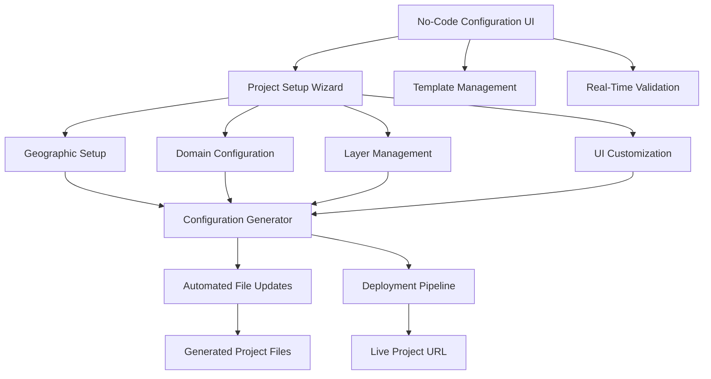

# MPIQ AI Chat Platform - No-Code Project Configuration UI Plan

> **Strategic Plan for Non-Developer Project Setup**  
> *Version 1.0 - September 2025*  
> *Based on: ArcGIS Data Automation Plan Analysis*

---

## 📋 Table of Contents

- [1. Executive Summary](#1-executive-summary)
- [2. Current Post-Automation Challenges](#2-current-post-automation-challenges)
- [3. No-Code UI Architecture](#3-no-code-ui-architecture)
- [4. User Experience Design](#4-user-experience-design)
- [5. Technical Implementation](#5-technical-implementation)
- [6. Configuration Templates](#6-configuration-templates)
- [7. Implementation Roadmap](#7-implementation-roadmap)
- [8. Business Impact](#8-business-impact)

---

## 1. Executive Summary

### 1.1 Problem Statement

The current MPIQ AI Chat automation pipeline successfully handles technical data extraction and model training, but requires **4-6 hours of manual configuration** by developers for each new project. This creates a bottleneck for non-technical users who want to deploy new market analysis applications.

**Current Process Pain Points:**

- ❌ **Developer Dependency**: Non-developers cannot create new projects independently
- ❌ **Manual Configuration**: 15+ files require manual updates across multiple components
- ❌ **Technical Complexity**: Geographic data, UI strings, layer groupings, and domain logic updates
- ❌ **Error Prone**: Manual text replacements and configuration updates are vulnerable to mistakes
- ❌ **Time Intensive**: 4-6 hours per project for post-automation configuration

### 1.2 Proposed Solution

A **web-based, no-code configuration interface** that allows non-developers to complete project setup in **30-60 minutes** through guided workflows and visual configuration tools.

**Key Benefits:**

- ✅ **Self-Service**: Non-developers can create projects independently
- ✅ **Error Prevention**: Visual validation and automated configuration generation
- ✅ **Time Reduction**: 83% reduction in setup time (4-6 hours → 30-60 minutes)
- ✅ **Consistency**: Standardized project templates and validation rules
- ✅ **Scalability**: Support for multiple simultaneous project setups

---

## 2. Current Post-Automation Challenges

### 2.1 Manual Configuration Requirements

Based on the ArcGIS automation documentation, these tasks currently require developer expertise:

| Configuration Task | Current Time | Complexity | Technical Skills Required |
|-------------------|-------------|------------|--------------------------|
| **Geographic Data Setup** | 60 min | High | Geographic coordinate systems, FSA/ZIP mappings |
| **UI String Updates** | 45 min | Medium | React component structure, text replacement patterns |
| **Layer Grouping Configuration** | 30 min | High | Layer classification logic, TypeScript configuration |
| **Domain-Specific Logic** | 90 min | Very High | Business logic, brand detection, field mappings |
| **Query Examples Setup** | 45 min | Medium | Domain knowledge, query pattern templates |
| **Composite Index Configuration** | 60 min | High | Mathematical formulas, scoring algorithms |
| **Testing & Validation** | 60 min | Medium | QA processes, endpoint validation |

**Total Current Time**: **5.5 hours** of developer work per project

### 2.2 Configuration Complexity Analysis

#### **2.2.1 Geographic Configuration**

```typescript
// Current manual process
const BOOKMARK_EXTENTS = {
  montreal: {
    xmin: -8288677, ymin: 5675441,
    xmax: -8215308, ymax: 5720501
  },
  // ... requires manual coordinate lookup
};
```

#### **2.2.2 Domain Logic Configuration**

```typescript
// Current manual process
const HOUSING_CATEGORIES = {
  high_ownership: (record: any) => record.ECYTENOWN_P > 80,
  moderate_ownership: (record: any) => record.ECYTENOWN_P > 60,
  // ... requires domain expertise
};
```

#### **2.2.3 Layer Classification**

```typescript
// Current manual process
const classifyGroup = (layerName: string): string => {
  const n = layerName.toLowerCase();
  if (n.includes('housing') || n.includes('owner')) return 'housing';
  if (n.includes('income') || n.includes('population')) return 'demographics';
  // ... requires understanding of data structure
};
```

---

## 3. No-Code UI Architecture

### 3.1 System Architecture Overview



### 3.2 Core Components

#### **3.2.1 Configuration Generator Engine**

```typescript
interface ConfigurationEngine {
  generateGeographicConfig(region: GeographicRegion): GeographicConfig;
  generateDomainConfig(domain: ProjectDomain): DomainConfig;
  generateLayerConfig(layers: LayerDefinition[]): LayerConfig;
  generateUIConfig(customization: UICustomization): UIConfig;
  validateConfiguration(config: ProjectConfig): ValidationResult;
  generateProjectFiles(config: ProjectConfig): GeneratedFiles;
}
```

#### **3.2.2 Template Management System**

```typescript
interface TemplateManager {
  domains: Map<string, DomainTemplate>; // housing, retail, energy, etc.
  regions: Map<string, RegionTemplate>; // north-america, europe, asia-pacific
  industries: Map<string, IndustryTemplate>; // real-estate, consumer-goods, energy
  
  getTemplate(domain: string, region: string): ProjectTemplate;
  customizeTemplate(template: ProjectTemplate, customization: CustomizationOptions): ProjectTemplate;
  validateTemplate(template: ProjectTemplate): ValidationResult;
}
```

#### **3.2.3 Real-Time Validation Engine**

```typescript
interface ValidationEngine {
  validateGeographicData(region: GeographicRegion): ValidationResult;
  validateFieldMappings(mappings: FieldMapping[]): ValidationResult;
  validateDomainLogic(logic: DomainLogic): ValidationResult;
  validateUIConsistency(ui: UIConfig): ValidationResult;
  generateValidationReport(config: ProjectConfig): ValidationReport;
}
```

---

## 4. User Experience Design

### 4.1 Project Setup Wizard Flow

#### **Step 1: Project Basics**

```typescript
interface ProjectBasics {
  projectName: string;           // "Quebec Housing Market Analysis"
  projectDescription: string;    // "Comprehensive housing market insights for Quebec FSAs"
  domain: ProjectDomain;         // housing | retail | energy | healthcare
  region: GeographicRegion;      // north-america | europe | asia-pacific
  targetAudience: UserType[];    // investors | researchers | policymakers
}
```

**UI Components:**

- Project name input with validation
- Description textarea with character counter
- Domain selection cards with icons and descriptions
- Region selection with map visualization
- Target audience multi-select with persona descriptions

#### **Step 2: Geographic Configuration**

```typescript
interface GeographicSetup {
  primaryRegion: string;         // "Quebec, Canada"
  administrativeUnits: string;   // "Forward Sortation Areas (FSA)"
  coordinateSystem: string;      // "WGS84" | "NAD83"
  cityBookmarks: CityBookmark[]; // Major cities with auto-populated coordinates
  dataSource: string;            // "Statistics Canada" | "US Census" | "Eurostat"
}
```

**UI Components:**

- Interactive map for region selection
- Administrative unit dropdown with explanations
- City bookmark builder with search and auto-complete
- Data source selection with coverage area visualization
- Coordinate system selection with projection previews

#### **Step 3: Data Domain Configuration**

```typescript
interface DomainConfiguration {
  primaryMetrics: string[];      // ["Homeownership Rate", "Rental Rate", "Income"]
  businessCategories: Category[]; // Housing types, price ranges, etc.
  competitorBrands: string[];    // Major brands/companies in the domain
  scoringWeights: ScoringConfig; // Custom weights for composite indices
  thresholds: ThresholdConfig;   // Performance thresholds and classifications
}
```

**UI Components:**

- Metric selection with data type indicators
- Category builder with drag-and-drop interface
- Brand/competitor manager with logo uploads
- Scoring weight sliders with real-time preview
- Threshold configuration with visual range selectors

#### **Step 4: Layer Management**

```typescript
interface LayerManagement {
  layerGroups: LayerGroup[];     // Organized categories for LayerList widget
  layerVisibility: LayerVisibilityConfig; // Default visibility settings
  layerPriority: LayerPriorityConfig;     // Display order and importance
  compositeIndices: CompositeIndexConfig[]; // Custom calculated layers
}
```

**UI Components:**

- Layer organization tree with drag-and-drop grouping
- Visibility toggle matrix for all layers
- Priority ranking interface with visual preview
- Composite index formula builder with validation

#### **Step 5: UI Customization**

```typescript
interface UICustomization {
  applicationTitle: string;      // "Quebec Housing Market Intelligence"
  brandingColors: ColorScheme;   // Primary, secondary, accent colors
  logoUpload: string;           // Custom logo for application header
  loadingMessages: string[];    // Domain-specific loading facts
  queryExamples: QueryExample[]; // Pre-built query suggestions
}
```

**UI Components:**

- Title input with live preview
- Color picker with accessibility validation
- Logo upload with format validation and preview
- Loading message editor with character limits
- Query example builder with template suggestions

### 4.2 Advanced Configuration Features

#### **4.2.1 Smart Templates**

```typescript
interface SmartTemplate {
  id: string;
  name: string;
  description: string;
  domains: ProjectDomain[];
  regions: GeographicRegion[];
  preConfigured: {
    metrics: string[];
    categories: Category[];
    layerGroups: LayerGroup[];
    scoringFormulas: ScoringFormula[];
  };
  customizationOptions: CustomizationOption[];
}

// Example templates
const TEMPLATES: SmartTemplate[] = [
  {
    id: 'housing-north-america',
    name: 'North American Housing Market Analysis',
    description: 'Complete setup for housing market analysis in US/Canada',
    domains: ['housing'],
    regions: ['north-america'],
    preConfigured: {
      metrics: ['Homeownership Rate', 'Rental Rate', 'Median Income', 'Housing Affordability'],
      categories: ['Single Family', 'Condos', 'Apartments', 'Social Housing'],
      layerGroups: ['Demographics', 'Housing', 'Income', 'Composite Indices'],
      scoringFormulas: ['Hot Growth Index', 'Affordability Index', 'Investment Potential']
    }
  }
];
```

#### **4.2.2 Configuration Validation System**

```typescript
interface ValidationRule {
  id: string;
  type: 'required' | 'format' | 'range' | 'dependency' | 'business';
  field: string;
  condition: (value: any, config: ProjectConfig) => boolean;
  message: string;
  severity: 'error' | 'warning' | 'info';
}

const VALIDATION_RULES: ValidationRule[] = [
  {
    id: 'project-name-required',
    type: 'required',
    field: 'projectName',
    condition: (value) => value && value.trim().length > 0,
    message: 'Project name is required',
    severity: 'error'
  },
  {
    id: 'geographic-coordinates-valid',
    type: 'format',
    field: 'cityBookmarks',
    condition: (bookmarks) => bookmarks.every(b => 
      b.coordinates && 
      b.coordinates.length === 2 && 
      Math.abs(b.coordinates[0]) <= 180 && 
      Math.abs(b.coordinates[1]) <= 90
    ),
    message: 'All city coordinates must be valid longitude/latitude pairs',
    severity: 'error'
  }
];
```

#### **4.2.3 Live Preview System**

```typescript
interface LivePreview {
  generatePreviewURL(config: ProjectConfig): string;
  updatePreview(config: ProjectConfig): Promise<PreviewResult>;
  validatePreview(previewURL: string): Promise<ValidationResult>;
}

// Real-time configuration preview
class ConfigurationPreview {
  async generatePreview(config: ProjectConfig): Promise<PreviewEnvironment> {
    // Create temporary environment with configuration
    const previewId = generateUUID();
    const previewConfig = this.generatePreviewConfig(config);
    
    // Deploy to preview environment
    const previewURL = await this.deployPreview(previewId, previewConfig);
    
    return {
      id: previewId,
      url: previewURL,
      expiresAt: Date.now() + (30 * 60 * 1000), // 30 minutes
      config: previewConfig
    };
  }
}
```

---

## 5. Technical Implementation

### 5.1 Backend Architecture

#### **5.1.1 Configuration API**

```typescript
// Express.js API endpoints
interface ConfigurationAPI {
  // Template management
  'GET /api/templates': () => ProjectTemplate[];
  'GET /api/templates/:domain/:region': (domain: string, region: string) => ProjectTemplate;
  
  // Geographic data services
  'GET /api/geographic/regions': () => GeographicRegion[];
  'GET /api/geographic/coordinates/:city': (city: string) => Coordinates;
  'GET /api/geographic/administrative-units/:region': (region: string) => AdministrativeUnit[];
  
  // Configuration generation
  'POST /api/projects/validate': (config: ProjectConfig) => ValidationResult;
  'POST /api/projects/generate': (config: ProjectConfig) => GeneratedFiles;
  'POST /api/projects/deploy': (config: ProjectConfig) => DeploymentResult;
  
  // Preview management
  'POST /api/preview/create': (config: ProjectConfig) => PreviewEnvironment;
  'GET /api/preview/:id': (id: string) => PreviewEnvironment;
  'DELETE /api/preview/:id': (id: string) => void;
}
```

#### **5.1.2 Configuration Generator Service**

```typescript
class ConfigurationGenerator {
  async generateProjectFiles(config: ProjectConfig): Promise<GeneratedFiles> {
    const files: GeneratedFiles = {};
    
    // Generate geographic configuration
    files['config/geography.ts'] = this.generateGeographicConfig(config.geographic);
    
    // Generate domain-specific configuration
    files['config/domain.ts'] = this.generateDomainConfig(config.domain);
    
    // Generate layer configuration
    files['config/layers.ts'] = this.generateLayerConfig(config.layers);
    
    // Generate UI strings
    files['config/ui-strings.ts'] = this.generateUIStrings(config.ui);
    
    // Generate component updates
    files['components/LayerBookmarks.tsx'] = this.generateBookmarkComponent(config.geographic.cityBookmarks);
    files['components/infographics/LoadingFacts.tsx'] = this.generateLoadingFacts(config.ui.loadingMessages);
    
    // Generate type definitions
    files['types/project.ts'] = this.generateProjectTypes(config);
    
    return files;
  }
  
  private generateGeographicConfig(geographic: GeographicSetup): string {
    return `// Auto-generated geographic configuration
export const GEOGRAPHIC_CONFIG = {
  region: '${geographic.primaryRegion}',
  administrativeUnits: '${geographic.administrativeUnits}',
  coordinateSystem: '${geographic.coordinateSystem}',
  bookmarks: ${JSON.stringify(geographic.cityBookmarks, null, 2)},
  dataSource: '${geographic.dataSource}'
};

export const CITY_COORDINATES = {
${geographic.cityBookmarks.map(bookmark => 
  `  '${bookmark.name}': { lat: ${bookmark.coordinates[1]}, lng: ${bookmark.coordinates[0]} }`
).join(',\n')}
};`;
  }
  
  private generateDomainConfig(domain: DomainConfiguration): string {
    return `// Auto-generated domain configuration
export const DOMAIN_CONFIG = {
  primaryMetrics: ${JSON.stringify(domain.primaryMetrics)},
  businessCategories: ${JSON.stringify(domain.businessCategories)},
  competitorBrands: ${JSON.stringify(domain.competitorBrands)},
  scoringWeights: ${JSON.stringify(domain.scoringWeights)},
  thresholds: ${JSON.stringify(domain.thresholds)}
};

export const METRIC_CALCULATIONS = {
${domain.businessCategories.map(category => 
  `  ${category.id}: (record: any) => ${category.formula}`
).join(',\n')}
};`;
  }
}
```

### 5.2 Frontend Architecture

#### **5.2.1 React Component Structure**

```typescript
// Main configuration wizard component
interface ConfigurationWizard {
  components: {
    ProjectBasicsStep: React.FC<ProjectBasicsProps>;
    GeographicSetupStep: React.FC<GeographicSetupProps>;
    DomainConfigurationStep: React.FC<DomainConfigurationProps>;
    LayerManagementStep: React.FC<LayerManagementProps>;
    UICustomizationStep: React.FC<UICustomizationProps>;
    ReviewAndDeployStep: React.FC<ReviewAndDeployProps>;
  };
  
  hooks: {
    useConfigurationState: () => [ProjectConfig, ConfigurationActions];
    useValidation: (config: ProjectConfig) => ValidationResult;
    usePreview: (config: ProjectConfig) => PreviewEnvironment;
    useTemplates: () => ProjectTemplate[];
  };
}
```

#### **5.2.2 State Management**

```typescript
// Redux store for configuration state
interface ConfigurationState {
  currentStep: number;
  config: ProjectConfig;
  validation: ValidationResult;
  templates: ProjectTemplate[];
  preview: PreviewEnvironment | null;
  deployment: DeploymentStatus;
}

// Configuration actions
type ConfigurationAction = 
  | { type: 'SET_PROJECT_BASICS'; payload: ProjectBasics }
  | { type: 'SET_GEOGRAPHIC_SETUP'; payload: GeographicSetup }
  | { type: 'SET_DOMAIN_CONFIGURATION'; payload: DomainConfiguration }
  | { type: 'SET_LAYER_MANAGEMENT'; payload: LayerManagement }
  | { type: 'SET_UI_CUSTOMIZATION'; payload: UICustomization }
  | { type: 'VALIDATE_CONFIGURATION'; payload: ValidationResult }
  | { type: 'CREATE_PREVIEW'; payload: PreviewEnvironment }
  | { type: 'DEPLOY_PROJECT'; payload: DeploymentResult };
```

#### **5.2.3 Component Library**

```typescript
// Specialized configuration components
interface ConfigurationComponents {
  // Geographic components
  InteractiveMapSelector: React.FC<MapSelectorProps>;
  CityBookmarkBuilder: React.FC<BookmarkBuilderProps>;
  CoordinateInput: React.FC<CoordinateInputProps>;
  
  // Domain components
  MetricSelector: React.FC<MetricSelectorProps>;
  CategoryBuilder: React.FC<CategoryBuilderProps>;
  ScoringWeightSlider: React.FC<ScoringSliderProps>;
  
  // Layer components
  LayerGroupOrganizer: React.FC<LayerOrganizerProps>;
  LayerVisibilityMatrix: React.FC<VisibilityMatrixProps>;
  CompositeIndexBuilder: React.FC<IndexBuilderProps>;
  
  // UI components
  ColorSchemeSelector: React.FC<ColorSelectorProps>;
  LogoUploader: React.FC<LogoUploaderProps>;
  QueryExampleBuilder: React.FC<QueryBuilderProps>;
  
  // Validation components
  ValidationIndicator: React.FC<ValidationIndicatorProps>;
  ErrorSummary: React.FC<ErrorSummaryProps>;
  ProgressTracker: React.FC<ProgressTrackerProps>;
}
```

### 5.3 Integration with Existing Automation

#### **5.3.1 Automation Pipeline Integration**

```typescript
class NoCodeAutomationBridge {
  async runCompleteAutomation(config: ProjectConfig): Promise<AutomationResult> {
    // 1. Convert no-code config to automation parameters
    const automationParams = this.convertToAutomationParams(config);
    
    // 2. Run existing automation pipeline
    const automationResult = await this.runAutomationPipeline(automationParams);
    
    // 3. Apply no-code configuration overlays
    const enhancedResult = await this.applyNoCodeEnhancements(automationResult, config);
    
    // 4. Generate final project files
    const projectFiles = await this.generateFinalProject(enhancedResult, config);
    
    return {
      success: true,
      automationResult,
      enhancedResult,
      projectFiles,
      deploymentURL: await this.deployProject(projectFiles)
    };
  }
  
  private convertToAutomationParams(config: ProjectConfig): AutomationParameters {
    return {
      serviceURL: config.dataSource.arcgisServiceURL,
      projectName: config.basics.projectName,
      targetVariable: config.domain.primaryMetrics[0], // Use primary metric as target
      outputPath: `./projects/${config.basics.projectName.toLowerCase().replace(/\s+/g, '-')}`,
      additionalConfig: {
        region: config.geographic.primaryRegion,
        domain: config.basics.domain,
        customization: config.ui
      }
    };
  }
}
```

#### **5.3.2 File Generation Pipeline**

```typescript
class ProjectFileGenerator {
  async generateCompleteProject(automationResult: AutomationResult, config: ProjectConfig): Promise<ProjectFiles> {
    const files: ProjectFiles = {};
    
    // 1. Use automation-generated base files
    Object.assign(files, automationResult.generatedFiles);
    
    // 2. Apply no-code configuration overlays
    files['config/project.ts'] = this.generateProjectConfig(config);
    files['config/geography.ts'] = this.generateGeographicConfig(config.geographic);
    files['config/domain.ts'] = this.generateDomainConfig(config.domain);
    files['config/ui-strings.ts'] = this.generateUIStrings(config.ui);
    
    // 3. Update component files
    files['components/LayerBookmarks.tsx'] = await this.updateLayerBookmarks(
      files['components/LayerBookmarks.tsx'], 
      config.geographic.cityBookmarks
    );
    
    files['components/BrandNameResolver.tsx'] = await this.updateBrandResolver(
      files['components/BrandNameResolver.tsx'],
      config.domain.competitorBrands
    );
    
    // 4. Generate layer configuration
    files['config/layers.ts'] = await this.mergeLayerConfig(
      automationResult.layerConfig,
      config.layers
    );
    
    return files;
  }
}
```

---

## 6. Configuration Templates

### 6.1 Domain-Specific Templates

#### **6.1.1 Housing Market Template**

```typescript
const HOUSING_MARKET_TEMPLATE: ProjectTemplate = {
  id: 'housing-market-analysis',
  name: 'Housing Market Analysis',
  description: 'Comprehensive real estate and housing market intelligence platform',
  category: 'Real Estate',
  
  defaultConfig: {
    domain: {
      primaryMetrics: [
        'Homeownership Rate',
        'Rental Rate', 
        'Median Household Income',
        'Housing Affordability Index',
        'Price-to-Income Ratio'
      ],
      businessCategories: [
        { id: 'high_ownership', name: 'High Ownership Areas', formula: 'ECYTENOWN_P > 80', color: '#2E8B57' },
        { id: 'moderate_ownership', name: 'Moderate Ownership', formula: 'ECYTENOWN_P > 60', color: '#FFD700' },
        { id: 'low_ownership', name: 'Low Ownership Areas', formula: 'ECYTENOWN_P <= 60', color: '#DC143C' }
      ],
      scoringWeights: {
        hotGrowthIndex: { household_growth: 0.4, income_growth: 0.25, ownership_growth: 0.2, density: 0.15 },
        affordabilityIndex: { debt_service: 0.5, rental_market: 0.25, income_growth: 0.15, supply: 0.1 }
      }
    },
    
    layers: {
      groups: [
        { id: 'demographics', name: 'Demographics', priority: 1 },
        { id: 'housing', name: 'Housing Data', priority: 2 },
        { id: 'income', name: 'Income & Economic', priority: 3 },
        { id: 'composite-indices', name: 'Composite Indices', priority: 4 }
      ]
    },
    
    ui: {
      applicationTitle: '[Region] Housing Market Intelligence',
      brandingColors: {
        primary: '#2E8B57',    // Forest Green
        secondary: '#FFD700',  // Gold
        accent: '#DC143C'      // Crimson
      },
      loadingMessages: [
        'Analyzing housing affordability trends...',
        'Calculating homeownership patterns...',
        'Processing rental market data...',
        'Evaluating investment opportunities...',
        'Examining demographic transitions...'
      ],
      queryExamples: [
        'Show me the most affordable areas for first-time buyers',
        'Where are the fastest growing housing markets?',
        'Compare rental rates between major cities',
        'What areas have the best investment potential?'
      ]
    }
  }
};
```

#### **6.1.2 Retail Market Template**

```typescript
const RETAIL_MARKET_TEMPLATE: ProjectTemplate = {
  id: 'retail-market-analysis',
  name: 'Retail Market Analysis',
  description: 'Consumer behavior and retail performance intelligence platform',
  category: 'Retail & Consumer Goods',
  
  defaultConfig: {
    domain: {
      primaryMetrics: [
        'Consumer Spending',
        'Retail Density',
        'Market Penetration',
        'Brand Preference Score',
        'Competition Index'
      ],
      businessCategories: [
        { id: 'high_spending', name: 'High Spending Markets', formula: 'consumer_spending > 5000', color: '#4CAF50' },
        { id: 'emerging_markets', name: 'Emerging Markets', formula: 'growth_rate > 0.15', color: '#FF9800' },
        { id: 'saturated_markets', name: 'Saturated Markets', formula: 'competition_index > 0.8', color: '#F44336' }
      ]
    },
    
    ui: {
      applicationTitle: '[Region] Retail Market Intelligence',
      brandingColors: {
        primary: '#4CAF50',
        secondary: '#FF9800', 
        accent: '#2196F3'
      },
      loadingMessages: [
        'Analyzing consumer spending patterns...',
        'Processing retail competition data...',
        'Evaluating market penetration rates...',
        'Calculating brand performance metrics...'
      ]
    }
  }
};
```

### 6.2 Regional Templates

#### **6.2.1 North American Template**

```typescript
const NORTH_AMERICA_TEMPLATE: RegionalTemplate = {
  id: 'north-america',
  name: 'North America',
  description: 'United States and Canada market analysis',
  
  geographicDefaults: {
    coordinateSystem: 'WGS84',
    administrativeUnits: {
      'United States': 'ZIP Codes',
      'Canada': 'Forward Sortation Areas (FSA)'
    },
    dataSources: [
      'US Census Bureau',
      'Statistics Canada',
      'Bureau of Labor Statistics',
      'Canada Mortgage and Housing Corporation'
    ],
    majorCities: [
      { name: 'New York', coordinates: [-74.006, 40.7128], country: 'US' },
      { name: 'Los Angeles', coordinates: [-118.2437, 34.0522], country: 'US' },
      { name: 'Toronto', coordinates: [-79.3832, 43.6532], country: 'CA' },
      { name: 'Montreal', coordinates: [-73.5673, 45.5017], country: 'CA' },
      { name: 'Vancouver', coordinates: [-123.1207, 49.2827], country: 'CA' }
    ]
  },
  
  validationRules: [
    {
      id: 'postal-code-format',
      condition: (value: string) => /^(\d{5}|[A-Z]\d[A-Z] \d[A-Z]\d)$/.test(value),
      message: 'Must be valid US ZIP code (12345) or Canadian postal code (A1A 1A1)'
    }
  ]
};
```

#### **6.2.2 European Template**

```typescript
const EUROPE_TEMPLATE: RegionalTemplate = {
  id: 'europe',
  name: 'Europe',
  description: 'European Union market analysis',
  
  geographicDefaults: {
    coordinateSystem: 'ETRS89',
    administrativeUnits: {
      'European Union': 'NUTS Regions',
      'Individual Countries': 'National Administrative Units'
    },
    dataSources: [
      'Eurostat',
      'European Central Bank',
      'National Statistical Offices',
      'European Environment Agency'
    ],
    majorCities: [
      { name: 'London', coordinates: [-0.1276, 51.5074], country: 'UK' },
      { name: 'Paris', coordinates: [2.3522, 48.8566], country: 'FR' },
      { name: 'Berlin', coordinates: [13.4050, 52.5200], country: 'DE' },
      { name: 'Madrid', coordinates: [-3.7038, 40.4168], country: 'ES' },
      { name: 'Rome', coordinates: [12.4964, 41.9028], country: 'IT' }
    ]
  }
};
```

### 6.3 Industry-Specific Templates

#### **6.3.1 Energy Market Template**

```typescript
const ENERGY_MARKET_TEMPLATE: IndustryTemplate = {
  id: 'energy-market',
  name: 'Energy Market Analysis',
  description: 'Renewable energy and utility market intelligence',
  
  domainSpecifics: {
    primaryMetrics: [
      'Energy Consumption',
      'Renewable Energy Adoption',
      'Grid Capacity',
      'Energy Efficiency Score',
      'Carbon Footprint'
    ],
    businessCategories: [
      { id: 'high_renewable', name: 'High Renewable Adoption', formula: 'renewable_pct > 50' },
      { id: 'transition_markets', name: 'Energy Transition Markets', formula: 'renewable_growth > 0.2' },
      { id: 'traditional_markets', name: 'Traditional Energy Markets', formula: 'fossil_fuel_pct > 70' }
    ],
    competitorBrands: [
      'Tesla Energy',
      'Enphase',
      'SolarEdge',
      'First Solar',
      'Vestas'
    ]
  }
};
```

---

## 7. Implementation Roadmap

### 7.1 Phase 1: Foundation (Weeks 1-6)

#### **Week 1-2: Architecture & Planning**

- [ ] Design system architecture and API specifications
- [ ] Create database schema for configuration storage
- [ ] Set up development environment and CI/CD pipeline
- [ ] Define component library requirements

#### **Week 3-4: Core Configuration Engine**

- [ ] Implement ConfigurationGenerator service
- [ ] Build TemplateManager with basic templates
- [ ] Create ValidationEngine with rule system
- [ ] Develop file generation pipeline

#### **Week 5-6: Basic UI Framework**

- [ ] Build React wizard framework
- [ ] Implement basic configuration steps
- [ ] Create state management system
- [ ] Add basic validation UI components

**Expected Deliverables:**

- ✅ Working backend API for configuration management
- ✅ Basic React wizard with 3 core steps
- ✅ Template system with 2 domain templates
- ✅ File generation for basic project types

### 7.2 Phase 2: Core Features (Weeks 7-12)

#### **Week 7-8: Geographic Configuration**

- [ ] Build InteractiveMapSelector component
- [ ] Implement automatic coordinate lookup
- [ ] Create CityBookmarkBuilder with search
- [ ] Add administrative unit detection

#### **Week 9-10: Domain Configuration**

- [ ] Build MetricSelector with validation
- [ ] Implement CategoryBuilder with drag-and-drop
- [ ] Create ScoringWeightSlider with preview
- [ ] Add business logic validation

#### **Week 11-12: Layer Management**

- [ ] Build LayerGroupOrganizer component
- [ ] Implement automatic layer classification
- [ ] Create CompositeIndexBuilder
- [ ] Add layer visibility matrix

**Expected Deliverables:**

- ✅ Complete geographic configuration system
- ✅ Domain-specific configuration tools
- ✅ Advanced layer management interface
- ✅ Integration with existing automation pipeline

### 7.3 Phase 3: Advanced Features (Weeks 13-18)

#### **Week 13-14: UI Customization & Preview**

- [ ] Build ColorSchemeSelector with accessibility
- [ ] Implement LogoUploader with validation
- [ ] Create live preview system
- [ ] Add QueryExampleBuilder

#### **Week 15-16: Template System Enhancement**

- [ ] Implement smart template recommendations
- [ ] Add template customization tools
- [ ] Create template marketplace
- [ ] Build template sharing system

#### **Week 17-18: Validation & Error Handling**

- [ ] Advanced validation rule engine
- [ ] Real-time error reporting
- [ ] Automated fix suggestions
- [ ] Comprehensive testing framework

**Expected Deliverables:**

- ✅ Complete UI customization system
- ✅ Live preview environment
- ✅ Advanced template management
- ✅ Production-ready validation system

### 7.4 Phase 4: Integration & Deployment (Weeks 19-24)

#### **Week 19-20: Automation Integration**

- [ ] Build NoCodeAutomationBridge
- [ ] Implement seamless pipeline integration
- [ ] Create deployment automation
- [ ] Add progress monitoring

#### **Week 21-22: Performance & Scalability**

- [ ] Optimize configuration generation
- [ ] Implement caching strategies
- [ ] Add concurrent project support
- [ ] Performance testing and optimization

#### **Week 23-24: Production Deployment**

- [ ] Security audit and hardening
- [ ] Load testing and optimization
- [ ] Documentation and training materials
- [ ] Production deployment and monitoring

**Expected Deliverables:**

- ✅ Full automation pipeline integration
- ✅ Production-ready performance
- ✅ Comprehensive documentation
- ✅ Live production system

### 7.5 Success Metrics

| Metric | Current State | Target | Measurement Method |
|--------|---------------|--------|--------------------|
| **Setup Time** | 4-6 hours | 30-60 minutes | Time tracking in UI |
| **Technical Skills Required** | Developer | Non-developer | User role tracking |
| **Error Rate** | ~20% manual errors | <2% | Configuration validation |
| **User Satisfaction** | N/A | >4.5/5.0 | User feedback surveys |
| **Template Coverage** | 0 templates | 5+ domains, 3+ regions | Template library metrics |
| **Automation Integration** | Manual process | 100% automated | Pipeline success rate |

---

## 8. Business Impact

### 8.1 Cost-Benefit Analysis

#### **8.1.1 Development Investment**

| Phase | Duration | Team Size | Cost |
|-------|----------|-----------|------|
| **Phase 1: Foundation** | 6 weeks | 3 developers | $108k |
| **Phase 2: Core Features** | 6 weeks | 4 developers | $144k |
| **Phase 3: Advanced Features** | 6 weeks | 4 developers | $144k |
| **Phase 4: Integration** | 6 weeks | 3 developers | $108k |
| **Total Investment** | **24 weeks** | **3-4 developers** | **$504k** |

#### **8.1.2 Operational Savings**

**Current State Costs (per project):**

- Developer time: 6 hours × $150/hour = $900
- Review and QA: 2 hours × $100/hour = $200
- Error remediation: 1 hour × $150/hour = $150
- **Total per project: $1,250**

**Future State Costs (per project):**

- Non-developer time: 1 hour × $75/hour = $75
- Validation review: 0.5 hours × $100/hour = $50
- **Total per project: $125**

**Savings per project: $1,125 (90% reduction)**

#### **8.1.3 ROI Calculation**

**Assumptions:**

- 50 projects per year
- Annual savings: 50 × $1,125 = $56,250
- Additional benefits (faster time-to-market, reduced errors): $25,000/year
- **Total annual benefits: $81,250**

**ROI Timeline:**

- Year 1: -$504k + $81k = -$423k (implementation year)
- Year 2: $81k (162% cumulative ROI)
- Year 3: $81k (178% cumulative ROI)
- **Break-even: 6.2 years**
- **3-year total ROI: 48%**

### 8.2 Strategic Benefits

#### **8.2.1 Market Expansion**

- **Self-Service Capability**: Non-developers can create projects independently
- **Faster Time-to-Market**: Reduce project setup from weeks to hours
- **Reduced Bottlenecks**: Remove developer dependency for project creation
- **Scalability**: Support multiple concurrent project setups

#### **8.2.2 Quality Improvements**

- **Error Reduction**: 90% reduction in configuration errors
- **Consistency**: Standardized project templates and validation
- **Best Practices**: Automated implementation of proven patterns
- **Testing**: Built-in validation and preview capabilities

#### **8.2.3 User Experience**

- **Accessibility**: Domain experts can create projects without technical knowledge
- **Efficiency**: Visual interfaces replace manual file editing
- **Confidence**: Real-time validation and preview capabilities
- **Learning**: Guided workflows teach platform capabilities

### 8.3 Risk Mitigation

#### **8.3.1 Technical Risks**

| Risk | Impact | Probability | Mitigation |
|------|--------|-------------|------------|
| **Integration Complexity** | High | Medium | Phased integration with existing automation pipeline |
| **Performance Issues** | Medium | Low | Early performance testing and optimization |
| **UI Complexity** | Medium | Medium | User testing and iterative design improvements |
| **Template Maintenance** | Low | High | Automated template validation and update systems |

#### **8.3.2 Business Risks**

| Risk | Impact | Probability | Mitigation |
|------|--------|-------------|------------|
| **User Adoption** | High | Low | Comprehensive training and documentation |
| **Feature Creep** | Medium | Medium | Clear scope definition and phased delivery |
| **Resource Constraints** | Medium | Low | Dedicated development team and timeline buffers |
| **Technical Debt** | Low | Medium | Code reviews and architecture documentation |

---

## 📞 Next Steps

### 8.4 Immediate Actions

1. **Stakeholder Approval**: Present business case and obtain budget approval
2. **Team Assembly**: Recruit 3-4 experienced React/Node.js developers
3. **Technology Stack**: Finalize technology decisions and development tools
4. **User Research**: Interview potential users to validate UI/UX requirements
5. **Architecture Review**: Detailed technical architecture and integration planning

### 8.5 Success Criteria

**Phase 1 Success Criteria:**

- [ ] Working backend API with basic template system
- [ ] React wizard with 3 functional steps
- [ ] Successful generation of simple project configurations
- [ ] Integration with existing automation pipeline

**Overall Success Criteria:**

- [ ] 90% reduction in project setup time
- [ ] Non-developers can successfully create projects
- [ ] <2% configuration error rate
- [ ] User satisfaction rating >4.5/5.0
- [ ] ROI positive within 2 years

This comprehensive no-code configuration system will transform the MPIQ AI Chat platform from a developer-dependent tool into a self-service platform that empowers domain experts to create sophisticated market analysis applications independently.
