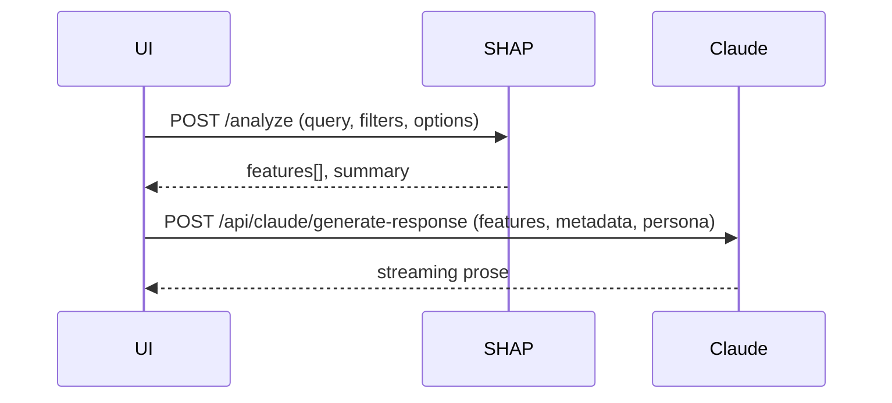

# Unified Two-Pass Analysis Architecture

_Last updated: July 2025_

The application processes **every** user question with two distinct passes to guarantee consistency between the map and the chat explanation.

| Pass | Engine | Responsibilities |
|------|--------|------------------|
| 1. Statistical | **SHAP micro-service** | Validate request, filter & rank features, compute SHAP, return full feature JSON + terse fallback summary |
| 2. Narrative   | **Claude route** | Turn statistical output into human prose, add comparisons & context, stream back to UI |

## Sequence Diagram

## Why Two Passes?
1. **Determinism + Fluency** – SHAP provides reliable numbers; Claude provides readable insight.  
2. **Consistency** – Both components consume the _same_ feature set.  
3. **Performance** – Map layer renders instantly from pass 1; prose can arrive seconds later.  
4. **Resilience** – If Claude fails, UI still shows fallback summary.

> **Never** bypass the Claude call in production – it is part of the contract.

## Implementation Hooks
* `geospatial-chat-interface.tsx` orchestrates the two calls.  
* SHAP response is cached; Claude receives a blob URL or inline `featureData`.  
* Narrative pass includes analysis metadata (`analysisType`, `visualizationMode`, cluster options etc.).

## Extending the Flow
When adding a new analysis type:
1. Teach SHAP worker to compute required metrics.  
2. Add task instructions in each persona prompt.  
3. Update `generate-response/route.ts` to pass any extra metadata.

## Related Docs
* [Claude + SHAP Contextual Chat](ai-contextual-chat.md) 