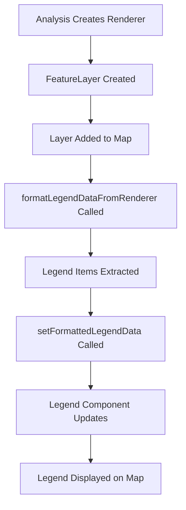
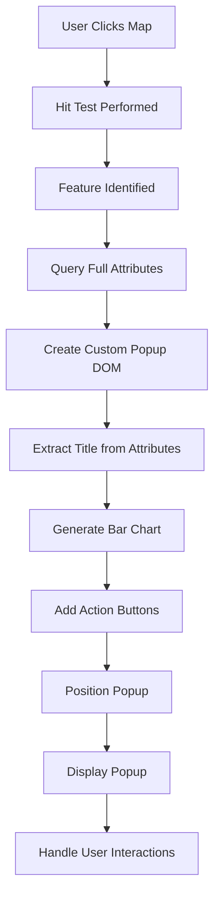

# Map Popups and Legends System Documentation

## Overview

This document explains how the map visualization system creates and manages popups and legends for both static layers and dynamic analysis results. The system uses a combination of ArcGIS native capabilities and custom React components to provide an interactive and informative user experience.

## Table of Contents
1. [Legend System](#legend-system)
2. [Popup System](#popup-system)
3. [Integration Flow](#integration-flow)
4. [Implementation Details](#implementation-details)
5. [Troubleshooting](#troubleshooting)

---

## Legend System

### Overview
The legend system extracts visual classification information from ArcGIS renderers and displays it in a user-friendly format. It supports multiple renderer types and updates dynamically based on layer changes.

### Key Components

#### 1. **Legend Data Extraction (`utils/legend-formatter.ts`)**
The core utility function that converts ArcGIS renderers to legend data:

```typescript
formatLegendDataFromRenderer(renderer: __esri.Renderer): LegendItem[]
```

**Supported Renderer Types:**
- **ClassBreaksRenderer**: Creates legend items for numeric ranges (e.g., quintiles, quartiles)
- **SimpleRenderer**: Single symbol for all features
- **UniqueValueRenderer**: Different symbols for categorical values

**Output Format:**
```typescript
interface LegendItem {
  label: string;      // Display text (e.g., "100 - 200")
  color: string;      // RGBA color string
  minValue?: number;  // Range minimum (for class breaks)
  maxValue?: number;  // Range maximum (for class breaks)
}
```

#### 2. **LayerController Legend System (`components/LayerController/LayerController.tsx`)**
The main legend management component that:
- Watches for renderer changes on layers
- Converts renderers to StandardizedLegendData
- Updates legend display in real-time
- Filters out "No Data" values

**Key Functions:**
```typescript
convertLayerToLegendData(layer: __esri.FeatureLayer): StandardizedLegendData | null
```

#### 3. **LayerLegend Component (`components/LayerController/LayerLegend.tsx`)**
Real-time legend updates for individual layers:
- Watches layer visibility and renderer changes
- Creates DOM elements for legend items
- Handles different geometry types (points, polygons)
- Supports interactive legend features

### Legend Creation Flow



### Example Legend Creation

```typescript
// After creating a FeatureLayer with a renderer
const renderer = featureLayer.renderer;
const legendItems = formatLegendDataFromRenderer(renderer);

// Convert to display format
const legendData = {
  items: legendItems.map(item => ({
    label: item.label,
    color: item.color,
    value: item.minValue
  }))
};

// Update UI
setFormattedLegendData(legendData);
```

---

## Popup System

### Overview
The popup system replaces ArcGIS default popups with custom React-based interactive popups that include charts, statistics, and action buttons.

### Key Components

#### 1. **CustomPopupManager (`components/popup/CustomPopupManager.tsx`)**
The main popup management component that:
- Intercepts map click events
- Queries features for complete attribute data
- Creates custom DOM-based popups
- Manages popup lifecycle and positioning

**Key Features:**
- Interactive bar charts showing data values
- Zoom-to-feature functionality
- Infographics integration
- Custom styling and animations
- Click-outside-to-close behavior

#### 2. **Popup Content Creation**
The popup content is dynamically generated based on feature attributes:

```typescript
// Title determination priority
1. DESCRIPTION field
2. ID field (no prefix)
3. FSA_ID field
4. NAME field
5. OBJECTID (with "Feature" prefix)
```

**Bar Chart Generation:**
- Displays numeric field values as horizontal bars
- Color-coded based on data ranges
- Includes field aliases for readability
- Shows actual values on hover

**Action Buttons:**
- **Zoom to**: Centers map on the selected feature
- **Infographics**: Opens detailed analysis panel

#### 3. **Popup Utils (`utils/popup-utils.ts`)**
Helper functions for standardized popup creation:

```typescript
createStandardizedPopupTemplate(config: StandardizedPopupConfig)
determinePopupTitle(attributes: any): string
```

### Popup Creation Flow



### Popup Integration

```typescript
// Disable ArcGIS default popups
featureLayer.popupEnabled = false;

// CustomPopupManager handles clicks
const clickHandler = mapView.on('click', (event) => {
  mapView.hitTest(event).then(response => {
    const graphic = findRelevantGraphic(response);
    if (graphic) {
      createCustomPopup(graphic, event.mapPoint);
    }
  });
});
```

---

## Integration Flow

### Unified Analysis Integration

The unified analysis system integrates both legends and popups through the following process:

1. **Analysis Execution**
   - AnalysisEngine processes query
   - DataProcessor creates renderer with classification
   - VisualizationRenderer generates visual configuration

2. **Feature Layer Creation**
   ```typescript
   const featureLayer = new FeatureLayer({
     source: features,
     renderer: analysisRenderer,
     popupEnabled: false,  // Disable default popups
     title: 'Analysis Results'
   });
   ```

3. **Legend Integration**
   ```typescript
   // Extract legend from renderer
   const legendItems = formatLegendDataFromRenderer(featureLayer.renderer);
   setFormattedLegendData({ items: legendItems });
   ```

4. **Popup Integration**
   ```typescript
   // CustomPopupManager automatically handles the layer
   <CustomPopupManager
     mapView={mapView}
     layer={featureLayer}
     config={popupConfig}
   />
   ```

### Static Layer Integration

For predefined layers from configuration:

1. **Layer Loading**
   - LayerController creates layers from config
   - Renderers applied based on layer type
   - Legend automatically extracted

2. **Legend Updates**
   - LayerLegend watches for renderer changes
   - Updates display in real-time
   - Handles visibility toggling

3. **Popup Handling**
   - CustomPopupManager attached to each layer
   - Uses layer configuration for field mapping
   - Applies consistent styling

---

## Implementation Details

### Color Handling

The system handles colors from multiple sources:

```typescript
// From ArcGIS Color objects
if (symbol.color.toHex) {
  color = symbol.color.toHex();
  opacity = symbol.color.a || 1;
}

// From direct arrays [r, g, b, a]
if (Array.isArray(symbol.color)) {
  const [r, g, b, a] = symbol.color;
  color = `rgba(${r}, ${g}, ${b}, ${a || 1})`;
}
```

### Field Mapping

The system uses field aliases for human-readable names:

```typescript
// Field mapping for popups and legends
const FIELD_ALIASES = {
  'MP30034A_B': 'Nike Market Share',
  'MP30029A_B': 'Adidas Market Share',
  'strategic_value_score': 'Strategic Value',
  // ... more mappings
};
```

### Memory Optimization

For large datasets:

```typescript
// Limit fields in graphics for performance
const essentialFields = [
  'OBJECTID', 'ID', 'DESCRIPTION', 
  targetVariable, 'value', 'rank'
];

// Create optimized graphics
const graphic = new Graphic({
  geometry: geometry,
  attributes: filteredAttributes  // Only essential fields
});
```

### Renderer Types by Analysis

Different analysis types use specific renderers:

| Analysis Type | Renderer Type | Legend Type |
|--------------|---------------|-------------|
| Strategic Analysis | ClassBreaksRenderer | Quartiles/Quintiles |
| Competitive Analysis | ClassBreaksRenderer | Market Share Ranges |
| Cluster Analysis | UniqueValueRenderer | Cluster Categories |
| Demographic Analysis | ClassBreaksRenderer | Population Ranges |

---

## Troubleshooting

### Common Issues and Solutions

#### Legend Not Appearing

**Symptoms:**
- Analysis completes but no legend shown
- Console shows "No legend data available"

**Solutions:**
1. Verify renderer exists on layer:
   ```typescript
   console.log('Renderer:', featureLayer.renderer);
   ```

2. Check formatLegendDataFromRenderer is called:
   ```typescript
   const legendItems = formatLegendDataFromRenderer(renderer);
   console.log('Legend items:', legendItems);
   ```

3. Ensure setFormattedLegendData is called with correct format

#### Popups Not Working

**Symptoms:**
- Clicking features shows no popup
- Default ArcGIS popup appears instead

**Solutions:**
1. Verify popupEnabled is false:
   ```typescript
   featureLayer.popupEnabled = false;
   ```

2. Check CustomPopupManager is initialized:
   ```typescript
   <CustomPopupManager mapView={mapView} layer={featureLayer} />
   ```

3. Ensure layer has required fields for popup title

#### Wrong Colors in Legend

**Symptoms:**
- Legend colors don't match map
- Colors appear as gray or default

**Solutions:**
1. Check renderer color format:
   ```typescript
   console.log('Symbol color:', renderer.symbol.color);
   ```

2. Verify color conversion handles your format
3. Check for transparency/opacity issues

### Debug Logging

Enable detailed logging for troubleshooting:

```typescript
// In formatLegendDataFromRenderer
console.log('[Legend] Renderer type:', renderer.type);
console.log('[Legend] Class breaks:', renderer.classBreakInfos);

// In CustomPopupManager
console.log('[Popup] Feature attributes:', feature.attributes);
console.log('[Popup] Title determination:', titleText);

// In unified analysis
console.log('[Analysis] Renderer created:', visualization.renderer);
console.log('[Analysis] Legend extracted:', legendItems);
```

---

## Best Practices

1. **Always Disable Default Popups**: Set `popupEnabled = false` when using CustomPopupManager
2. **Extract Legends After Rendering**: Call formatLegendDataFromRenderer after layer is created
3. **Use Field Aliases**: Map technical field names to user-friendly labels
4. **Handle Missing Data**: Check for null/undefined values in attributes
5. **Optimize Large Datasets**: Limit fields and features for performance
6. **Test Different Renderers**: Ensure legend extraction works for all renderer types
7. **Maintain Consistency**: Use the same color schemes across legends and maps

---

## Related Files

- `/utils/legend-formatter.ts` - Core legend extraction utility
- `/components/popup/CustomPopupManager.tsx` - Custom popup implementation
- `/components/LayerController/LayerController.tsx` - Layer and legend management
- `/components/LayerController/LayerLegend.tsx` - Real-time legend updates
- `/utils/popup-utils.ts` - Popup helper utilities
- `/lib/analysis/VisualizationRenderer.ts` - Renderer creation for analysis
- `/components/geospatial-chat-interface.tsx` - Unified analysis integration