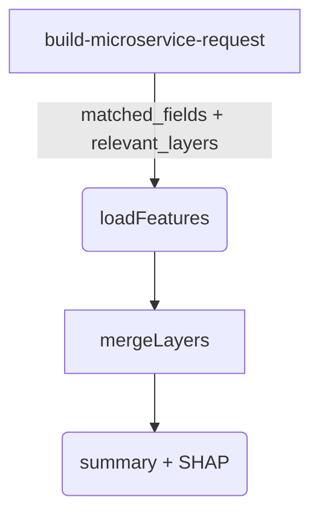

# Merge-Logic Refactor: supporting multi-field, multi-layer analyses

_2025-06-28_

The current Claude / SHAP pipeline silently relies on a **single global `target_variable`** and an ad-hoc fallback to `thematic_value` when a requested column is missing from a layer.  That hack works for two-brand *count* comparisons but fails for percentage columns and any scenario that needs three or more unique metrics.

This document outlines a step-by-step plan to introduce a **field-union merge** that keeps every requested column, regardless of which layer it originates from.

---
## 1  Goals

1. _Accuracy_: Every column listed in `matched_fields` makes it to the merged feature set.
2. _Layer-agnostic_: Works whether fields come from one layer or many.
3. _Backward compatible_: Existing single-layer queries behave the same.
4. _Minimal surface_: Touch only the server-side merge pipeline; no UI changes.

---
## 2  Current flow (baseline)

* **mergeLayers** iterates `relevant_layers`, fetches their features, and
  naïvely copies all attributes into one synthetic "Analysis Results" layer.
* A feature is **dropped** if it lacks the global `target_variable`.
* Only the last value written for a given field survives (simple overwrite).

---
## 3  Refactor roadmap

| Step | Change | Notes |
|------|--------|-------|
| 1 |Create `types/union-layer.ts` with a `MergedFeature` interface that can hold a map of _field → value_. |Keeps typing strict.|
| 2 |Rewrite `mergeLayers()` in `server/claude-service.ts` (or the equivalent route) so it:   a. Builds a `Map<geoId, MergedFeature>` keyed by ZIP (or GEOID).   b. For each incoming ArcGIS feature add **only** the fields present in `matched_fields`.   c. If a key already exists, **preserve** existing values; fill holes only.|Prevents destructive overwrites.|
| 3 |Remove the "drop whole layer if target missing" rule. Instead, after the union loop compute `target_variable` per feature:   `feature[target] ?? feature[secondaryTarget] ?? …` |Allows per-feature completeness.|
| 4 |Add `secondary_targets` array to the payload so the UI can specify fallbacks (e.g. `[MP30034A_B_P, MP30034A_B]`).|Keeps metrics aligned.|
| 5 |Update summariser to iterate the **field list**, not assume one `target_variable`.|Required for multi-metric narratives.|
| 6 |Unit tests:   – 3-brand comparison (Nike, Adidas, Jordan)   – Demographic + income correlation across two layers   – Single-layer query regression|Protects behaviour.|
| 7 |Load-test with 10k ZIPs to verify merge memory footprint.|Performance gate.|

---
## 4  Backward-compatibility strategy

* Keep **global `target_variable`** in the request for legacy clients.
* If `secondary_targets` not provided, server falls back to old logic.
* UI change (adding `secondary_targets`) can be shipped later; server will already understand it.

---
## 5  Risks & Mitigations

| Risk | Mitigation |
|------|------------|
|Memory blow-up merging many layers|Stream features and flush at 5 000-row chunks or use Node streams.|
|Unexpected nulls where a metric genuinely missing in all layers|Post-merge validation: drop metric if >95 % null and warn in log.|
|Client assumes `thematic_value` always present|Keep `thematic_value` renderer injection until all visualisation code migrated to read the explicit metric list.|

---
## 6  Timeline (2-day sprint)

1. **½ day** – scaffold union types & refactor `mergeLayers()` (Steps 1-3).  
2. **½ day** – update summariser + add server tests (Steps 4-5).  
3. **1 day** – integrate payload changes, full regression test, load-test.  
4. **½ day** – polish, docs, PR.

---
## 7  Deliverables

* Updated server code (`claude-service.ts` or route equivalent).
* New union-layer types and helper utils.
* Unit-test suite in `__tests__/union-merge/*.test.ts`.
* This design doc residing at `docs/merge-logic-refactor.md`. 